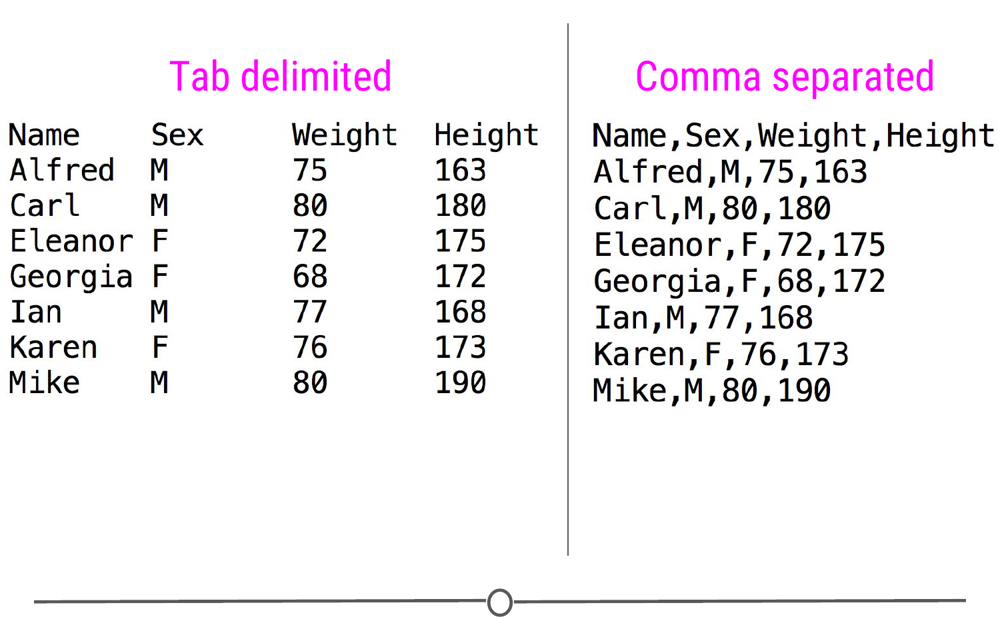
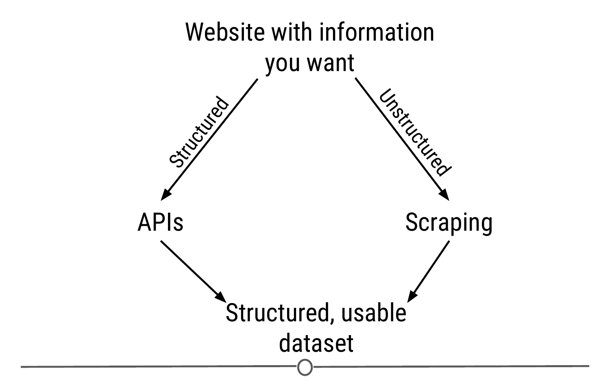
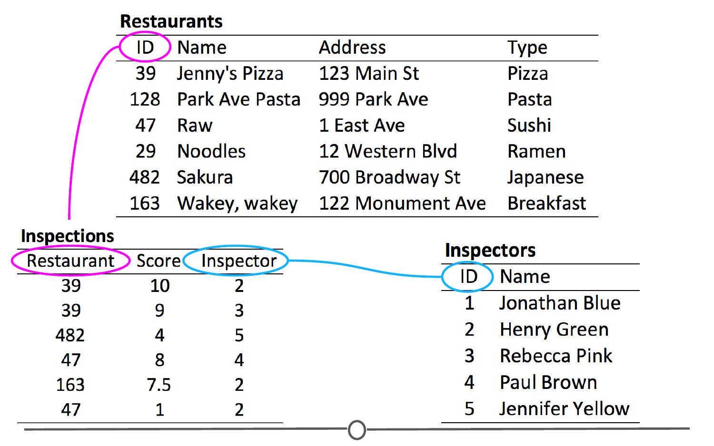
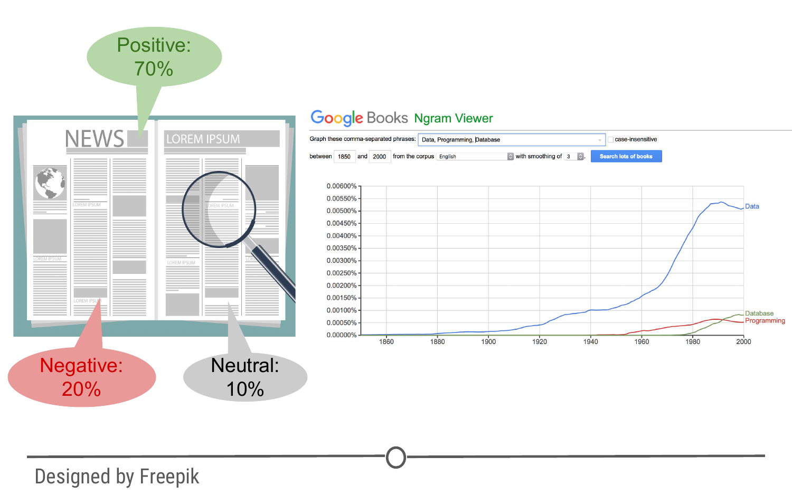
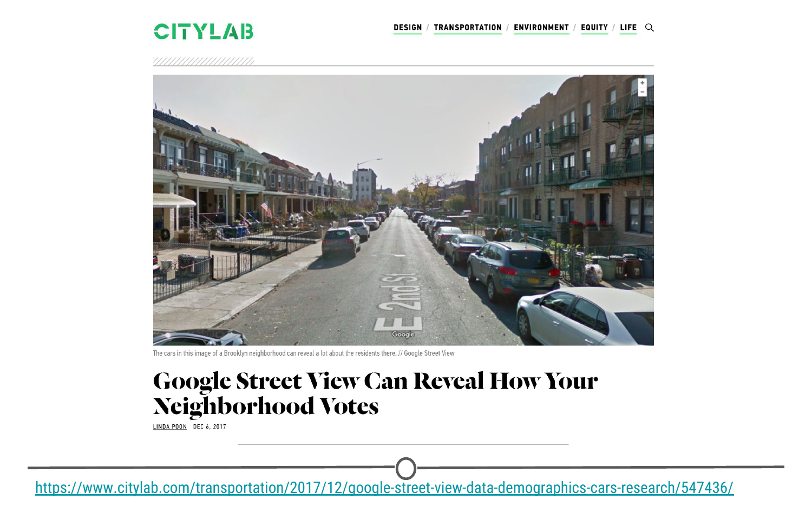
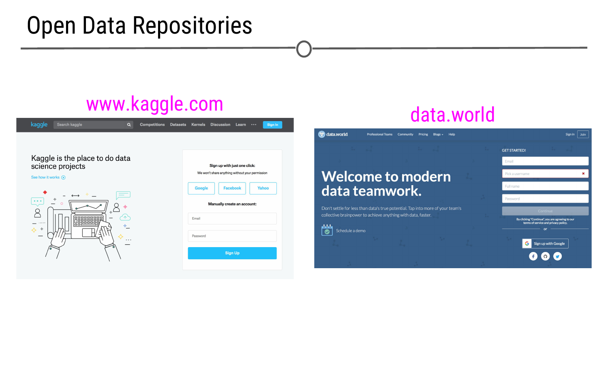
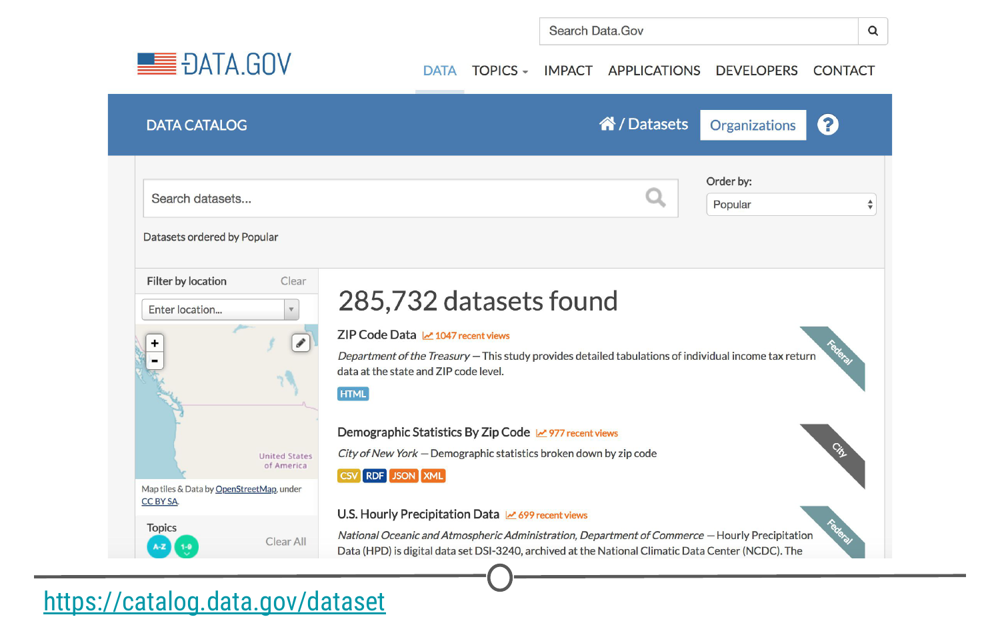
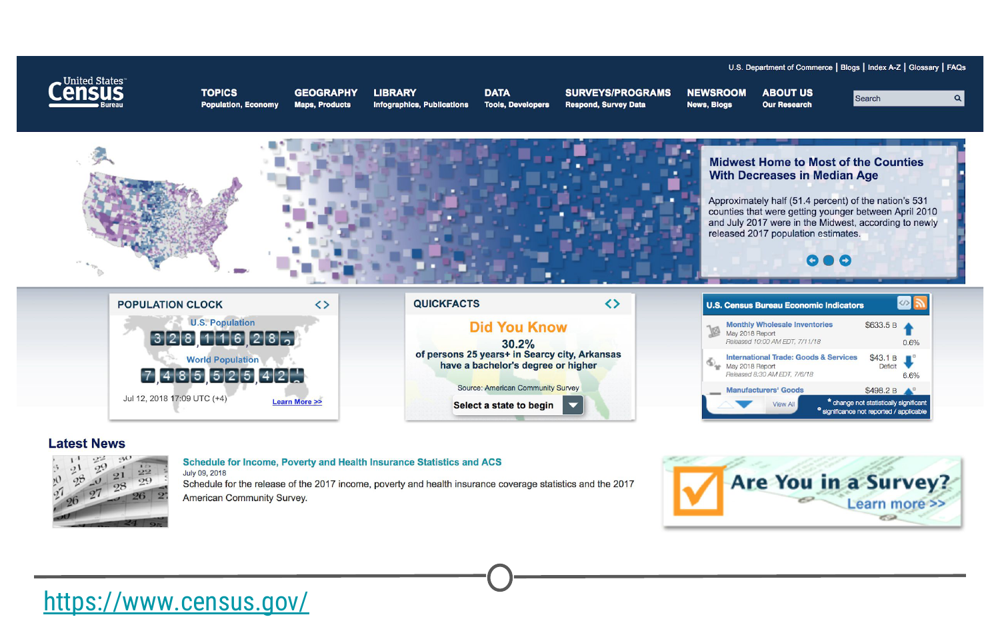
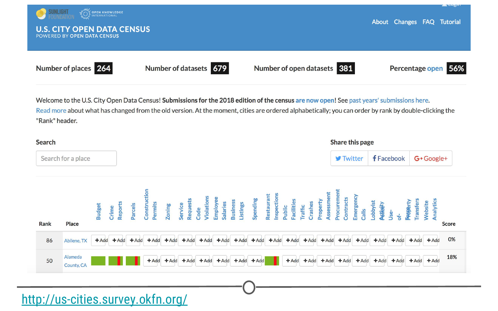
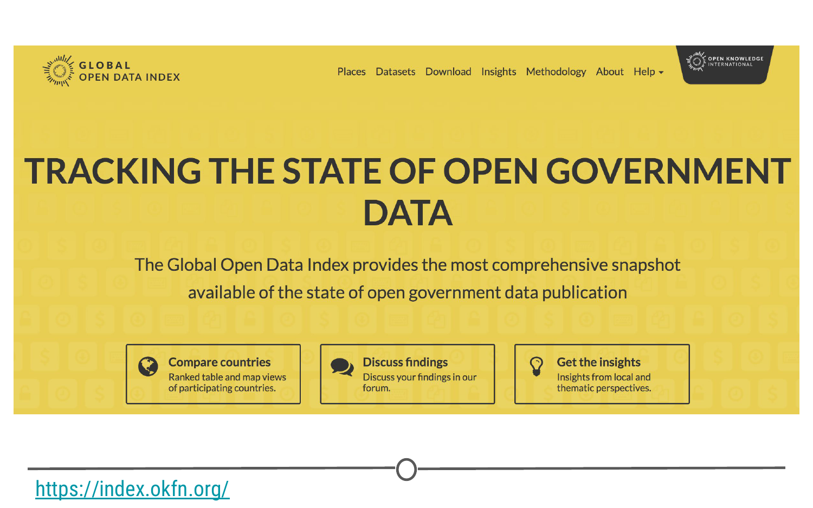

# What is data and where to find it

In the first course in this series, the Data Scientist's Toolbox, we discussed what exactly data is and some examples of the different kinds of data that you can analyse. We defined data using both the [Cambridge definition](https://dictionary.cambridge.org/dictionary/english/data) and the definition from [Wikipedia](https://en.wikipedia.org/wiki/Data), to arrive at an understanding of data as "A set of values of qualitative or quantitative variables that are collected to be examined and considered to help in decision making." Examples of data that we previously considered included structured data, like spreadsheets of information, or unstructured data, like electronic medical records, audio, or video files.

The knowledge and ability of how to work with a variety of data types is a critical skill for you to master as a data scientist. Our hope is that this series of courses will introduce you to a variety of data types and how to work with them so that you feel confident going forward as a data scientist in future courses and future projects! The role of the data scientist is to be able to collect and clean data, study the data, create models to help understand and answer the question, and to share your findings with other people. We will work through each of these steps throughout these courses - and understanding the importance of data and what qualifies as data is an important first step.

### Data, data everywhere 

Every time you buy something with a credit card or like a photo on Instagram, data is generated. Spreadsheets where you track your finances are data. The photos you upload to social media are data. The tweets people write are data. The information on your favorite website is data. In today's increasingly digital world, data are everywhere.

In this course, we are going to discuss some principles of good data analysis, examine common types of data and how to read that data into R, and go over ways to manage and tidy your data. We'll also spend time talking about some of the less conventional types of data so that you are aware of some of the packages that exist for working with these types of data, even if you aren't working with them every day. In this lesson we'll briefly introduce a number of different types of data and resources for accessing publicly available data. 

### Examples of different types of data 

**1. Spreadsheets**

We've discussed before how often data that is stored in spreadsheets (like Excel or Google Sheets) is structured data - which makes analysing it all the easier. Often, these data are stored as comma-separated values (.csv), tab delimited (.txt), or Excel (.xlsx, .xls) files. **CSV** files are as they sound, each value in the spreadsheet is separated by a comma; whereas **tab delimited** files separate the values by tabs. 

**2. Data from the Internet**

Given the vast amount of information stored on the internet, it should come as no surprise that the internet can be a data scientist's best friend! Not only are there structured data tables accessible, but you can also communicate with websites via **"APIs"**, to retrieve specific requested information, or you can **"scrape"** websites of their useful data and create a dataset of your own. Briefly, **Application Programming Interfaces (APIs)** are, in the most general sense, software that allow two different web-based applications to communicate with one another over the Internet (think posting on Instagram and having the picture also appear on your Facebook). For our purposes, APIs can be incredibly helpful for retrieving data; we can retrieve data from various websites by requesting certain information and the API responds with a table of that information. **Web scraping** is a process of extracting information from a website that isn't necessarily in a nice data table and formatting your newly "scraped" data into a usable format. 

**3. Databases** 

In addition to singular spreadsheets of data, data that are more complex than what can be stored in a single spreadsheet are often stored in what are known as **relational databases**. These contain multiple tables that are related to one another in some way. 

For example, consider a spreadsheet of all the restaurants in your area. This spreadsheet may contain information about the restaurant's name, its location, and what type of food it serves. Additionally, you may have a separate spreadsheet containing information about food inspections. Each row could contain a different inspection, who performed the inspection, and information about how the restaurant performed. Each restaurant would have multiple inspections, assuming the restaurant has been open a while. 

In a relational database, these two spreadsheets are linked such that each restaurant has a unique ID that is in common between the two spreadsheets. So if you wanted to know where a restaurant was located and information about how that restaurant performed on their last inspection, you could search that ID and all the data in both sheets would be pulled out. 

This is what we mean by **relational**. The information within the database is all related to one another (in our example, each contains information about restaurants); however, each spreadsheet within the database contains different information. Relational databases help keep track of data as datasets grow and new pieces of information are incorporated.

**4. Unconventional Data**

In addition to information stored in spreadsheets and relational databases or data scraped from the web, there are *many* other types of data that one could work with, but that data scientists typically work with less frequently, despite their abundance. We've touched on some of these before, but we'll spend a bit more time on them in this course. 

*Text*

Politicians give speeches. Authors write books. Everyone writes emails. All of these generate *a lot* of text. While not as straightforward as analyzing numbers, text too can be analyzed. From text, we can draw insights about what words have been used historically and how this has changed over time. We can infer the writers feelings and attitude just by examining their word choice ("sentiment analysis"). We can use the words from a book to infer in what year that book was written. Or, we could analyze what words in an email elicit a response, and what words elicit that response most quickly. There is a lot of text out there to be analysed with the right question! 

*Images*

Similarly, it won't come as any surprise that images are all around us. Pictures are constantly being posted to social media, and nearly every online news story is accompanied by at least one image. The ability to analyze images allows Facebook to guess who you are when a picture is posted of you. And, it allows software programs to combine two pictures and guess what those individuals' kids may look like. The ability to analyze images is not always the most straightforward, but is also possible within R. 

*Audio*

We are constantly barraged with sound. We listen to music and podcasts through our phones, radios, and computers. We leave voicemails and voice messages for one another and these interactions generate audio files. Consider having access to audio files for thousands of popular songs. One could analyze these to group these files by genre and build a model that predicts which types of songs in the future will be the most popular. 

### Finding Data

If you have a question you want to answer with data, where do you find data to work with? In some cases you'll have to create your own dataset but in other cases you can find data that others have already generated and start from there! Here, we'll discuss the difference between public and private data and direct you to a number of resources where you can find helpful datasets for data science projects!

### Public versus Private Data

Before discussing where to find data, we need to know the difference between private and public data. **Private data** are datasets to which a limited number of people or groups have access. There are many reasons why a dataset may remain private. If the dataset has personally-identifiable information within it (eg: addresses, phone numbers), then the dataset may remain private for privacy reasons. Or, if the dataset has been generated by a company, they may keep it private so that they have an advantage over their competitors. Often, you will not have access to private data (although sometimes you can request and gain access to the data or pay for the data to get access). 

In contrast, **public data** are freely-available for your use. Unlike private data generated by companies, data generated by governments are often made public and are available for anyone to use.

### Where to find data

As a data scientist, there's a good chance you may work with private company data as part of your job. However, before you have that job, it's great practice to work with datasets that are publicly-available and waiting for you to use them! In this section, we'll direct you to sources of different datasets where you can find a dataset of interest to you and get working with it! 

#### Open Datasets

There are a number of companies dedicated to compiling datasets into a central location and making these data easy to access. Two of the most popular are [Kaggle](https://www.kaggle.com/) and [data.world](https://data.world/). On each site, you'll have to register for a free account. After registering you'll have access to *many* different types of datasets! Explore what's available there and then start playing around with a dataset that interests you!

#### Government Data

Government data can provide a wealth of information to a data scientist. Government datasets cover topics from education and student loan debt to climate and weather. They include business and finance datasets as well as law and agriculture data. Here we provide lists of governments' open data to just give you an *idea* of how many datasets are out there. This will only include a *tiny* portion of what cities and federal governments' data are available for you to use - so if you are curious, explore! 

**US Data**

If you're interested in working with government data from the United States, [data.gov](https://www.data.gov/) and [data.gov datasets](https://www.data.gov/dataset) are a great resource.

The [US Census](https://www.census.gov/) is responsible for collecting data about the people within the United States and its economy every ten years. These [data](https://www.census.gov/data.html) are also accessible online *and* they can be worked with in R using the very helpful [`tidycensus`](https://walkerke.github.io/tidycensus/) package!

The US's federal government is of course not the only place to obtain government data. More and more cities across the world are starting to release open data at the city level. To see a summary of what datasets are available from cities across the USA, check out the [US Open City Data Census](http://us-cities.survey.okfn.org/) from the Sunlight Foundation. A few of these cities and their respective open city data links are provided below:

* [Baltimore, MD (USA)](https://data.baltimorecity.gov/)
* [Cincinnati, OH (USA)](https://data.cincinnati-oh.gov/)
* [Las Vegas, NV (USA)](https://opendata.lasvegasnevada.gov/)
* [New York City, NY (USA)](https://opendata.cityofnewyork.us/)
* [San Francisco, CA (USA)](https://datasf.org/opendata/)
* [Toronto, Ontario (Canada)](https://www.toronto.ca/city-government/data-research-maps/open-data/)

**Global Data**

In addition to the United States, there are many other countries providing access to open data with more and more providing access and updated datasets each year. To see what datasets are available globally, the [Global Open Data Index](https://index.okfn.org/dataset/) is a great place to start! Countries with publicly available data include (but are not limited to!) datasets from many countries within [Africa](http://dataportal.opendataforafrica.org/) and [Latin America](https://opendatabarometer.org/latin-american-open-data-initiative/) as well as  [Canada](https://open.canada.ca/en/open-data),  [Ireland](https://data.gov.ie/), [Japan](http://www.data.go.jp/?lang=english), [Taiwan](https://data.cdc.gov.tw/en/), and the [UK](https://data.gov.uk/). 

#### APIs

As we mentioned above, APIs provide access to data you're interested in obtaining from websites. There are APIs for *so* many of the websites you access regularly. [Google](http://developers.google.com/apis-explorer/#p/), [Twitter](https://dev.twitter.com/), [Facebook](https://developers.facebook.com/), and [GitHub](https://developer.github.com/v3/?) all have APIs that you can access to obtain the dataset you're interested in working with!

#### Data You Already Have

Getting data sometimes just involves taking a look at things you already have but just haven't yet *realized* are data you can analyze. 

For example, audio files you've bought and have on your computer are data! You could use this type of data to categorize the music in your library or predict similar songs that you might also like. Social networking websites, like Facebook and Twitter, collect a lot of data about you as an individual. You have access to this information through the website's APIs, but can also download data directly. After news of the [Facebook and Cambridge Analytica data breach](https://www.theguardian.com/news/2018/mar/17/cambridge-analytica-facebook-influence-us-election), many articles were published about [how to download your Facebook data](https://www.wired.com/story/download-facebook-data-how-to-read/). These data can be downloaded and then analyzed to look at trends in your data over time. How many pictures have you uploaded and been tagged in over time - has that changed? What topics do you most frequently discuss in Messenger? Or, maybe you're interested in mapping the places you've been based on where you've checked in. All of these data can be analyzed from data that are already there, just waiting for you to work with them! 

### Summary 

In this lesson, we looked at what data is and what are some resources to find it. Some common types of data that you may encounter include spreadsheets (structured), data from APIs or from web scraping, relational databases where information is linked across different spreadsheets, and some unconventional sources like text, images, and audio. Once we were familiar with some of the types of data, we spent some more time looking at places that you can find data, first emphasizing the importance of understanding the difference between public vs private data. Some great sources of data include open datasets, like those you can find at Kaggle or data.world, government databases, like censuses, APIs, or looking at data you already have but in new ways! Hopefully, you now feel equipped to find some interesting datasets that you can analyse to answer your questions! 

### Slides

This lesson's slides can be found [here](https://docs.google.com/presentation/d/1EsyHtEXIjoEnr-baeK3711_sFaiyt0MMl1nidaPeJyY/edit?usp=sharing)  
