# Organizing your data analysis

Data science projects involve lots of files. There are files of data, files for code, files for documentation, figures, and documents to communicate with other people. A surprising amount of doing data science really well is just being good at managing and organizing all of these files so that they are:

* Easy to find  
* Easy to share  
* Easy to understand  
* Easy to update  

The reason that you need to make it easy to find and work with the files in your analysis is because data science is really closely related to communication. We use data to understand the world and communicate that understanding. So when you are building a data science project, you should be thinking about who will be on the receiving end of your data analysis. 

While you are actively working on a project, it is often easy to find any file you need off the top of your head. But the audience of your data analysis is not you, right now. One audience is other people who you will share your work with. They don't know about all the different places you have stored data, or which piece of code to run first. You need to make it easy on them to be able to understand what you did. 

Another audience that may surprise you when you are just starting, but will be familiar to any experienced data analyst, is you. A twist on a [famous saying about data science](http://kbroman.org/Tools4RR/assets/lectures/01_intro.pdf) is: 

> Your closest co-worker is you six months ago, but you don't reply to emails. 

This is because it is really common for you to work on a data science project, present the results, and then move on to another project. But someone else is studying your results and might have questions and want you to make a change. So a few months later, when you've forgotten where everything is, they come back and ask you to make a minor change and you have to dive back in and figure out which files you need to look at. 

### Why Organize?

Having a system to organizing files into folders and following file naming conventions provides the following benefits: 

- Easier collaboration: You will see that as a data scientist, you will have to work with teams of other data scientists most of the time. Organizing makes collaboration a lot easier.

- Lower likelihood of making mistakes: When you organize, it is easier for you and others to see where you might have made a mistake before it's too late. 

- Easier recall: Going back to your analysis and understanding what you have done in 6 months or a year or even later will be a lot easier. If your project is not organized, it is very likely that you go back to your analysis and do not understand what you or your collaborator have previously done.

- More transparency and honesty on your part: This is because you make it easier for others to go through your files and replicate your analysis.

### Setting Up Data Science Project Folders

The first step to having an organized R project is to organize and name the folders and files in that project. Naming and organizing files seems very boring, but it is one of the most important parts of any data science project! Not having the files or the data available is one of the most common reasons that errors are missed in data science projects. 

#### A project organization framework

We will walk through setting up an organized R project here to show you how you should set up every new data science project before you start doing any work. It will be much harder to set up after the project has started and files are scattered everywhere.  

First, in RStudio, go to File > New Project. Follow the prompts to create a new project named "my_first_project"

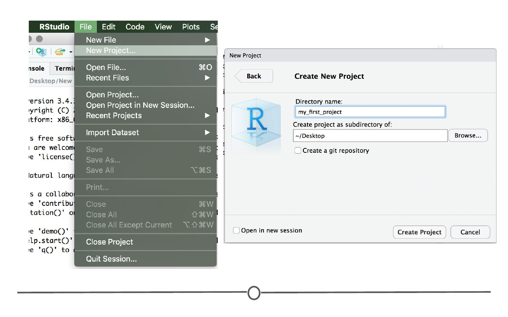

Each time you start a new project, you will need to create a set of folders for that project. You can create a new folder by clicking on New Folder at the top of the file window in the bottom right quadrant.  

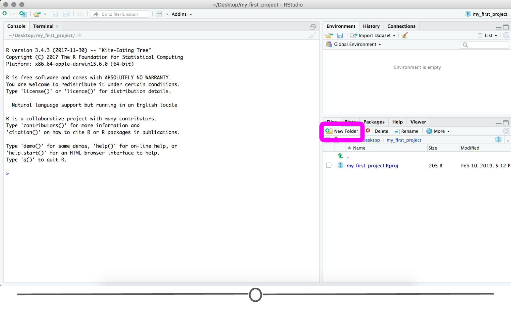

Then you can type in the name of the folder you want to create. First let's create a folder called _data_. You should now see a folder called "data" in the file quadrant.


Next we will create a few more folders. For each one click the New Folder button, enter the name and click OK. The folders we need to create will be called *figures*, *code*, and *products*. Once you have created the folders you should see something like this.

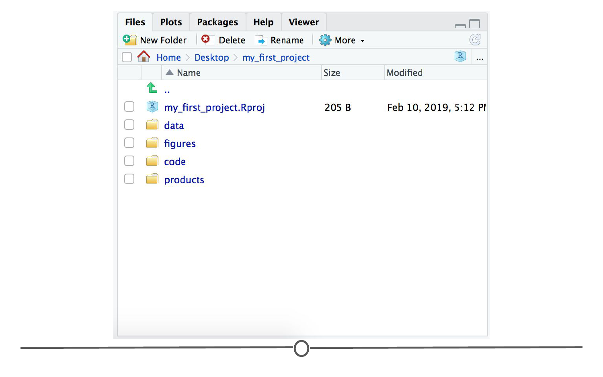

These folders represent the four parts of any data science project. 

* _data_ - is the folder where you will put all the data you have collected or been given to analyze  
* _figures_ - is where you will put plots, data pictures, and other images you have created to show data to other people  
* _code_ - is where you will create code files for collecting, cleaning up, or analyzing data 
* _products_ - this is the place where you will place any reports, presentations, or products you create for sharing with other people  

#### The README file

Once you have a file structure in place, write a README file that explains how code and data are organized and how they are related. In other words, what is what. For each filename, we recommend to have a short description of what the file is for. You can also have a description of how the data were obtained or collected, including links or references to publication or other documentation. Mention people involved with the project, and provide contact information of at least one of the collaborators. Every project should have a README file so that you can keep notes on what you have done during your project. You will add to this README as your project expands. 

To create the README file click File > New File > Text File and a new file will open in the Source quadrant of RStudio.

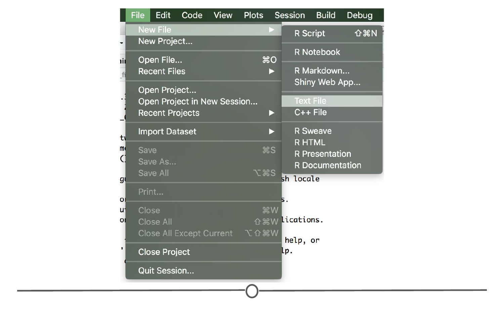

You should see a new text file open with the title _Untitled_, like this. 

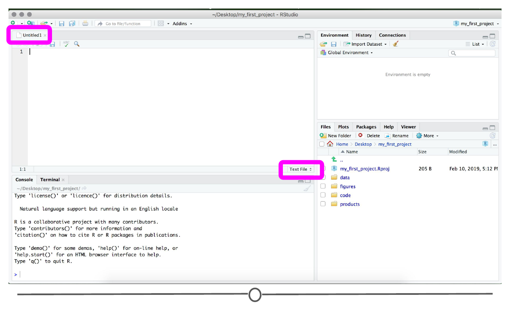

To save the file click on the disk icon in the top left hand corner of the screen, name the file README.md and click Save.  

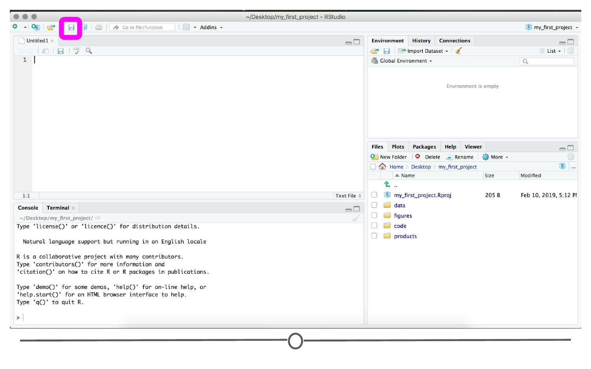
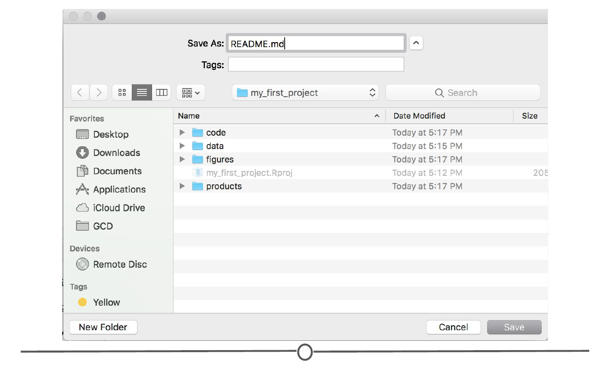

You should now see the README.md file in your file list on the bottom right of the screen. 

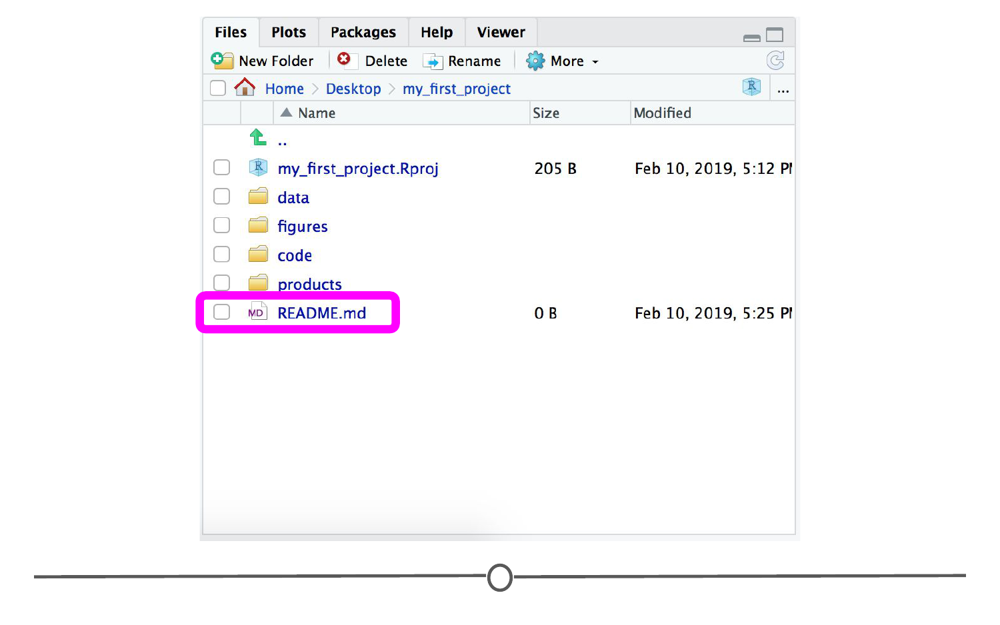

The next thing to do is fill in the README file with the initial description of your project. For now you can copy this text and paste it into your README file, then click the save button.  

```text
# This is the README file for my_first_project
The folders in this project are: 

* _data_ - is the folder where you will put all the data you have collected or been given to analyze. 
* _figures_ - is where you will put plots, data pictures, and other images you have created to show data to other people. 
* _code_ - is where you will create code files for collecting, cleaning up, or analyzing data. 
* _products_ - this is the place where you will place any reports, presentations, or products you create for sharing with other people.
```

The README file can be used to describe both the high level organization as well as any important special cases about your project. It may be helpful to create additional README files in each subfolder to provide information specific to the files in that subfolder. You would want to link to them from the global README file you have just created. A good idea is to update the README file as you work. As you create new files and folders, add their descriptions to the README file so you can keep track of what you are working on. 

You might also make a more detailed README file, which includes a list of variables, units of measurement of each variable, definition of code and symbols used to deal with missing data, licenses or restrictions on the content of the project including the data, and information about how others should cite your analysis.

#### The next level of organization

This is the top level of the organization of a new data science project, but we will usually need to create a little more organization within each folder. For example, if you click on the data folder you will see that it is empty. You can see at the top of the file organization tab that you are inside the folder *data* which is inside of the folder *my_first_project*. 


We need to create two new folders inside of the data folder, one for our raw data and one for our tidy data. You will learn a lot more about them later, but for now use the *New Folder* button to create one folder called *raw_data* and another called *tidy_data*. 

One way to write the folders we have now created is like this: 

* data/
    * raw_data/  
    * tidy_data/  
* code/  
* figures/  
* products/  

Here you can see that the *raw_data* folder is inside of the *data* folder. You can now click on the word *my_first_project* at the top of the file window and it will take you back up one level so you will see the folders for data, code, figures, and products. 

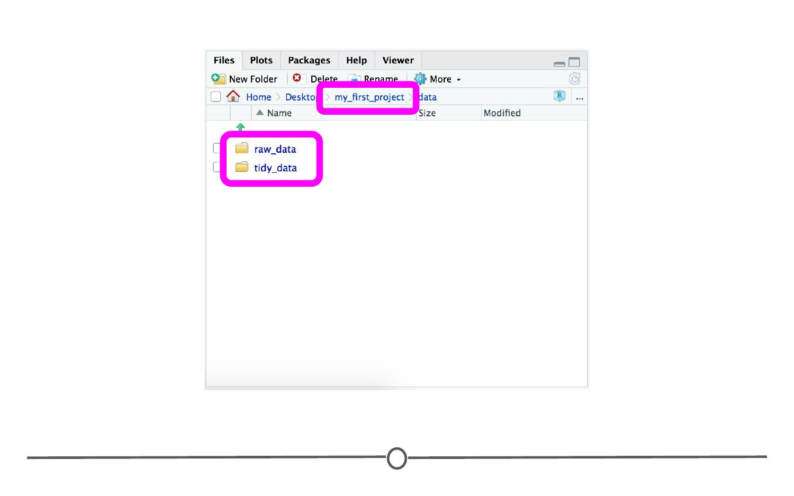

The rest of the folders we will need can be written in that same way. The folder structure would look something like this. 

* data/
    * raw_data/
    * tidy_data/
* code/
    * raw_code/
    * final_code/
* figures/
    * exploratory_figures/
    * explanatory_figures/
* products/
    * writing/
  
We need to create the folders *raw_code* and *final_code* inside of the *code* folder. We also need the folders *exploratory_figures* and *explanatory_figures* in the *figures* folder. Finally we need the folder *writing* inside of the *products* folder. 
  
Using the same steps we did for creating the folders inside of the *data* folder, you can create the rest of the folders you will need to organize your data science project. Every time you start a new project you will need to do these steps to set up the folders you will need to store all the files you will be creating. 

Using the *raw_data* folder for keeping the raw data untouched is important especially if you don't have a second copy of the raw data. If you make changes to and tidy up the raw data within your analysis, make sure you do not overwrite your raw data. It is important that you keep the raw data intact and instead add the cleaned and tidy data to the *tidy_data* folder. 

Next is using the *raw_code* folder for keeping your preliminary code. Let's see what we mean by that. When you are doing the preliminary part of your analysis, code with no constraint, that is do not worry much about how nice your code looks or whether they are self explanatory. Don't devote much of your brain power to commenting or tidying at first. Save this kind of code in the *raw_code* folder since it's raw and most of the time no one but you understands it. Later on, when you clean your code and make it more understandable, you can save bits and pieces of it in your final code file in the *final_code* folder. Next, we will talk about how to name the files that will go in these folders. 

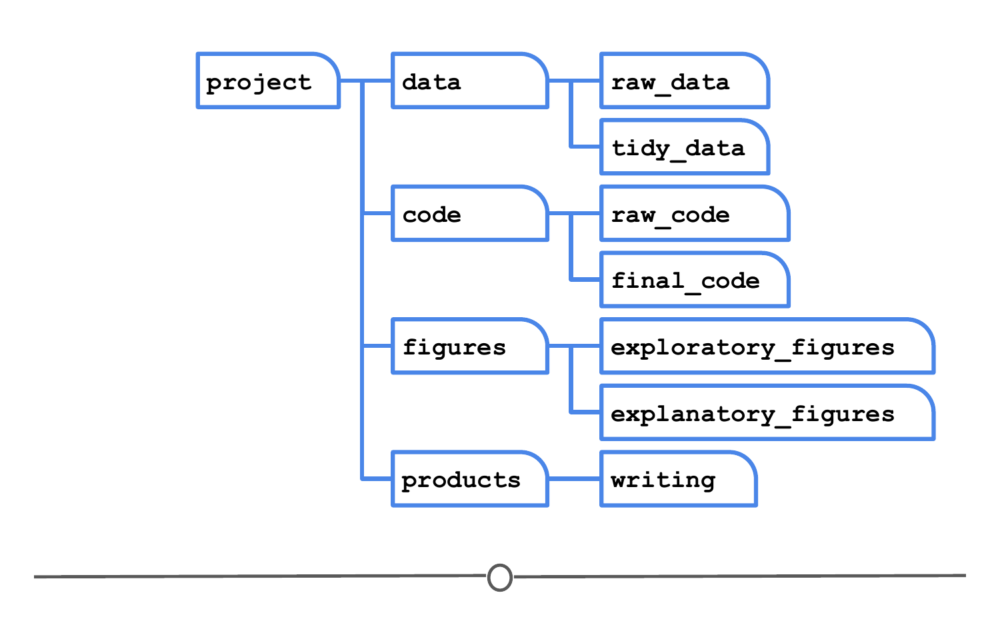

### File Naming

This might seem like a silly topic to cover, but one of the most frustrating things when looking at someone's data science project is to see a set of files that are completely scattered with names that don't make any sense. It also makes it harder to search for files if they don't have a consistent naming scheme. 

One of the best organized file naming systems is due to [Jenny Bryan](http://www2.stat.duke.edu/~rcs46/lectures_2015/01-markdown-git/slides/naming-slides/naming-slides.pdf) who gives three key principles of file naming for data science projects. Files should be:

* Machine readable
* Human readable
* Nicely ordered

If your files have these three characteristics, then it will be easy for you to search for them (machine readable), easy for you to understand what is in the files (human readable), and easy for you to glance at a whole folder and understand the organization (nicely ordered). We'll now discuss some concrete rules that will help you achieve these goals. 

#### Machine readable files

The machine we are talking about when we say "machine readable" is a computer. To make a file machine readable means to make it easy for you to use the machine to search for it. Let's see which one of the following examples are good example of machine readable files and which are not. 

- **Avoid spaces:** *2013 my report.md* is a not good name but *2013_my_report.md* is.
- **Avoid punctuation:** *malik's_report.md* is not a good name but *maliks_report.md* is.
- **Avoid accented characters:** *01_zoë_report.md* is not a good name but *01_zoe_report.md* is.
- **Avoid case sensitivity:** *AdamHooverReport.md* is not a good name but *adam-hoover-report.md* is.
- **Use delimiters:** *executivereportpepsiv1.md* is not a good name but *executive_report_pepsi_v1.md* is.

So to wrap up, spaces, punctuation, and periods should be avoided but underscores and dashes are recommended. You should always use lowercase since you don't have to later remember if the name of the file contained lowercase or uppercase letters. Another suggestion is the use of delimiters (hyphens or underscores) instead of combining all the words together. The use of delimiters makes it easier to look for files on your computer or in R and to extract information from the file names like the image below.

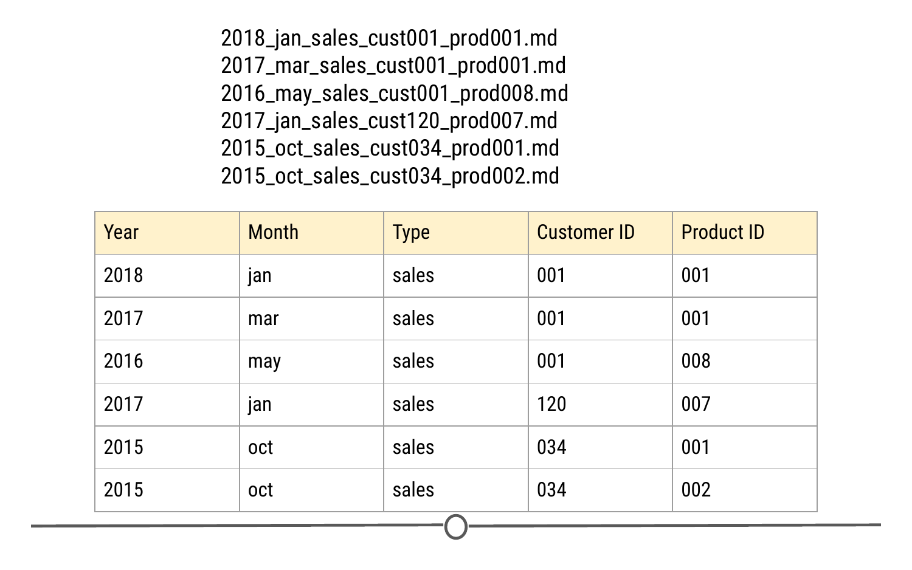

#### Human readable files

What does it mean for a file to be human readable? A file name is human readable if the name tells you something informative about the content of the file. For instance, the name `analysis.R` does not tell you what is in the file especially if you do multiple analyses at the same time. Is this analysis about the project you did for your client X or your client Y? Is it preliminary analysis or your final analysis? A better name maybe would be `2019-exploratory_analysis_crime.R`. The ordering of the information is mostly up to you but make sure the ordering makes sense. For better browsing of your files, it is better to use the dates and numbers in the beginning of the file name.

#### Be nicely ordered

By using dates, you can sort your files based on chronological order. Dates are preferred to be in the ISO8601 format. In the United States we mainly use the mm-dd-yyyy format. If we use this format for naming files, files will be first sorted based on month, then day, then year. However, for browsing purposes, it is better to sort files based on year, then month, and then day, therefore, the yyyy-mm-dd format, also known as the ISO8601 format, is better. Therefore, `2017-05-21-analysis-cust001.R` is preferred to `05-21-2017-analysis-cust001.R`.

If dates are not relevant for your file naming, put something numeric first. For instance if you're dealing with multiple reports, you can add a reportxxx to the beginning of the file name so you can easily sort files by the report number.

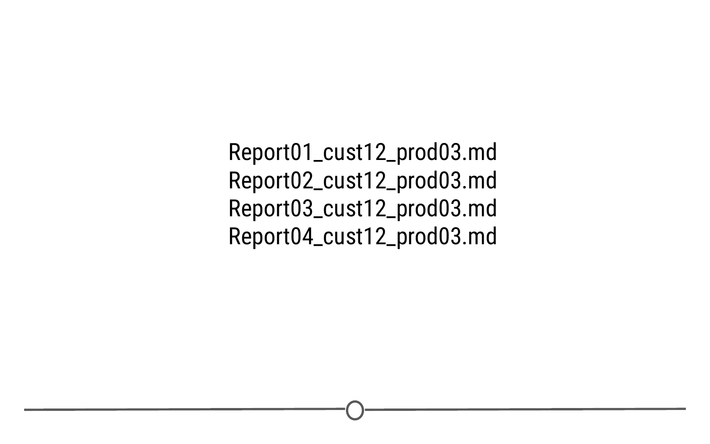

In addition to making sure your files can be nicely ordered, always left-pad numbers with zeros. That is first set a max number of digits for your numbers determined by how many files you will potentially have. So if you may not have more than 1000 files you can choose three digits. If not more than a hundred you can choose two digits and so on. Once you know the number of digits, left-pad numbers with zeros to satisfy the number of digits you determined in the first step. In other words, if you're using three digits, instead of writing 1 write 001 and instead of writing 17 write 017.


### Summary 

In this lesson we covered why and how you should organize your data projects. We first looked at how to set up the organizational framework of a project and which folders and subfolders you should start with. We then examined how to set up a README file and what details to include therein. And finally, we learned the three main rules consider when naming your files: machine readability, human readability, and ordered. 

### Slides

This lesson's slides can be found [here](https://docs.google.com/presentation/d/1ITYap0r_eVPJQd6lurFBoxaadrzOronxN8I-HAYVdlQ/edit?usp=sharing)  

