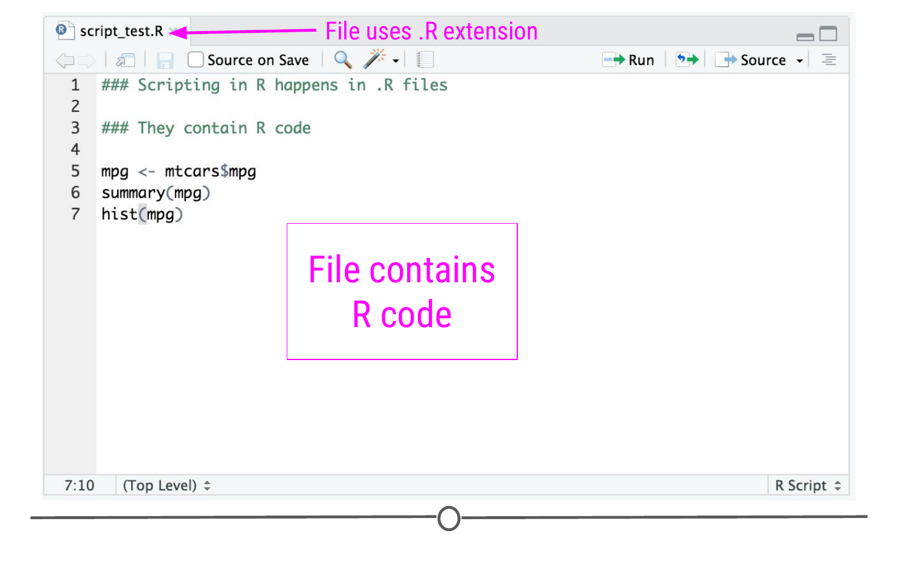
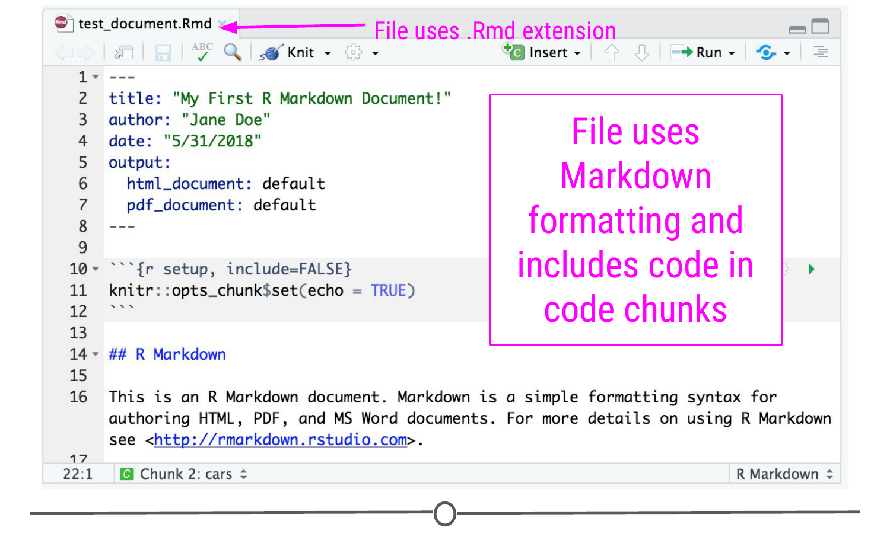
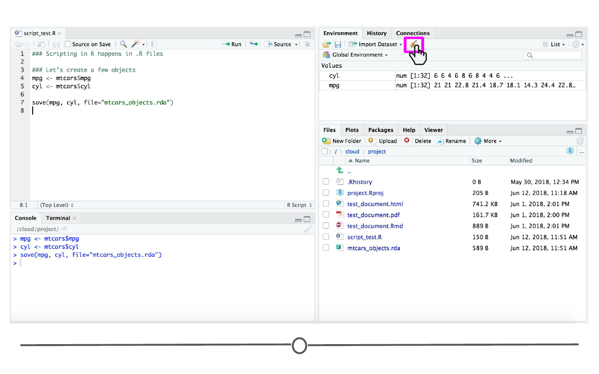
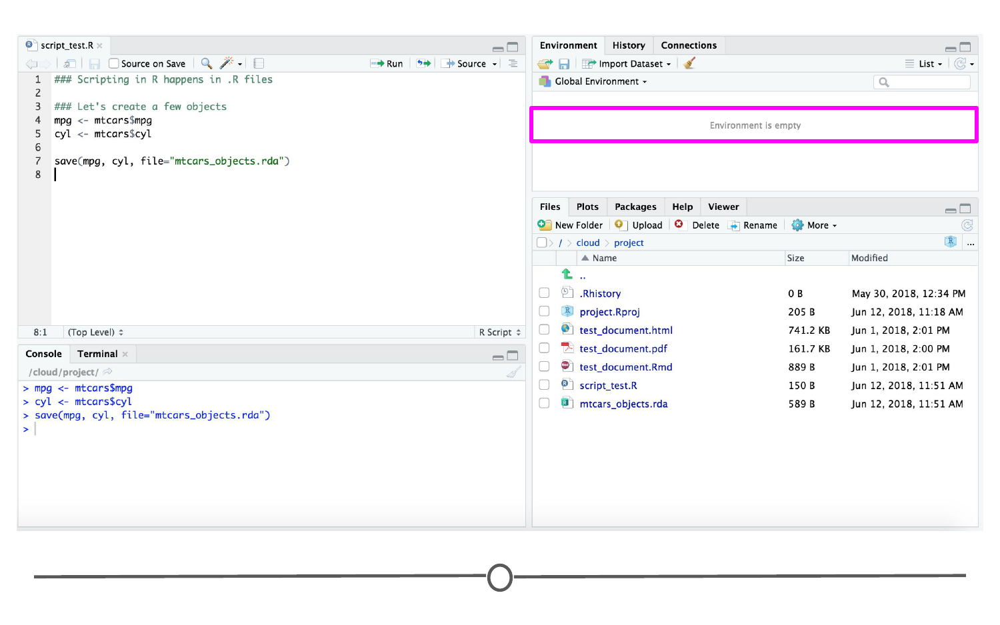
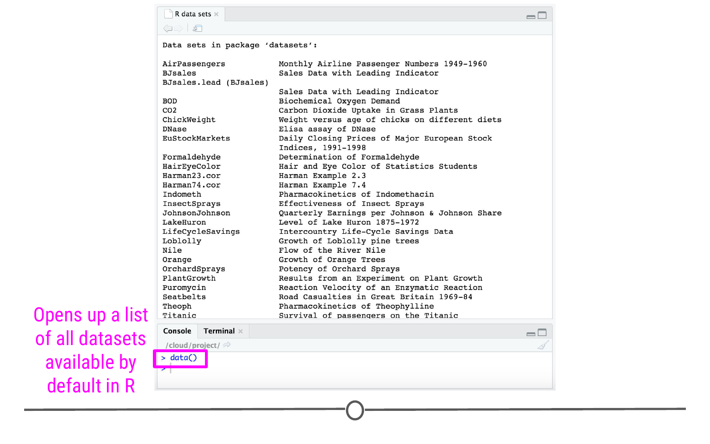

# Data in R

We've already discussed setting up your folder structure and discussed how to name your files, but what types of files are used by and produced by R? We haven't formalized exactly what all the different types of data are in R or how to access them. We'll discuss all of that in this lesson. 

### File Types in R

Before discussing further details about each type of file, we'll point out that the file extension (what comes after the period in the file name) specifies what type of file you're working with. While the extension matters (.R is different than .Rmd), capitalization does not matter for file extensions (.r is the same as .R). Just something to keep in mind as you start working with these types of files.

That said, while the *computer* will know what type of file it is regardless of capitalization, when you're writing code, capitalization *does* matter. If you try to read in a file named "script.r" but accidentally specify "script.R", your code won't be able to find the file. We mention this now so that as you start saving files you save files using consistent capitalization. The capitalization in each of the sections below is the capitalization we recommend. We'll summarize this here before walking through each one. For following file extensions, we recommend the following capitalization:

* Scripting files: .R
* R Markdown: .Rmd
* Saved R Objects: .rda
* Serialized R Objects: .rds
* R Project files .Rproj

#### R Script file (.R)

The most basic file type in R uses the .R file extension. R Script files contain code written in the R programming language. As you want to write R code and save this code, you'll save it as a .R file. 

To get started writing an R Script file, you'll go to File > New File > R Script along the menu at the top. This will open up a blank R Script file.

This R Script is where you would write R code. As you write code, you'll want to save this file. Here, in this example, you can see the R code we've written and that this file has been saved as "script_test.R."



#### R Markdown (.Rmd)

We've also introduced R Markdown files previously in the first course of this series. As a refresher, R Markdown documents use Markdown syntax *and* include code chunks with R code that will be run when the document is "Knit" into its final format (which can be PDF, HTML, or Word documents among others).

To get started writing an R Markdown document, you'll go to File > New File > R Markdown... After filling out the information in the pop-up window and clicking OK, an R Markdown document will open up. In this document you'll use Markdown syntax outside of code chunks and R code in the code chunks to generate your reports. 



R Markdown documents are great at producing reproducible reports that walk people through your data science process from start to finish.

#### Saved R objects (.rda, .RData)

As you write R code (say, in an .R file), you will inevitably create objects. For example, in the code you see here, `mpg` is an object created by this code that contains the data from the `mpg` column of the `mtcars` data frame and `cyl` an object from the `cyl` column of the `mtcars` data frame. 

```r
mpg <- mtcars$mpg
cyl <- mtcars$cyl
``` 


If I were to run these two lines of code, they would show up in the Console, and the objects `mpg` and `cyl` would now be visible in the Environment tab. 


Often you'll create objects that you won't need to save. However, from time to time you'll make changes to a data frame or generate an object that you'll want to use later. To save an object and use it later, you can save it as an R data file. These files contain objects that can be saved directly *from* and read directly *into* R using the commands `save()` and `load()`. And, in particular, R data files can **save multiple objects**.

To save the two objects `mpg` and `cyl` into an R Data file, you would do the following:

```r
save(mpg, cyl, file="mtcars_objects.rda")
```


The syntax for `save` requires you to specify the objects you want to save, separated by commas. Then, the filename you want this R data file to have is specified using the `file=` argument. When this line of code is run, the specified file (here, `mtcars_objects.rda`) appears in the Files tab within RStudio, demonstrating that this file has been created.

If in the future, if you were to want to load the objects `mpg` and `cyl` back into your R session, you would do this using `load()`. To do that here, we'll first have to remove these objects from RStudio. To accomplish this, click on the broom in the Environment tab of RStudio.  



After clicking "Yes" to confirm that you want to remove all objects, you'll see that `mpg` and `cyl` are no longer in your RStudio environment. They have been removed from RStudio.



To load them back in from `mtcars_objects.rda`, you would do the following:

```r
load("mtcars_objects.rda")
```

Note that you need to put quotes around the filename to specify that this is a file and *not* an object in R.

A second note is a reminder about file paths. Here, the file we want is in the directory we're working in. If that were not the case, you would have to specify the path to the file within the quotation marks (i.e. "path/to/file/mtcars_objects.rda")

When you run this line of code, you'll see that `cyl` and `mpg` are once again available objects in your RStudio Environment tab!


To recap, when you want to save multiple objects to be read in at a later time, you'll save them as an R data file (.rda). R Data files are generated using the `save()` function and read into R using the `load()` command.

#### Serialized R objects (.rds)

Serialized R object files are similar to R data files with the exception that they can only save a *single* R object at a time. When you only want to save a single object (say, `mpg`), these files are the best option.

To save a serialized R object file, you'll use the function `saveRDS()`. To read a serialized object file into R, you'll use the function `readRDS()`.

For example, to save the `mpg` object you would use the following:

```r
saveRDS(mpg, file="mpg.rds")
```


This will generate the file `mpg.rds`. 

To read this file back in, we'll first remove all objects from RStudio using the broom icon in the Environment tab as before and will then use the `readRDS()` function.

Unlike with .rda objects, when you read a .rds object back in, to make the object available, you have to assign the object a variable name. Otherwise, the contents of the object will just print to your Console. This is helpful because it doesn't matter what the name of the object was when you saved it. As long as you know the filename, you can pick a new object name. Here, we assign the serialized R object file to `mpg`, but we could have chosen a different object name.

```r
 mpg <- readRDS("mpg.rds")
```


#### R Project files (.Rproj)
 
R Projects are incredibly helpful files. In their simplest form, by working within an R Project and saving an .Rproj file, you are always able to pick back up on a project from where you left off. 
 
When you return to a project, your .RProj file will:

* start a new R session
* load the .RData file in your project's main directory if there is one (this is the same directory where your .Rproj file is)
* load the .Rhistory file into the RStudio History tab
* set the current working directory to the project directory.
* make previously edited documents available in the Files tab
* restore RStudio settings to what they were the last time the project was closed.

This allows you to pick back up from where you left off!

Then, when you leave to work on a different project, your .RData will be saved and your .Rproj file updated so that you can pick up from where you left off the next time you open the project!

### Datasets in R

Now that we've covered the main types of R files you'll be working with and generating in RStudio, we'll move on to formally discussing the datasets available within R.

You've previously seen and worked with datasets that are available to you in R. Specifically, you've seen examples that used the `iris` and `mtcars` datasets in previous lessons. However, we haven't covered how to find all available datasets that are included in R automatically, so we'll do that now.

To access a list of all the available datasets within R, you'll type `data()` into your Console. This will open up a file called "R data sets". You can scroll through this list to get a sense of what data sets are available. The name of the data set is in the first column while a brief description of the dataset is in the second column. 



 If one of these datasets looks interesting to you, say the "Orange" dataset, you can get more detailed information about the dataset by using the help function in R (`?`). 
 
```r
 ?Orange
```
 
This opens up an explanation in the Help tab of RStudio. Here, you can see a description of the dataset and can scroll to see what variables are included in this dataset. Finally, at the bottom of the Help window, you'll see examples of how to work with the dataset!
 

 
### Datasets in Packages

In addition to the datasets available by default to you in R, many packages (but not all!) also contain datasets that you can use. To see a list of what datasets are available from a specific package, you can again use the `data()` function, but you'll want to specify the name of the package using the `package=` argument

For example, to see a list of the datasets available from the ggplot2 package, you would want to use the following:

```r
data(package="ggplot2")
```


As before, this function will open up a list of the available datasets within that package. 

In order to use any of these datasets, however, you'll have to load the package using the `library()` function. After loading the package, you can then access the Help pages for a dataset, as previously, using `?`.

```r
library(ggplot2)
?msleep
```


### Other types of data in R

In addition to datasets included automatically in R/RStudio and those that are in R packages, there are lots of other types of data that can be read into R. This could be data from a Google Sheet or an Excel spreadsheet or data from a website. In the lessons covered in the next week of this class, we'll discuss how to get various files from different sources loaded into R. 

### Summary

In this lesson we've covered the main file formats that are used within R. Make sure you're comfortable with what the various file extensions mean and in what scenarios you would use the different file extensions. Additionally, we discussed how to access datasets that are available by default in RStudio as well as those that are available through specific R packages. You already have so much data at you fingertips, and we're just getting started!

### Additional Resources

* [R Studio Projects](https://support.rstudio.com/hc/en-us/articles/200526207-Using-Projects)
* [R Data files](https://thepracticalr.wordpress.com/2017/04/27/load-save-and-rda-files/)

### Slides

This lesson's slides can be found [here](https://docs.google.com/presentation/d/11jbX8L4RK_aj6kN_u3QrCCea5z0iyRNKHa9bIZ1Pd-w/edit?usp=sharing)
