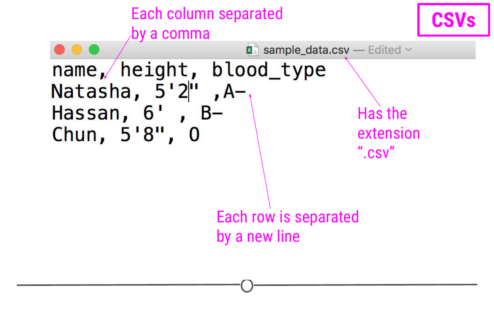
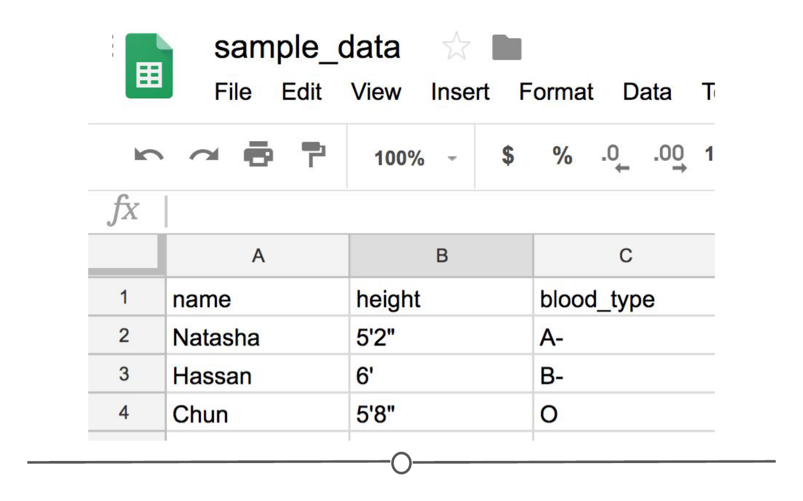
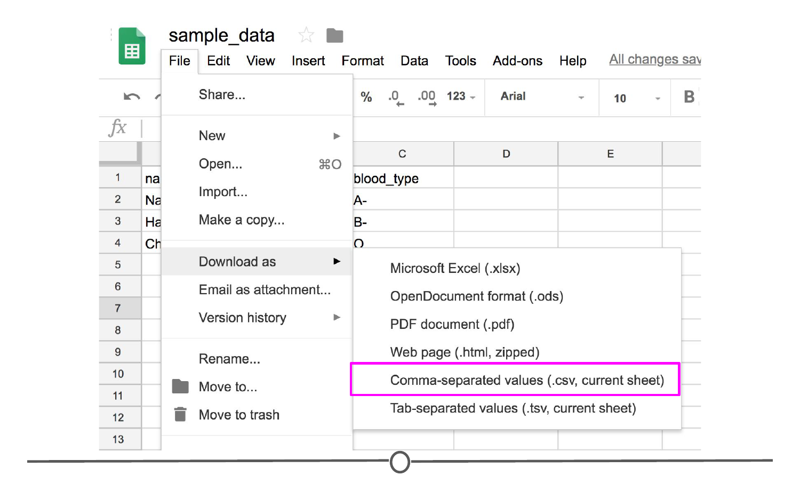
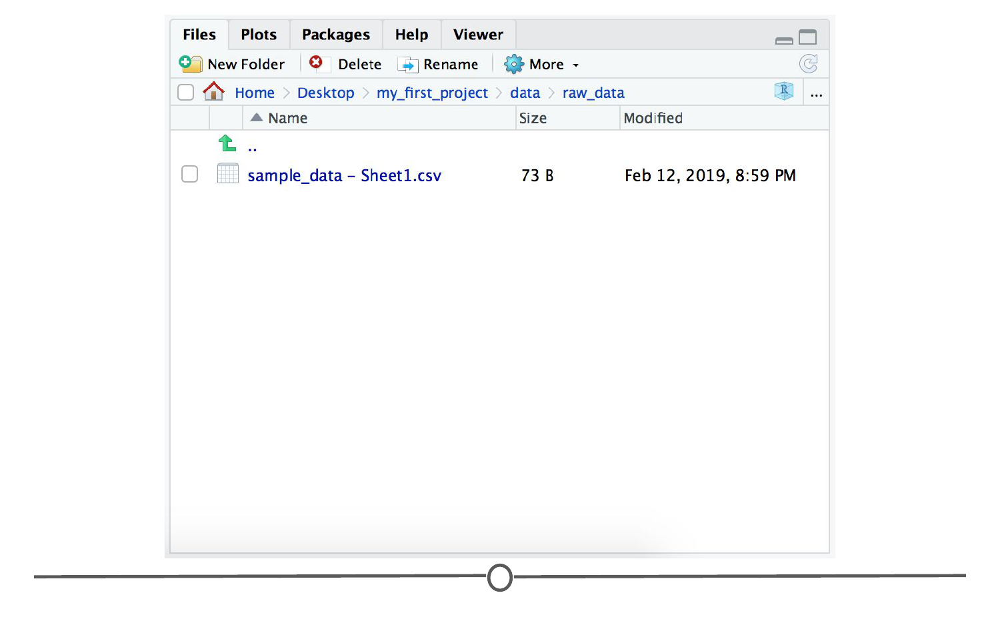
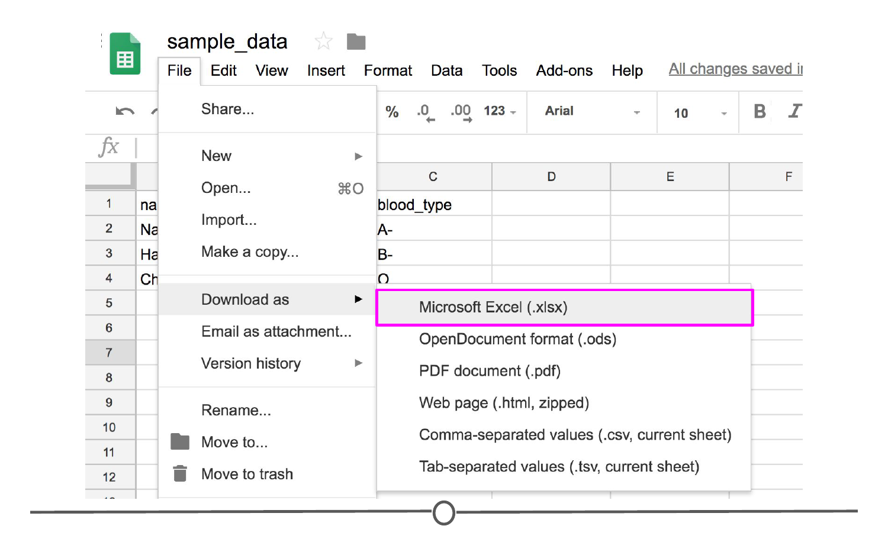

# Getting data from tabular sources

In this lesson, we'll discuss a few of the main file types used to store tabular data. To review briefly, **tabular data** are the type of data stored in spreadsheets. Information from different variables are stored in **columns** and each observation is stored in a different **row**. The values for each observation is stored in its respective **cell**.

### CSV files

**Comma-separated values (CSV)** files allow us to store tabular data in a simple format. CSVs are **plain-text** files, which means that all the important information in the file is represented by text (where text is numbers, letters, and symbols you can type on your keyboard). 

For example, consider a dataset that includes information about the heights and blood types of three individuals. You could make a table that has three columns (names, heights, and blood types) and three rows (one for each person) in Google Sheets or Microsoft Excel. However, there is a better way of storing this data in plain text without needing to put them in table format. CSVs are a perfect way to store these data. In the CSV format, the values of each column for each person in the data are separated by commas and each row (each person in our case) is separated by a new line. This means your data would be stored in the following format:



Notice that CSV files have a .csv extension at the end. You can see this above at the top of the file. One of the advantages of CSV files is their *simplicity*. Because of this, they are one of the most common file formats used to store tabular data. Additionally, because they are plain text, they are compatible with *many* different types of software. CSVs can be read by most programs. Specifically, for our purposes, these files can be easily read into R, where they can be better understood by the human eye. Here, you see the same CSV opened in Google Sheets, where it's more easily interpretable by the human eye:



As with any file type, CSVs do have their limitations. Specifically, CSV files are best used for data that have a consistent number of variables across observations. For example, in our example, there are three variables for each observation: "name", "height", and "blood_type". If, however, you had eye color and weight for the second observation, but not for the other rows, you'd have a different number of variables for the second observation than the other two. This type of data is not best suited for CSVs. However, whenever you have information with the same number of variables across all observations, CSVs are a good bet!

### Creating CSV files

Often, you will either be given the data or input the data yourself into a spreadsheet program, like Excel or Google Sheets. To create a .CSV file from these files to be read into R, you will either click File > Save as and change the file format to comma separated values (.csv) for Excel, or for Google Slides, you will click File > Download as and again change the file format to CSV. 



For practice, click on the following [link](https://docs.google.com/spreadsheets/d/1xujeqvLjK6nnrIrwJC-GPgagNvon3WYtCnhcufNzVCE/edit?usp=sharing) and download the Google Sheet as a CSV. 

### Reading CSV files into R

Now that you have a CSV file, let's discuss how to get it into R! First, you must know the location of your CSV - you will either refer to this location by its path (eg: /path/to/file/your.csv) or, more ideally, if you are working within an R project, you should move your CSV to your "raw_data" folder that you created at the beginning of the project, and that becomes the path to your file. 



While the file has now been placed in the appropriate folder within your project, it has not actually been loaded into your R environment yet! We'll do that now!

First, you will need to install the `readr` package, if you haven't already, and then load the library. To do so, input the following command: 

```r 
install.packages("readr")
library(readr)
```

Within this package, there is a function called `read_csv()` which will read the file into R. To do so, name the R object with a name that you will call from within R (we've assigned it here to be called `df_csv`), and then call the function to that object name using `read_csv()` where you will put the full file name (including the file extension .csv) in quotes between the parentheses. 

```r
## read CSV file into R
df_csv <- read_csv("data/raw_data/sample_data - Sheet1.csv")
```
Your data will now be imported into the R environment. If you use the command `head(df_csv)` you will see the first several rows of your imported data frame. 

```r
## check the contents of your new data frame 
head(df_csv)
```


Above, you see the simplest way to import a CSV file. However, as with many functions, there are other arguments that you can set to specify how to import your specific CSV file, a few of which are listed below. However, as usual, to see all the arguments for this function, use `?read_csv` within R.

- `col_names = FALSE` to specify that the first row does NOT contain column names. 
- `skip = 2` will skip the first 2 rows. You can set the number to any number you want. Helpful if there is additional information in the first few rows of your data frame that are not actually part of the table.
- `n_max = 100` will only read in the first 100 rows. You can set the number to any number you want. Helpful if you're not sure how big a file is and just want to see part of it

By default, `read_csv()` converts blank cells to missing data (NA).

Finally, while we introduced the function `read_csv` here and recommend that you use it, as it is the simplest and fastest way to read CSV files into R, we do want you to know that there *is* a function `read.csv()` which is available by default in R. You will likely see this function in others' code, so we just want to make sure you're aware of it.

### Excel files

While CSV files hold plain text as a series of values separated by commas, an Excel (or .xls or .xlsx) file holds information in a workbook that comprises both values and formatting (colors, conditional formatting, font size, etc.). You can think of Excel files as a fancier CSV file. While this may sound appealing, we'll remind you that CSV files can be read by many different pieces of software, but Excel files can only be viewed in specific pieces of software, and thus are generally less flexible. That said, many people save their data in Excel, so it's important to know how to work with them in RStudio. 

Let's go back to the Google Sheet that we created and instead of downloading the file locally as as CSV, download it as *Microsoft Excel (.xlsx)* file. 



As before, move the file to the raw_data folder of your project structure so that it is easy to find and read into R. 

#### Reading Excel files into R

To read this file into R, we'll have to use a different function than above, as this file is not a CSV file. We'll use the `read_excel()` function from the `readxl` package. Install the package first and then use the function `read_excel()` to read the Excel file into your R Environment. As above, by default, `read_excel()` converts blank cells to missing data (NA).

```r
## install and load package
install.packages("readxl")
library(readxl)

## read XLSX file into R 
df_excel <- read_excel("data/raw_data/sample_data.xlsx")

## check the contents of your new data frame 
head(df_excel)
```


### Text files

Another common form of data is text files that usually come in the form of TXT or TSV file formats. Like CSVs, text files are simple, plain-text files; however, rather than the columns being separated by commas, they are separated by tabs (represented by "\\t" in plain-text). Like CSVs, they don't allow text formatting (e.g. text colors in cells) and are able to be opened on many different software platforms. This makes them good candidates for storing data.

#### Reading TSV files into R

The process for reading these files into R is similar to what you've seen so far. We'll again use the `readr` package, but we'll instead use the `read_tsv()` function. 

```r
## read TSV file into R
df_tsv <- read_tsv("data/raw_data/sample_data - Sheet1.tsv")

## check the contents of your new data frame 
head(df_tsv)
```

#### Reading TXT files into R

Sometimes, tab-separated files are saved with the .txt file extension. TXT files can store tabular data, but they can also store simple text. Thus, while TSV is the more appropriate extension for tabular data that are tab-separated, you'll often run into tabular data that individuals have saved as a TXT file. In these cases, you'll want to use the more generic `read_delim()` function from `readr`.

Google Sheets does not allow tab-separated files to be downloaded with the .txt file extension (since .tsv is more appropriate); however, if you were to have a file "sample_data.txt" uploaded into your RStudio project, you could use the following code to read it into your R Environment, where "\\t" specifies that the file is tab-delimited. 

```r
## read TXT into R
df_txt <- read_delim("sample_data.txt", delim = "\t")

## check the contents of your new data frame 
head(df_txt)
```

This function allows you to specify how the file you're reading is delimited. This means, rather than R knowing by default whether or not the data are comma- or tab- separated, you'll have to specify it within the argument `delim` in the function.

`read_delim()` is a more generic version of `read_csv()`. What this means is that you *could* use `read_delim()` to read in a CSV file. You would just need to specify that the file was comma-delimited if you were to use that function.

```r
## read CSV into R using read_delim by specifying the delimiter as a comma
df_csv <- read_delim("sample_data.csv", delim = ",")
```

### Exporting Data in R to CSV

Next, we will talk about how to export data from R. So far we learned about reading data into R. However, sometimes you would like to share *your* data with others and thus need to export your data from R to some format that your collaborators can see. 

As discussed above, CSV format is a good candidate because of its simplicity and compatibility. Let's say you have a data frame in the R environment that you would like to export as a CSV. To do so, you could use `write_csv()` from the `readr` package. 

Since we've already created a data frame named `df_csv`, we can export it to a CSV file using the following code. After typing this command, a new CSV file called `my_csv_file.csv` will appear in the Files tab and in your project folder.

```r
write_csv(df_csv, path = "my_csv_file.csv")
```

You could similarly save your data as a TSV file using the function `write_tsv()` function.

We'll finally note that there are default R functions `write.csv()` and `write.table()` that accomplish similar goals. You may see these in others' code; however, we recommend sticking to the intuitive and quick `readr` functions discussed in this lesson.

### Previewing your data

As a final aside, we are going to go through some of the packages and functions that allow you to quickly view/preview your R objects that you've just read in. 

Above, we showed a little bit about how you can use `head()` to see the first few lines of a dataframe/object; there is a related function called `tail()` to see the last few lines of a dataframe/object. In the R console, type `?head` or `?tail` to see some of the options associated with these functions. Of particular note is the `n=` argument, to specify how many rows of your dataframe to display. 

Another helpful function is `str()` which allows you to see the **str**ucture of an R object. Let's see how the output of this function compares to `head()` using a dataset included in R, `mtcars`. 

```r 
head(mtcars)
str(mtcars)
```


So, while `head()` allows you to see how the object is structured and the rownames and some of the data included in the object, `str()` includes some of the same information, but also tells you what kind of object you are working with (here, data.frame) as well as the dimensions of the object (here, 32 observations across 11 variables) and what type of data the observations are (here, they are all numbers, but other classes could include characters ("chr") or factors, etc.). 

Finally, two functions used to preview and summarize data in R objects include **glimpse** and **skim**, from the dplyr and skimr packages, respectively. Install these packages, if you haven't already, and then see how their respective functions preview the `mtcars` dataset. 

```r 
## install dplyr, if you have not already (you probably have)
install.packages("dplyr")

## install skimr
install.packages("skimr")

## load these libraries
library(dplyr)
library(skimr)

## call the functions glimpse() and skim() on the mtcars dataset 
glimpse(mtcars)
skim(mtcars)
```


From this, we can see that `glimpse()` is fairly similar in output to `str()` except it displays more observations per variable. `skim()` on the other hand, provides some summary statistics including the number of observations (n), the average (mean), the standard deviation (sd) and even outputs a little histogram of the distribution of your observations within each variable.

### Summary 

In this lesson, we covered how to read in and write out some of the most common file types you will encounter in your data science projects. CSV and TSV files are very similar formats with the column separation being specified by commas and tabs, respectively. Excel files are another common form of tabular data but are not stored as plain-text documents so do require specific software (Excel) or conversion to a plain text format (eg: using `read_excel`). We also looked at some ways to preview or summarize your data, including `head(), tail(), str(), glimpse()`, and `skim()`. 

### Slides

This lesson's slides can be found [here](https://docs.google.com/presentation/d/1sSTjnrHliPA6hngjNxA9f5oYK5c3pbanEq3yuwTXdAM/edit?usp=sharing)  
