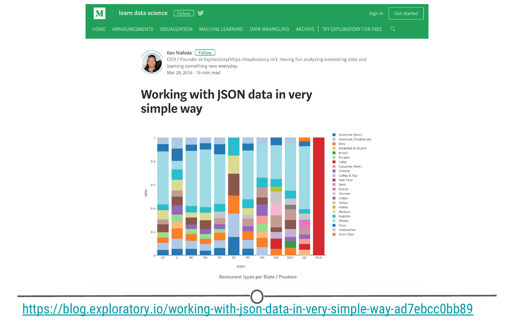
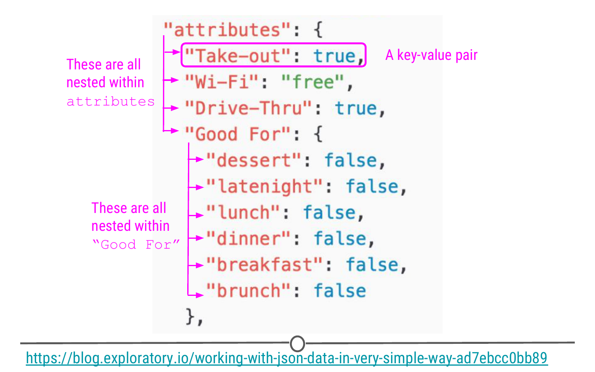
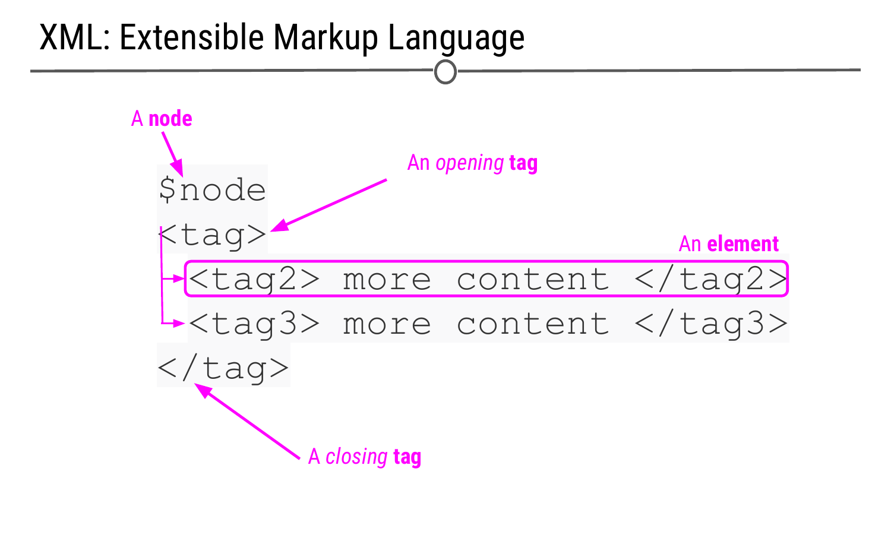

# Getting data from hierarchical sources

In the previous lesson we talked about a common file type that you will encounter in data science projects - tabular data. In this lesson, we'll talk about another common format that you may encounter, especially if you are going to be requesting data from APIs or web scraping. These data are often obtained in either JSON or XML format, which are both hierarchical forms of data (meaning data is nested within other pieces of data), the problem with each being that the data is not already structured in a table, ready for import into R! By the end of this lesson, you should be able to recognize what JSON and XML data look like and how to import these data into R. We will talk about how to get data from APIs or via web scraping in the last two lessons of this week of the course, but before we get there, we thought it prudent that you know how to recognize and deal with the types of data that they produce!

### What is JSON data and what does it look like? 

JSON (JavaScript Object Notation) is a text-based way to send information between a browser and a server. JSON is easy for humans to read and to write. Thus, it makes sense that API calls would return information in the JSON format. JSON data adhere to certain rules in how they are structured. For simplicity, JSON format requires objects to be comprised of **key-value pairs**, in which the **key** is analogous to the variable in a classic data table, and the pairs are the observations, both formatted in a very specific way. For example, an example of data formatted in JSON format could be: `{"Name": "Isabela"}`, "Name" would be a key, "Isabela" would be a value, and together they would be a key-value pair. 

Let's take a look at how JSON data looks in R. First, we are going to make a JSON object in R (similar to last time where we made a CSV in Google Sheets and loaded it into R). To do so, copy the following code into RStudio. 

```r
## generate a simple JSON object
json <-
'[
  {"Name" : "Woody", "Age" : 40, "Occupation" : "Sheriff"}, 
  {"Name" : "Buzz Lightyear", "Age" : 34, "Occupation" : "Space Ranger"},
  {"Name" : "Andy", "Occupation" : "Toy Owner"}
]'

## take a look
json
```

This format cannot, as it is, be easily worked with within R; however, there is an R package to take data from JSON format to an object-based format that *can* be worked with in R as if it were originally a data frame from a tabular data source. The R package `jsonlite` is just what to work with whenever you have data in JSON format. When using the defaults of the function `fromJSON()`, `jsonlite` will take the data from JSON array format and helpfully return a data frame. 

```r
# Using jsonlite to convert a JSON object to an R data frame

## Install and load the jsonlite package 
install.packages("jsonlite")
library(jsonlite)

## Use the fromJSON() function to convert to a dataframe
mydf <- fromJSON(json)

## See how the data is now formatted
mydf
```


Data frames can also be returned to their original JSON format using the function: `toJSON()`.

```r
## Use the toJSON() function to convert the dataframe back to JSON format
json2 <- toJSON(mydf)

## Compare how the JSON object created by the function compares to the JSON objec we input
json2
json
```


In addition to JSON data using key-pairs, JSON data are *nested* and *hierarchical*. This means that key-pairs can be organized into different levels (hierarchical) with some levels of information being stored *within* other levels (nested). You will be able to see what this means in practice in the following example where data was downloaded from Yelp in JSON format and analysed in R. 

[Kan Nishida](https://blog.exploratory.io/@kanaugust), a data scientist, was interested in [understanding what restaurant types were found most frequently in each state or province](https://blog.exploratory.io/working-with-json-data-in-very-simple-way-ad7ebcc0bb89). To do this, he used JSON data originally released from Yelp. He wrangled the data from JSON format into a tabular format using `jsonlite` and other data wrangling packages, such as `dplyr`, to ultimately determine the types of restaurants found most frequently in a number of different states and provinces.



As we alluded to above, we can see a snippet of JSON data here from Yelp explaining a restaurant's qualities exemplifying how JSON data can be hierarchical and nested. Here, we're looking at the `attributes` of this restaurant. Within `attributes`, there are four *nested* categories: `Take-out`, `Wi-Fi`, `Drive-Thru`, and `Good For`. In the *hierarchy*, attributes is at the top, while these four categories are within attributes. Within one of these attributes `Good For`, we see another level within the hierarchy. In this third level we see a number of other categories nested within `Good For`. This should give you a slightly better idea of how JSON data are structured.



### What is XML data and what does it look like? 

**Extensible Markup Language (XML)**, is another human- and machine-readable language that is used frequently by web services and APIs. However, instead of being based on key-value pairs, XML relies on **nodes**, **tags**, and **elements**. The author defines these *tags* to specify what information is included in each *element* of the XML document and allows for elements to be nested within one another. The **nodes** define the hierarchical structure of the XML (which means that XML is hierarchical and nested like JSON)! As before, our goal, once we recognize data to be in XML format, is to convert the data into a dataframe in R that we can easily work with. 



XML accomplishes the same goal as JSON, but it just does it in a different format. Thus, the two formats are used for similar purposes -- sharing information on the web; however, because the format in which they do this is different, a different R package is needed to process XML data. This package is called `xml2`.

To see an example of using `xml2` to parse XML data after scraping a website, check out this post from [José Roberto Ayala Solares](https://towardsdatascience.com/@jroberayalas) where he took the text from a New York Times article called ["Trump's Lies"](https://www.nytimes.com/interactive/2017/06/23/opinion/trumps-lies.html), scraped the data from the web (obtaining it in XML), and then [wrangled it into a tidy format](https://towardsdatascience.com/web-scraping-tutorial-in-r-5e71fd107f32) using `xml2`.

### Summary
  
In this lesson, our goal is to make you aware that data from the Internet (and APIs in particular) will often come in either JSON or XML format. Thus, the JSON and XML examples provided here only give you a bit of an idea of what JSON and XML data are and how to work with them. Nevertheless, the more frequently you retrieve data from APIs and the Internet, the more comfortable you'll have to become with both JSON and XML. And, `jsonlite` and `xml2` will help you as you work with these data in R!

### Additional Resources

#### jsonlite
* [jsonlite: Getting Started](https://cran.r-project.org/web/packages/jsonlite/vignettes/json-aaquickstart.html)
* [blogpost on jsonlite](https://www.opencpu.org/posts/jsonlite-a-smarter-json-encoder/), by [Jeroen Ooms](https://github.com/jeroen)
* [JSON information](https://www.json.org/)
* [JSON : What It Is, How It Works, & How to Use It](https://www.copterlabs.com/json-what-it-is-how-it-works-how-to-use-it/)

#### XML
* [An Introduction to XML](https://www.sitepoint.com/really-good-introduction-xml/)
* [`xml2` package](https://blog.rstudio.com/2015/04/21/xml2/)
* [`xml2` Trump's Lies example](https://towardsdatascience.com/web-scraping-tutorial-in-r-5e71fd107f32)

### Slides

This lesson's slides can be found [here](https://docs.google.com/presentation/d/1MiI8rUDDpAigPA1ZbtnQZqDujQ86FRsSSBVQPK-g6MQ/edit?usp=sharing)  
