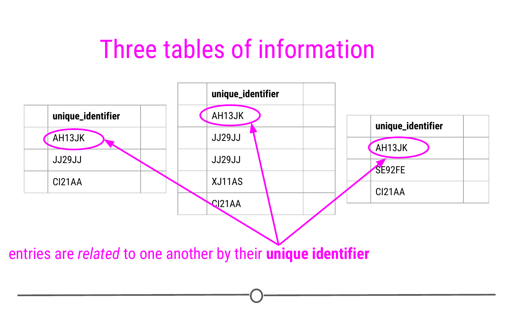
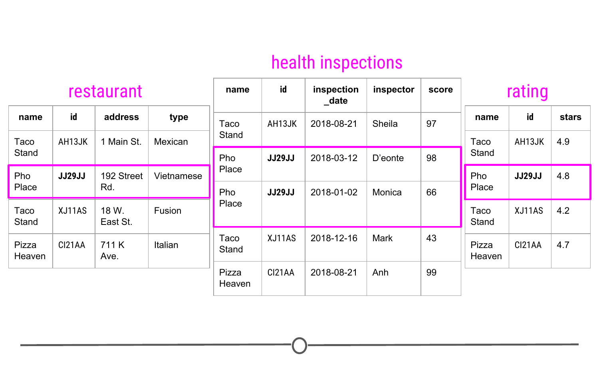
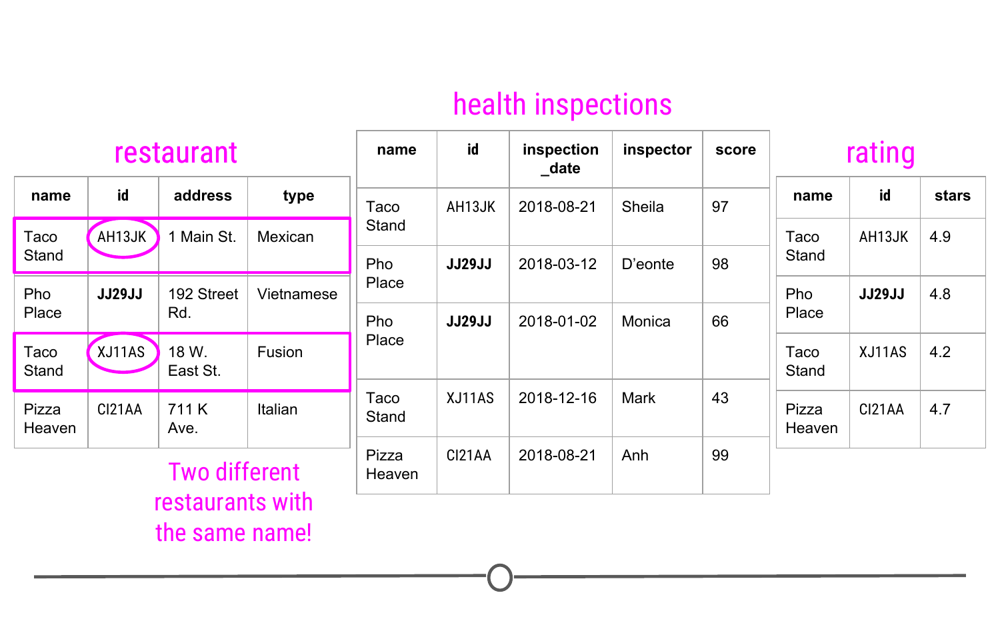
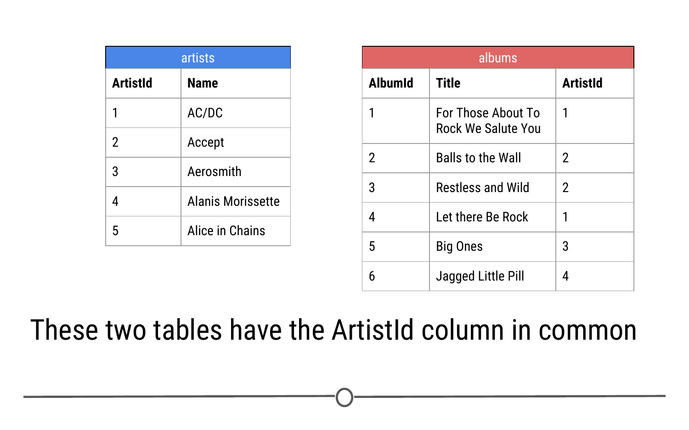
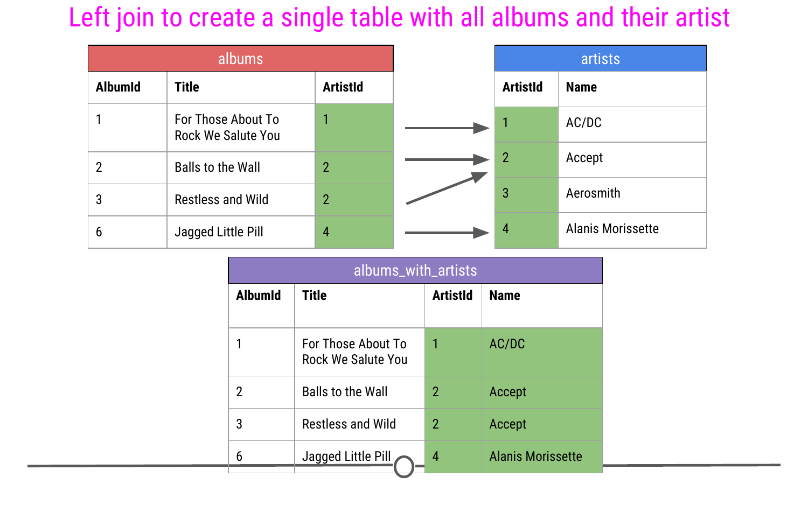

# Getting data from databases

In lessons up to this point, the analyses you've done have generally been carried out with a single dataset (eg: data from a single Google Sheet). However, there will be many cases as a data scientist where the data for your project will be stored across a number of different spreadsheets that are all related to one another. In this lesson, we'll discuss what relational data are, why you would want to store data in this way, and how to work with these types of data in RStudio.

### Relational Data

Relational data can be thought of as information being stored across many tables, with each table being related to all the other tables. Each table is linked to every other table by a set of **unique identifiers**. 



To better understand this, let's consider a toy example. We mentioned this example in the introductory lesson in this course, and we'll return to it now. Consider a town where you have a number of different restaurants. In one table you have information about these restaurants including, where they are located and what type of food they serve. You then have a second table where information about health and safety inspections is stored. Each inspection is a different row and the date of the inspection, the inspector, and the safety rating are stored in this table. Finally, you have a third table. This third table contains information pulled from an API, regarding the number of stars given to each restaurant, as rated by people online. Each table contains different bits of information; however, there is a common column `id` in each of the tables. This allows the information to be linked between the tables. The restaurant with the `id` "JJ29JJ" in the restaurant table would refer to the same restaurant with the `id` "JJ29JJ" in the health inspections table, and so on. The values in this `id` column are known as `unique identifiers` because they uniquely identify each restaurant. No two restaurants will have the same `id`, and the same restaurant will always have the same `id`, no matter what table you're looking at. The fact that these tables have unique identifiers connecting each table to all the other tables makes this example **relational data**.



#### Why relational data?

Storing data in this way has a number of advantages; however, the three most important are:

1. Efficient Data Storage
2. Avoids Ambiguity
3. Privacy

**Efficient Data Storage** - By storing each bit of information in a separate table, you limit the need to repeat information. Taking our example above, imagine if we included everything in a single table. This means that for each inspection, we would copy and paste the restaurant's address and type every time the facility is inspected. If a restaurant were inspected 15 times, this same information would be unnecessarily copy and pasted in each row! To avoid this, we simply separate out the information into different tables and relate them by their unique identifiers.

**Avoids Ambiguity** - Take a look at the first table: "restaurant" here. You may notice there are two different restaurants named "Taco Stand." However, looking more closely, they have a different id *and* a different address. They're even different types of restaurants. So, despite having the same name, they actually are two different restaurants. The unique identifier makes this immediately clear!



**Privacy** - In using relational data, if there is ever information that is private and only some people should have access to, using this system simplifies that. You can restrict access to some of the data to ensure only those who should have access are able to access the data.

### Relational Databases: `SQL`

Now that we have an idea of what relational data are, let's spend a second talking about how relational data are stored. Relational data are stored in databases. The most common database is **SQLite**. In order to work with data in databases, there has to be a way to **query** or search the database for the information you're interested in. **SQL** queries search through SQLite databases and return the information you ask for in your query.

For example, a query of the above example may look to obtain information about any restaurant that was inspected after July 1st of 2018. One would then use SQL commands to carry out this query and return the information requested.

While we won't be discussing how to write SQL commands in-depth here, we *will* be discussing how to use the R package `RSQLite` to connect to a SQLite database using `RSQLite` and how to work with relational data using `dplyr` and `dbplyr`.

### Connecting to Databases: `RSQLite`

To better understand databases and how to work with relational data, let's just start working with data from a database! The data we'll be using are from a database frequently used to practice working with relational data: `chinook.db`. The database includes 11 tables with data that represents a digital media store. The data includes information generally related to media, artists, artists' work, and those who purchase artists' work (customers). More information about the details of how the tables are related to one another can be found [here](http://www.sqlitetutorial.net/sqlite-sample-database/). For our purposes though, we're only going to describe two of the tables we'll be using in our example in this lesson. We're going to be looking at data in the `artists` and `albums` tables. `artists` and `albums` are related by the column `ArtistId`.


Without any more details, let's get to it! Here you'll see the code to install and load the `RSQLite` package. You'll then download the `chinook` sample database, connect to the database, and first obtain a list of the tables in the database:

```r
## install and load packages
## this may take a minute or two
install.packages("RSQLite")
library(RSQLite)
library(httr)

## specify driver
sqlite <- dbDriver("SQLite")

## download data
url <- "http://www.sqlitetutorial.net/wp-content/uploads/2018/03/chinook.zip"
GET(url, write_disk(tf <- tempfile(fileext = ".zip")))
unzip(tf)

## Connect to Database
db <- dbConnect(sqlite, 'chinook.db')

## list tables in database
dbListTables(db)
```

The output from `dbListTables()` will include 13 tables. Among them will be the two tables we're going to work through in our example: `artists` and `albums`.


In this example, we're downloading a database and working with the data locally. However, more often, when working with SQLite databases, you'll be connecting remotely. Using the `RSQLite` package is particularly helpful in this case because it allows you to connect to and query the database from R without reading all the data in. This is helpful in the case of very large databases, where you'll want to avoid copying all the data and will instead want to only work with the parts of the database you need. 

### Working with Relational Data: `dplyr` & `dbplyr`

To access these tables within RStudio, we'll have to install the package `dbplyr`, which enables us to access the parts of the database we're going to be working with. While `dbplyr` has to be loaded to work with databases, you likely won't notice that you're using it beyond that. Otherwise, you'll just work with the files as if you were working with `dplyr`'s functions!

After installing and loading `dbplyr`, we'll be able to use the helpful `tbl()` function to extract the two tables we're interested in working with!

```r
## install and load packages
install.packages("dbplyr")
library(dbplyr)
library(dplyr)

## get two tables
albums <- tbl(db, "albums")
artists <- tbl(db, "artists")

## preview how these tables look 
albums 
artists
```
Doing so, we see that the two tables have the `ArtistId` column in common. 



We'll spend a bit more time on this topic later, but for now, we are going to simply join these two data sets together on the basis of this common ID to create a single data frame. For this example, we are going to want to include the artist name for each of the albums.  

```r
# Perform a "left" join to create an R object of the albums that includes the artist names and not just ID
albums_with_artists <- left_join(albums, artists)

# Preview the data and see that a new column with artist Name has been added!
albums_with_artists

```



We will have an entire lesson dedicated to joins in next week, but for now, you can have a preview of how useful these commands can be in bringing together data from multiple sources into a single object on the basis of a common column. 

### How to Connect to a Database Online 

As mentioned briefly above, most often when working with databases, you won't be downloading the entire database. Instead, you'll connect to a server somewhere else where the data live and query the data (search for the parts you need) from within R. 

For example, in this lesson we downloaded the entire `chinook` database, but only ended up using `artists` and `albums`. In the future, instead of downloading *all* the data, you'll just connect to the database and work with the parts you need.

This will require connecting to the database with `host`, `user`, and `password`. This information will be provided by the database's owners, but the syntax for entering this information into R to connect to the database would look something like what you see here:

```r
con <- DBI::dbConnect(RMySQL::MySQL(), 
  host = "database.host.com",
  user = "janeeverydaydoe",
  password = rstudioapi::askForPassword("database_password")
)
```

While not being discussed in detail here, it's important to know that connecting to remote databases from R is possible and that this allows you to query the database without reading *all* the data from the database into R. 

For some practice on using R to query SQL databases, follow these `RSQLite` tutorials [Part 1](https://taylorwhitten.github.io/blog/RSQLite1) [Part 2](https://taylorwhitten.github.io/blog/RSQLite2), by [Taylor W. Brown](http://www.taylorwhittenbrown.com/) and [Josh R. Bruce](https://joshuarbruce.com/).

### Summary

In this lesson we discussed what relational data are, the benefits of relational data, and how to work with them in R. This led to a discussion about the package `RSQLite`, which allows you to connect to and make queries from databases. Finally, we touched *very* briefly on how to connect to a remote database from within R. 

### Additional Resources

* [Relational Data - Chapter 13](http://r4ds.had.co.nz/relational-data.html#introduction-7), by Hadley Wickham
* [Tidy Animated Verbs](https://github.com/gadenbuie/tidyexplain#readme), by [Garrick Aden-Buie](https://www.garrickadenbuie.com/) to visualize joins in relational data
* [SQL databases and R](https://datacarpentry.org/R-ecology-lesson/05-r-and-databases.html), from Data Carpentry

### Slides

This lesson's slides can be found [here](https://docs.google.com/presentation/d/1K-tRg-019YTwYq1CRilX3zQcvzodnn8Q1jsQE6NrUrU/edit?usp=sharing)  
