# Getting data from APIs

In the first lesson we mentioned that **Application Programming Interfaces (APIs)** are, in the most general sense, software that allow two different web-based applications to communicate with one another over the Internet. Modern APIs conform to a number of standards. This means that many different applications are using the same approach, so a single package in R is able to take advantage of this and communicate with many different applications, as long as the application's API adheres to this generally agreed upon set of "rules". In this lesson, we'll install this package and interface with a few different APIs to cover the general concepts. 

### API access

The R package that we'll be using to acquire data and take advantage of this is called `httr`. This package name suggests that this is an "R" package for "HTTP". So, we know what R is, but what about HTTP? 

You've probably seeing HTTP before at the start of web addresses, eg: http://www.gmail.com, so you may have some intuition that HTTP has something to do with the Internet, which is absolutely correct! HTTP stands for **Hypertext Transfer Protocol**. In the broadest sense, HTTP transactions allow for messages to be sent between two points on the Internet. You, on your computer, can request something from a web page, and the protocol (HTTP) allows you to connect with that webpage's server, do something, and then return to you whatever it is you asked for. 

Working with a web API is similar to accessing a website in many ways. When you type a URL (eg: www.google.com) into your browser, information is sent from your computer to your browser. Your browser then interprets what you're asking for and displays the website you've requested. Web APIs work similarly. You **request** some information from the API and the API sends back a **response**.

The `httr` package will help you carry out these types of requests within R. Let's stop talking about it and see an actual example!


### Getting Data: `httr`

HTTP is based on a number of important verbs : `GET()`, `HEAD()`, `PATCH()`, `PUT()`, `DELETE()`, and `POST()`. For the purposes of retrieving data from the Internet, you may be able to guess which verb will be the most important for our purposes! `GET()` will allow us to *fetch* a resource that already exists. We'll specify a URL to tell `GET()` where to go look for what we want. While we'll only highlight `GET()` in this lesson, for full understanding of the many other HTTP verbs and capabilities of `httr`, refer to the additional resources provided at the end of this lesson. 

`GET()` will access the API, provide the API with the necessary information to request the data we want, and retrieve some output. 

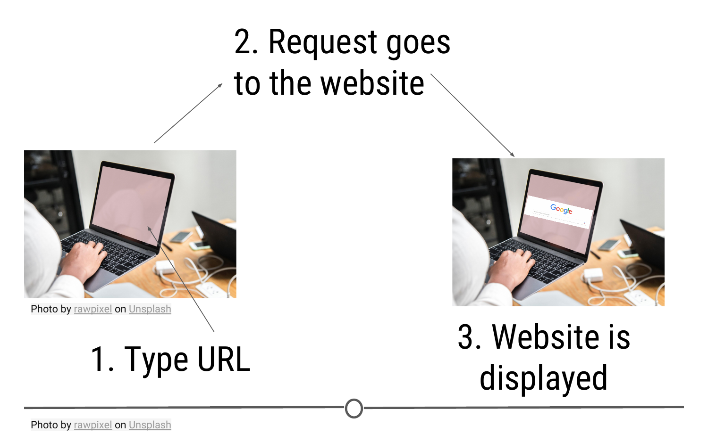

### Example 1: GitHub's API

The example is based on a wonderful [blogpost](https://www.tylerclavelle.com/code/2017/randapis/) from [Tyler Clavelle](https://www.tylerclavelle.com/about/). In this example, we will take advantage of GitHub's API, because it's accessible to anyone. Other APIs, while often freely-accessible, require credentials, called an **API key**. We'll talk about those later, but let's just get started using [GitHub's API](https://developer.github.com/v3/) now!

#### API Endpoint

The URL you're requesting information from is known as the **API endpoint**. The documentation from GitHub's API explains what information can be obtained from their API endpoint: [https://api.github.com](https://api.github.com). That's the base endpoint, but if you wanted to access a particular individual's GitHub repositories, you would want to modify this base endpoint to: `https://api.github.com/users/username/repos`, where you would replace `username` with *your* GitHub username.  

#### API request: `GET()`

Now that we know what our API endpoint is, we're ready to make our **API request** using `GET()`. 

The goal of this request is to obtain information about what repositories are available in *your* GitHub account. To use the example below, you'll want to change the username `janeeverydaydoe` to your GitHub username.

```
## load package
library(httr)
library(dplyr)
 	
## Save GitHub username as variable
username <- 'janeeverydaydoe'

## Save base endpoint as variable
url_git <- 'https://api.github.com/'

## Construct API request
api_response <- GET(url = paste0(url_git, 'users/', username, '/repos'))
```

Note: In the code above, you see the function `paste0()`. This function concatenates (links together) each of the pieces within the parentheses, where each piece is separated by a comma. This provides `GET()` with the URL we want to use as our endpoints! 

#### API response: `content()`

Let's first take a look at what other variables are available within the `api_response` object:

```r
## See variables in response
names(api_response)
```


While we see ten different variables within `api_response`, we should probably first make sure that the request to GitHub's API was successful. We can do this by checking the status code of the request, where "200" means that everything worked properly:

```r
## Check Status Code of request
api_response$status_code
```

But, to be honest, we aren't really interested in just knowing the request worked. We actually want to see what information is contained on our GitHub account. 

To do so we'll take advantage of `httr`'s `content()` function, which as its name suggests, extracts the contents from an API request.

```r
## Extract content from API response
repo_content <- content(api_response)
```


You can see here that the length of `repo_content` in our case is 6 by looking at the Environment tab. This is because the GitHub account `janeeverydaydoe` had six repositories at the time of this API call. We can get some information about each repo by running the function below:

```r
## function to get name and URL for each repo
lapply(repo_content, function(x) {
  df <- data_frame(repo = x$name,
                   address = x$html_url)}) %>% 
  bind_rows()
```

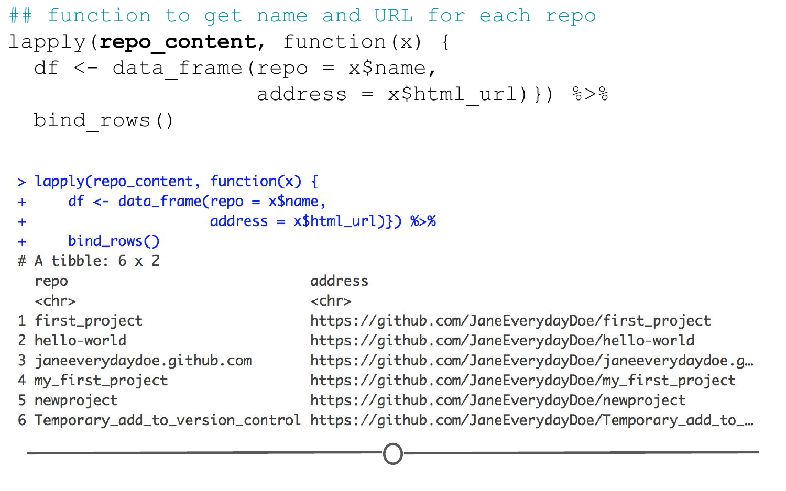

Here, we've pulled out the name and URL of each repository in Jane Doe's account; however, there is *a lot* more information in the `repo_content` object. To see how to extract more information, check out the rest of Tyler Clavelle's wonderful post [here](https://www.tylerclavelle.com/code/2017/randapis/).

### Example 2: Obtaining a CSV

For this example, the data are available for download from this link: [data.fivethirtyeight.com](https://data.fivethirtyeight.com/), but are also hosted on GitHub [here](https://github.com/fivethirtyeight/data), and we will want to use the specific URL for this file: [https://raw.githubusercontent.com/fivethirtyeight/data/master/steak-survey/steak-risk-survey.csv](https://raw.githubusercontent.com/fivethirtyeight/data/master/steak-survey/steak-risk-survey.csv) in our `GET()` request.

To do so, we would do the following:

```r
## Make API request
api_response <- GET(url = "https://raw.githubusercontent.com/fivethirtyeight/data/master/steak-survey/steak-risk-survey.csv")

## Extract content from API response
df_steak <- content(api_response, type="text/csv")
```


Here, we again specify our url within `GET()` followed by use of the helpful `content()` function from `httr` to obtain the CSV from the `api_response` object. `df_steak` includes the data from the CSV directly from the GitHub API, without having to download the data first!

### API keys

Not all API's are as "open" as GitHub's. For example, if you ran the code for the first example above exactly as it was written (and didn't change the GitHub username), you would have gotten information about the repos in janeeverydaydoe's GitHub account. Because it is a fully-open API, you're able to retrieve information about not only your GitHub account but also other users' public GitHub activity. This makes good sense because sharing code among public repositories is an important part of GitHub.

Alternatively, while Google also has an API (or rather, *many* API's), they aren't quite as open. This makes good sense. There is no reason I should have access to the files on someone else's Google Drive account. Controlling whose files one can access through Google's API is an important privacy feature. 

In these cases, what is known as a key is required to gain access to the API. **API keys** are obtained from the website's API site (e.g. for Google's APIs, you would start [here](https://developers.google.com/apis-explorer). Once acquired, these keys should **never be shared on the Internet**. There is a reason they're required, after all. So, be sure to **never push a key to GitHub or share it publicly**. (If you do ever accidentally share a key on the Internet, return to the API and disable the key immediately.)

For example, to access the Twitter API, you would obtain your key and necessary tokens from [Twitter's API](https://developer.twitter.com/en/docs/tweets/search/overview) and replace the text in the `key`, `secret`, `token` and `token_secret` arguments below. This would authenticate you to use Twitter's API to acquire information about your home timeline. 

```r
myapp = oauth_app("twitter",
                   key = "yourConsumerKeyHere",
                   secret = "yourConsumerSecretHere")
sig = sign_oauth1.0(myapp,
                    token = "yourTokenHere",
                    token_secret = "yourTokenSecretHere")
homeTL = GET("https://api.twitter.com/1.1/statuses/home_timeline.json", sig)
```

### Example 3: YouTube 

Bringing together the ideas from above, we are going to form an API query to the Google API for YouTube. To do so, first we are going to need an API key to get access to the YouTube API. 

Go to: [https://console.developers.google.com/](https://console.developers.google.com) and login with your Google account (please create one if you don't have an account already). After logging in, you should see a screen like below: 

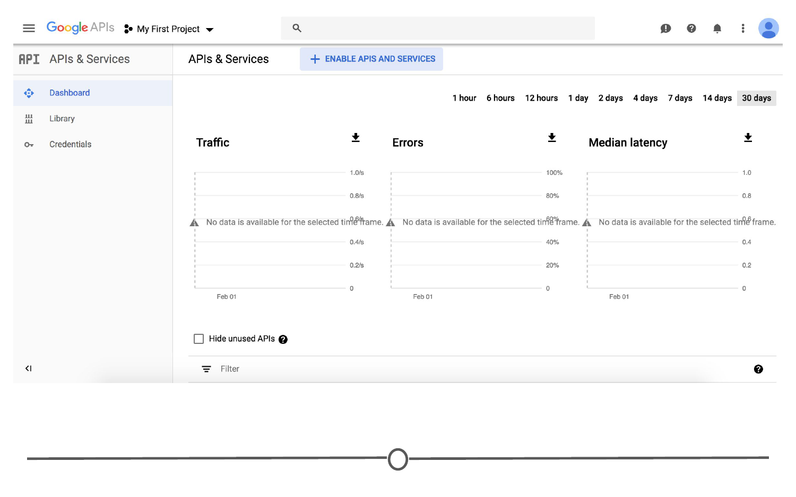

In the upper left of the window, there is a drop-down menu, click on this and a new window will open. In this window, click on "NEW PROJECT". 

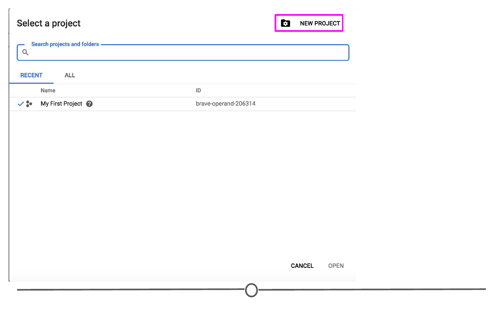

Name your project and click "Create".

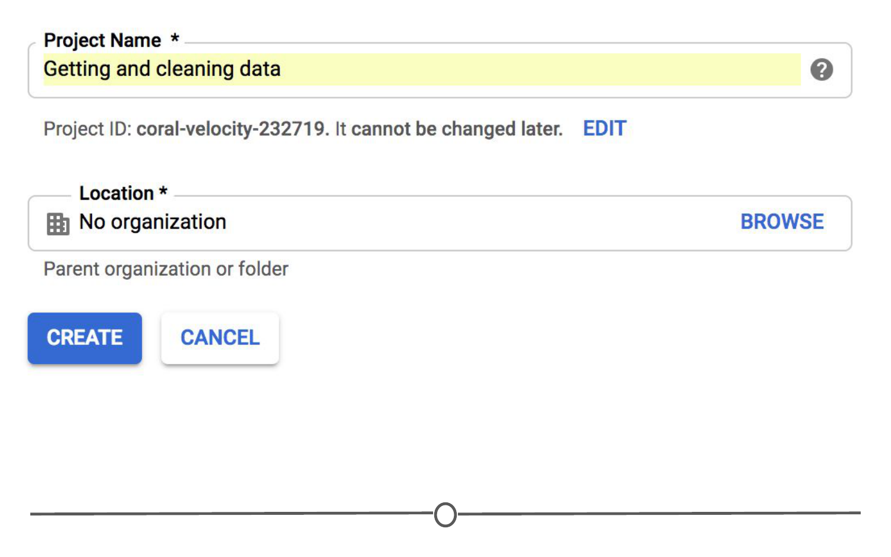

Once done, you should be presented with the project dashboard. Click on "Enable APIs and Services."

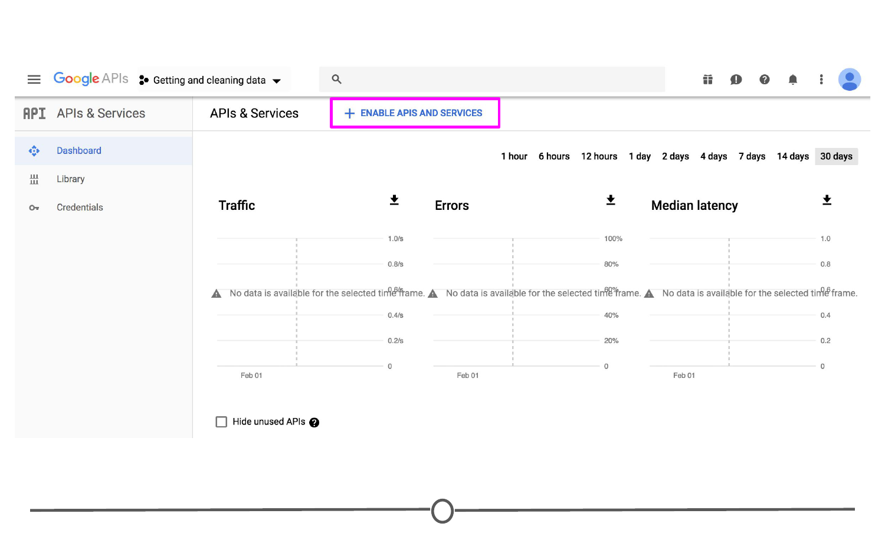

In the API library search, search for "YouTube."

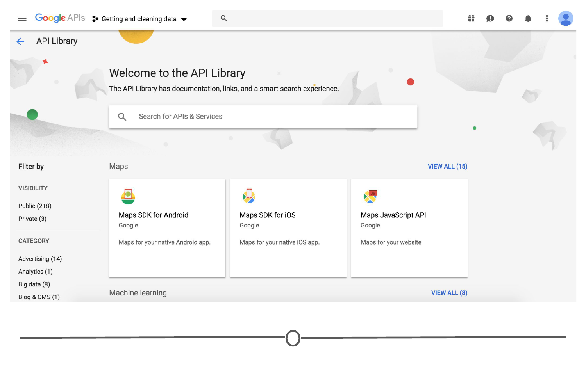

Click on the "YouTube Data API v3."

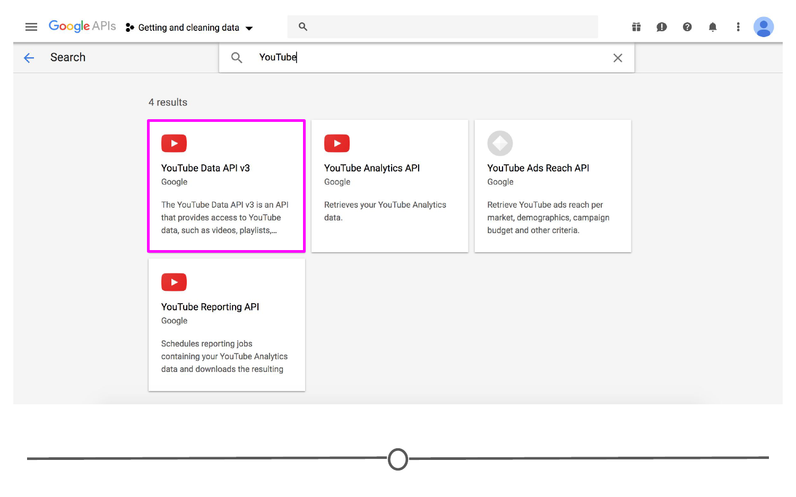

Click "Enable" and from this dashboard, click on "Credentials"

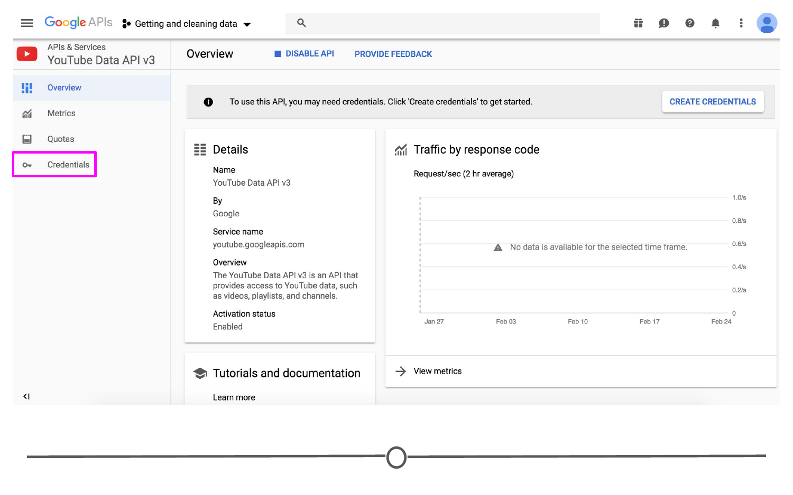

From this webpage, you can answer the provided questions as below and an API key will be generated! 

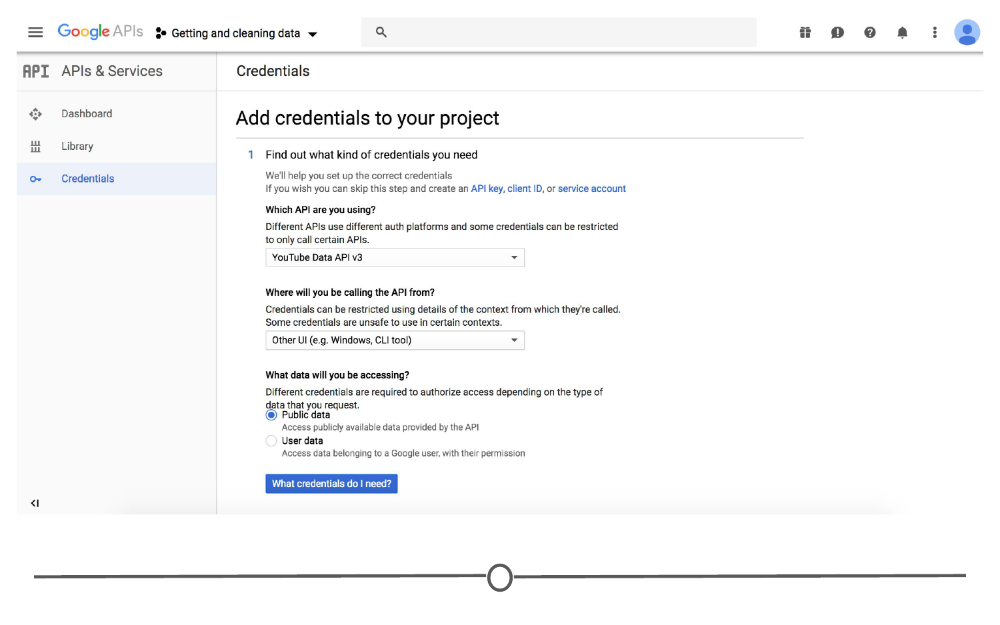

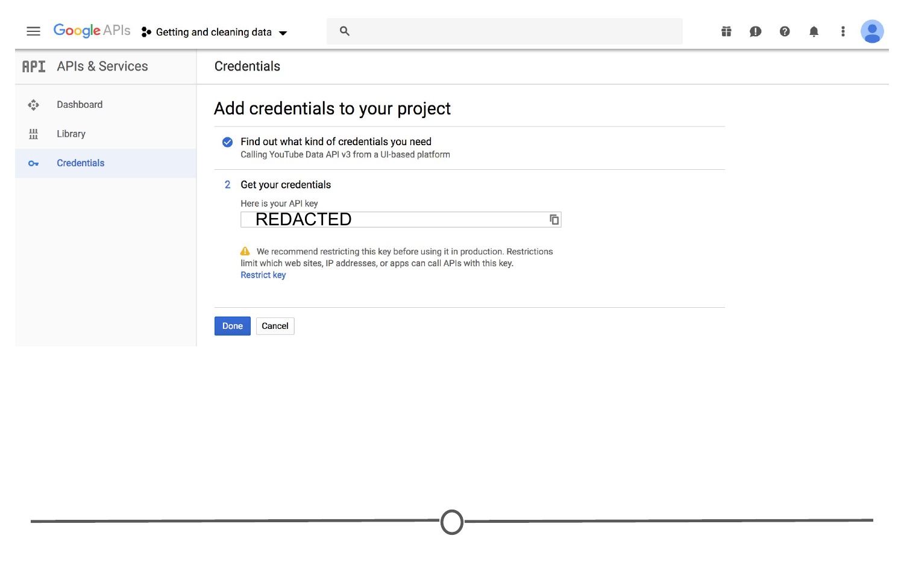

Now we are ready to make a [query](https://developers.google.com/youtube/v3/sample_requests) of the YouTube API! To do so, we are going to, yet again, use `httr`'s `GET()` function. In this example, we are going to [search for videos](https://developers.google.com/youtube/v3/docs/search/list) of the Internet's favourite subject: kittens. 

```r

# Save your API key as a variable. NEVER share this with anybody -- including accidentally sharing on GitHub! 
API_key <- "REDACTED"
 
# Base URL for the YouTube API
Base_URL <- "https://www.googleapis.com/youtube/v3/"

# Our query term, formatted as per YouTube API requirements 
Query <- "search?q=kittens&maxResults=10&order=date&part=snippet"

# Combine each of these to perform the query using GET()
Response <- GET(url = paste0(Base_URL, Query, API_key))

# Check that our request worked! 
Response$status_code

# See what we got back! 
test <- content(Response)

# Just look at the video titles
for(i in 1:10) {
  print(content(Response)$items[[i]]$snippet$title)
}

```

And there we have it, we have the 10 most recent videos featuring kittens! 

Bringing it back to a previous lesson, oftentimes, APIs will produce results in JSON format. We can use the `jsonlite` package from before to query the YouTube API. 

```r
# Perform query
Response2 <- fromJSON(paste0(Base_URL, Query, API_key))

# Check all results 
Response2

# Just look at the video titles
Response2$items$snippet$title

```

### Keeping Track of your Data

So far, we've discussed how to work with data you've obtained from the Internet. However, things on the Internet can change. If you're not downloading the file to your system directly, you won't have a static copy saved on your system. This means that while you're saving space on your computer and not creating unnecessary copies of an identical file, the next time you go to access the file, it may not be there *or* it may have been updated. For these reasons, it's incredibly important to record the date of when you acquired the data. This can be recorded in your R Markdown file where you're doing your analysis. Regardless, however, a record of the date you acquired the data is incredibly important.

To see the volatility of some API requests, let's just repeat our request to the YouTube API and see how the kitten video situation has changed in these last few minutes! 

```r

# Use the same query as before
Response_updated <- GET(url = paste0(Base_URL, Query, API_key))

# Lets see how the video titles have changed!

## Before
for(i in 1:10) {
  print(content(Response)$items[[i]]$snippet$title)
}

## Updated 
for(i in 1:10) {
  print(content(Response_updated)$items[[i]]$snippet$title)
}

# Best practice: Record the date and time that you accessed the data
Sys.time()
```

If you've gone particularly quickly through this lesson and the citizens of YouTube aren't very busy, you may see that these results haven't changed (by my estimations, a kitten video is uploaded every five to ten minutes). Try waiting a few minutes and seeing if the results have changed after a bit of a wait!

### Summary

In this lesson, we covered the basics of accessing APIs, mainly through using the package `httr`. We first looked at how to structure a query and access the response, using an open API: GitHub, where you don't need a key to access information. We then practiced this by querying the FiveThirtyEight GitHub to access a CSV file. Next, we learned about API keys and how they keep websites and their data secure. We also emphasized that you should be vigilant of your API keys and not share them, especially inadvertently by pushing them to GitHub. We then got our very own API key to access the YouTube API and found the latest in kitten videos! Finally, by repeating our query in an ever changing API, we demonstrated the requirement that you keep track of when you accessed an API, as the data you get back from a query can change! Hopefully you feel a little more comfortable accessing APIs through RStudio - next lesson we will learn how to scrape information from the internet without an API! 

### Additional Resources

* [HTTP basics](https://code.tutsplus.com/tutorials/http-the-protocol-every-web-developer-must-know-part-1--net-31177)
* [httr: Quick Start Guide](https://cran.r-project.org/web/packages/httr/vignettes/quickstart.html)
* [httr tutorial](https://www.tylerclavelle.com/code/2017/randapis/), by [Tyler Clavelle](https://www.tylerclavelle.com/about/)
* [GitHub API Documentation](https://developer.github.com/v3/)
* [Blog post with additional examples of using `httr` to access APIs](https://www.r-bloggers.com/using-the-httr-package-to-retrieve-data-from-apis-in-r/)
* [Some free to use APIs that you can play with!](https://medium.com/@vicbergquist/18-fun-apis-for-your-next-project-8008841c7be9)

### Slides

This lesson's slides can be found [here](https://docs.google.com/presentation/d/1ulmgyVemeOFThrX006zakFEdv_ymfJOeoZBwZXSVrPs/edit?usp=sharing)  
