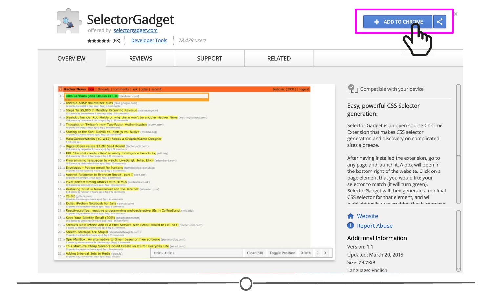
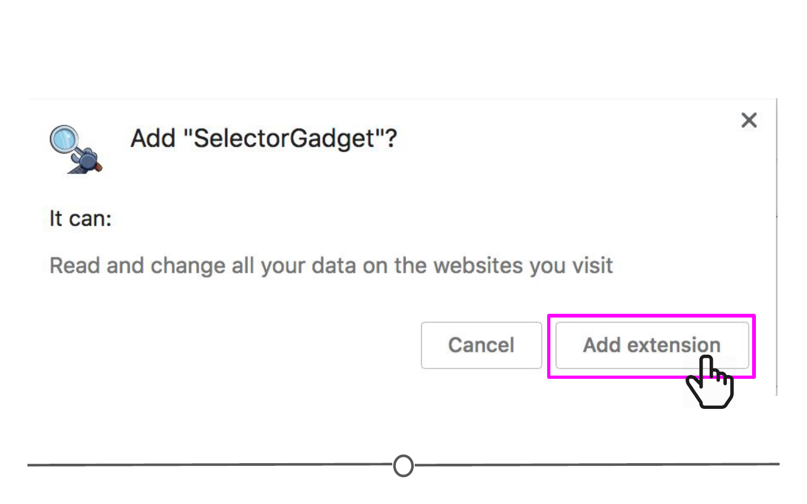
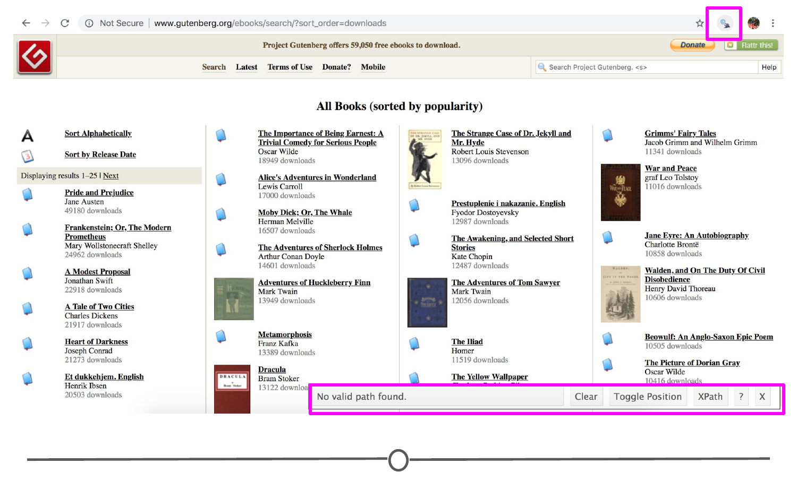
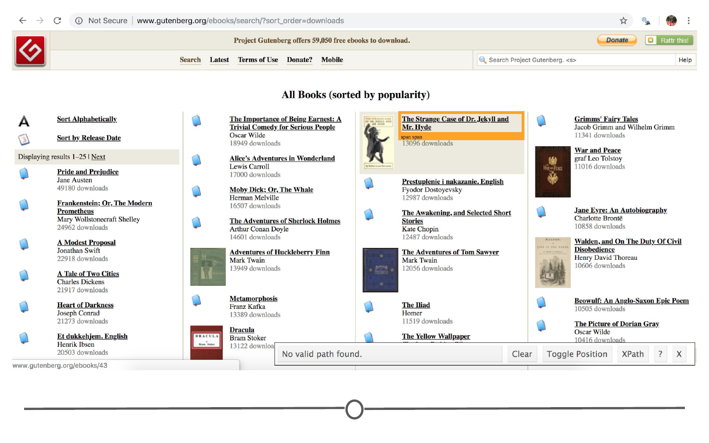
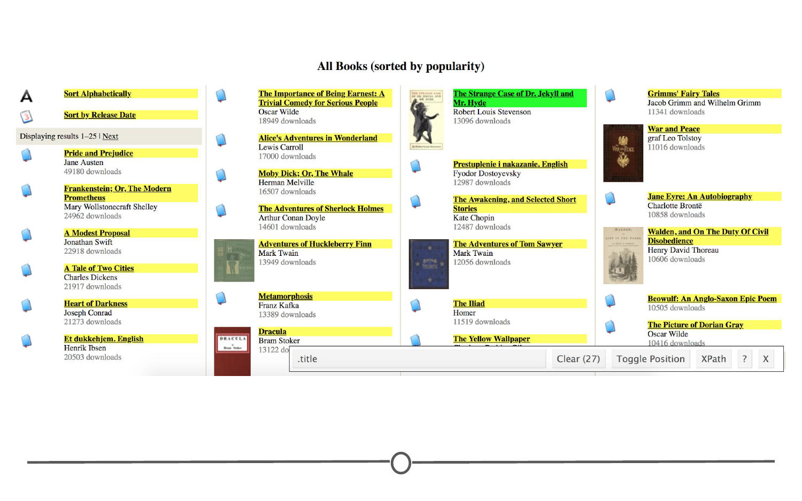
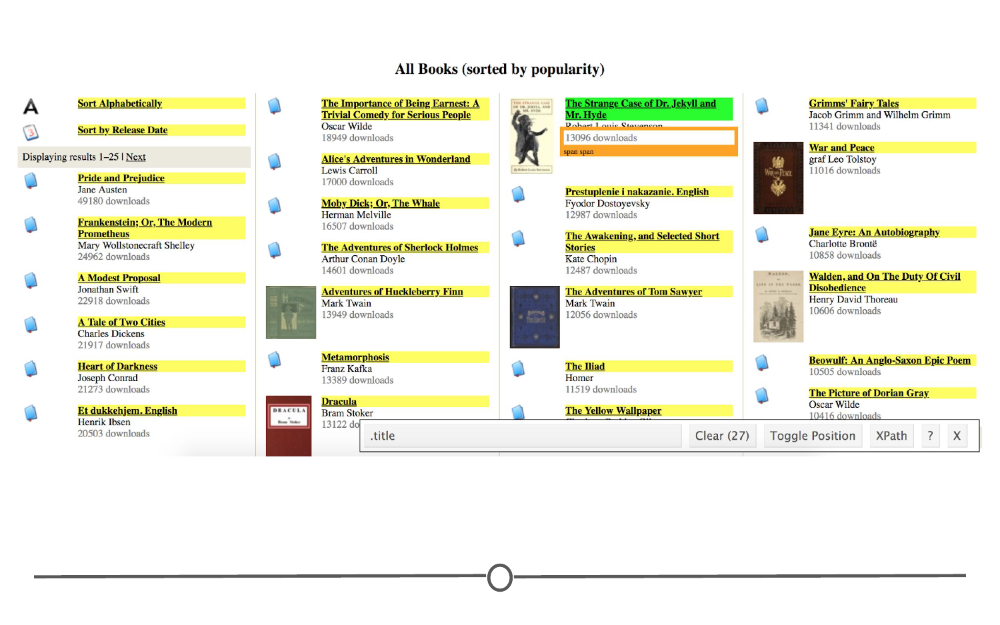
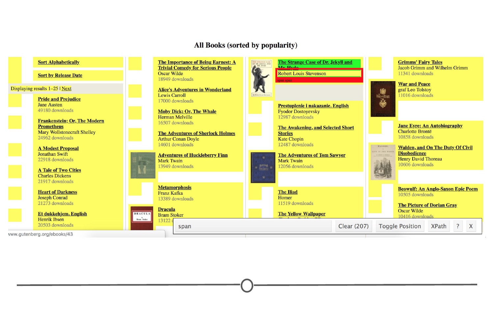
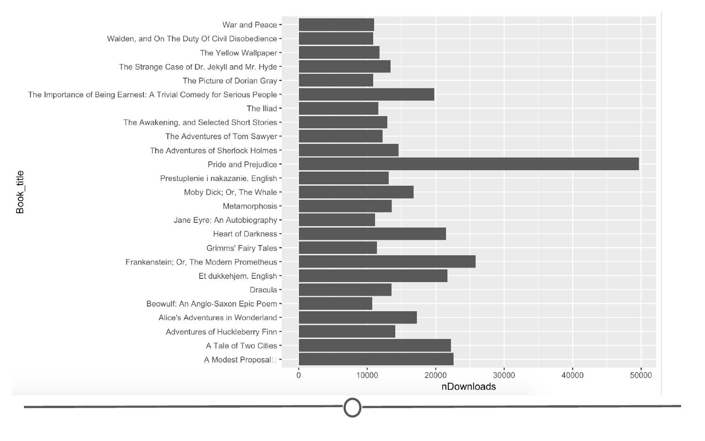

# Getting data from the internet

In the introductory lesson, we mentioned that there is a lot of data available for analysis on the Internet, which probably comes at no surprise given the vast size of the Internet. Sometimes these data are in a nice CSV format that we can quickly pull from the Internet. Sometimes, the data are spread across a web page, and it's our job to "scrape" that information from the webpage and get it into a usable format. Knowing first that this is possible within R and second, having some idea of where to start is an important beginning step to get data from the Internet.

### Using 'rvest' to scrape the web

Picture an example of wanting to start a company but not knowing exactly what people you'll need. So, you go to the websites of a bunch of companies similar to the company you want to start and find all the names and titles of the people working there. You then compare the titles across companies and voila, you've got a better idea of who you'll need at your new company. 

You could imagine that while this information may be helpful to have, getting it manually would be a pain. Navigating to each site individually, finding the information, copying and pasting each name. That sounds awful! Thankfully, there's a way to scrape the web from R directly!

This uses the helpful package `rvest`. It gets its name from the word "harvest." The idea here is you'll use this package to "harvest" information from websites! However, as you may imagine, this is less straightforward than pulling data that are already formatted the way you want them (as we did with APIs), since we'll have to do some extra work to get everything in order. 

First, let's install the `rvest` package, if you haven't already done so. 

```r
## Install and load the rvest package
install.packages("rvest")
library(rvest)
```

### `rvest` basics

When `rvest` is given a webpage (URL) as input, an `rvest` function reads in the HTML code from the webpage. HTML is the language websites use to display everything you see on the website. You've seen HTML documents before, as this is one of the formats that you can Knit to from an R Markdown (.Rmd) document! Generally, all HTML documents require each webpage to have a similar structure. This structure is specified by using different **tags**. For example, a header at the top of your webpage would use a specific tag. Website links would use a different tag. These different tags help to specify how the website should appear. `rvest` takes advantage of these tags to help you extract the parts of the webpage you're most interested in. So let's see exactly how to do all of this with an example.

### SelectorGadget

But first, to use `rvest`, there is a tool that will make your life *a lot* easier. It's called SelectorGadget. It's a "javascript bookmarklet." What this means for us is that we'll be able to go to a webpage, turn on SelectorGadget, and help figure out how to appropriately specify what components from the webpage we want to extract using `rvest`. 

To get started using SelectorGadget, you'll have to enable the Chrome Extension. 

To enable SelectorGadget:  

1. Click [here](https://chrome.google.com/webstore/detail/selectorgadget/mhjhnkcfbdhnjickkkdbjoemdmbfginb) to open up the SelectorGadget Chrome Extension

2. Click "ADD TO CHROME"



3. Click "Add extension" 



4. SelectorGadget's icon will now be visible to the right of the web address bar within Google Chrome. You will click on this to use SelectorGadget in the example below.

### Project Gutenberg Example

Similar to the example above, what if you were interested in knowing the most popular books on the Project Gutenburg library and how many times they had been downloaded in the last week? Sure, you could go to their website http://www.gutenberg.org/ebooks/search/?sort_order=downloads and copy and paste each title and download number into a spreadsheet. But, that's not very fun!

Alternatively, you could write and run a few lines of code and get all the information that way! We'll do that in the example below. 

#### Using SelectorGadget

To use SelectorGadget, navigate to the webpage you're interested in scraping, in this case, http://www.gutenberg.org/ebooks/search/?sort_order=downloads, and toggle SelectorGadget by clicking on the SelectorGadget icon. A menu at the bottom-right of your web page should appear.



Now that SelectorGadget has been toggled, as you mouse over the page, colored boxes should appear. We'll click on the the title of one of the books to tell SelectorGadget that we are interested in that component of the page. (Click on the question mark symbol in the little SelectorGadget menu for a quick primer on how it works!)



In doing so, we can see that other components of the webpage that SelectorGadget has deemed similar to what you've clicked will be highlighted. And, text will show up in the menu at the bottom of the page letting you know what you should use in `rvest` to specify the part of the webpage you're most interested in extracting. 



Here, we see with that SelectorGadget has highlighted the book titles! Perfect. But we also said we wanted to know how many times each book was downloaded. So mouse over that section of the page for one of the books and click on it as well. 



Uh oh. A bunch of different parts of the website are now deemed similar and have been highlighted yellow - we don't want that! Those other things in yellow should not be included in our `rvest` search later! Let's fix this. First, mouse over the author names of the books that have been mistakenly included and you should see a red outline appear. If you click while that red outline is present, it should remove all the items that are deemed similar to that item and **exclude** elements like that from your SelectorGadget search. 



Okay, we're getting closer! Just one more thing - the "Sort Alphabetically" and "Sort by Release Date" are still highlighted in yellow. Mouse over one of those elements until it is outlined in red and click. Now the only things on the webpage that are yellow (and thus included in your SelectorGadget terms) are the book titles and the number of times they've been downloaded. 

With this done, SelectorGadget has found the correct element tags that we will give to `rvest` to extract just the information we want! 


#### Using `rvest`

Now we're ready to use `rvest`'s functions. We'll use the function `read_html()` to read in the HTML from our webpage of interest. 

We'll then use `html_nodes()` to specify which parts of the webpage we want to extract. Within this function we specify ".extra , .booklink .title", as that's what SelectorGadget told us to specify to "harvest" the information we're interested in. 

Finally `html_text` extracts the text from the tag we've specified, giving us that list of books and their download numbers that we wanted to see!

```
## load package
library(rvest)

## provide URL
Books <- read_html("http://www.gutenberg.org/ebooks/search/?sort_order=downloads")

## Get book titles and the number of times they've been downloaded
Books %>% 
  html_nodes(".extra , .booklink .title") %>%
  html_text() 
```
With just a few lines of code we have the information we were looking for!

From here, now that the data is in R, we can format it however we like and manipulate the data! 

Briefly, let's turn it into a dataframe and make a simple plot comparing the number of downloads! 

```
# Save the results to a vector

Downloads <- Books %>% 
  html_nodes(".extra , .booklink .title") %>%
  html_text() 
  
# Rearrange the data with the titles in one column and the downloads in another 
Downloads <- t(matrix(Downloads, ncol=25))   

# Turn this into a dataframe for plotting and rename the columns 
Downloads <- as.data.frame(Downloads)
colnames(Downloads) <- c("Book_title", "nDownloads")

# Remove the word "downloads" from the numbers and convert to numeric
Downloads$nDownloads <- as.numeric(gsub(" downloads", "", Downloads$nDownloads))

# Plot the number of times a book has been downloaded 
library(ggplot2)

ggplot(data=Downloads, aes(x=Book_title, y=nDownloads)) + # tell ggplot which data to plot
geom_bar(stat = "identity") + # indicate to use a barplot
coord_flip()  # so that the book titles are horizontal 
```


And there you have it! You've scraped the information from the Project Gutenberg website and produced a graph of the data! You can tweak your ggplot command to modify nearly all aspects of the plots - including the order of the books, the colours of the bars, the background and axes colours - the possibilities are endless! Play with this!

### Summary 

In this lesson we learned how to use `rvest` and SelectorGadget to scrape information from the web. `rvest` is an incredibly useful R package to load HTML data into R and SelectorGadget is a very useful extension that allows you to narrow down the parameters you provide to `rvest`! We then worked through an example using both of these tools to scrape information on ebook downloads from the Project Gutenberg, which we then plotted within R. Between this lesson and the last, we hope you are beginning to feel comfortable gathering data from the internet - either formally through an API or by web scraping. 

### Additional Resources

* [rvest tutorial](https://blog.rstudio.com/2014/11/24/rvest-easy-web-scraping-with-r/), from RStudio
* [rvest documentation](https://github.com/hadley/rvest)
* [SelectorGadget documentation + video](https://selectorgadget.com/)
* [rvest tutorial](https://www.datacamp.com/community/tutorials/r-web-scraping-rvest), from DataCamp

### Slides

This lesson's slides can be found [here](https://docs.google.com/presentation/d/1xSTmX9Pw41F2XoYp-pK03JdEQjQZVDCdqwlXdVNWCks/edit?usp=sharing)  
