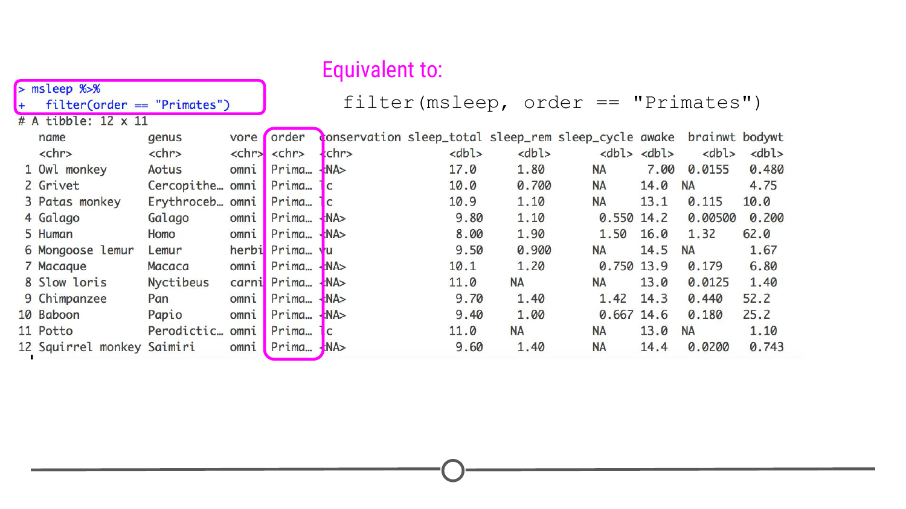
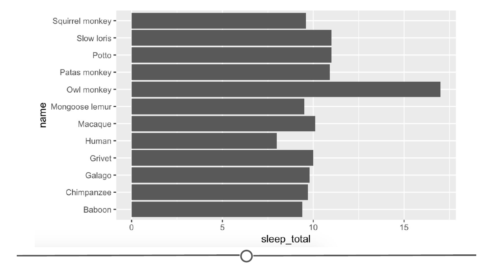
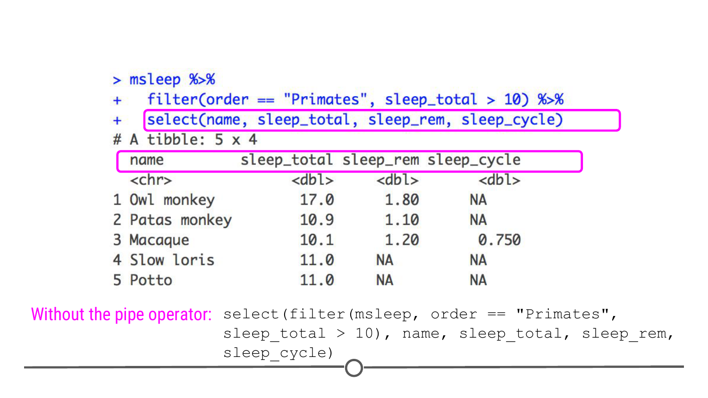

# Filtering data 

When working with a large dataset, you're often interested in only working with a portion of the data at any one time. For example, if you had data on people from ages 0 to 100 years old, but you wanted to ask a question that only pertained to children, you would likely want to only work with data from those individuals who were less than 18 years old. To do this, you would want to **filter** your dataset to only include data from these select individuals. Filtering can be done by row or by column. We'll discuss the syntax in R for doing both. Please note that the examples and organization for this lesson were adapted from [Suzan Baert's](https://suzan.rbind.io/) wonderful `dplyr` [tutorials](https://suzan.rbind.io/2018/01/dplyr-tutorial-1/).

For the examples below, we'll be using a dataset from the `ggplot2` package called `msleep`. This dataset includes sleep times and weights from a number of different mammals. It has 83 rows, with each row including information about a different type of animal, and 11 variables. As each row is a different animal and each column includes information about that animal, this is a **wide** dataset.

To get an idea of what variables are included in this data frame, you can use `glimpse()`. 

```r

## load package
library(dplyr)

## take a look at the data
glimpse(msleep)
```


This function summarizes how many rows there are (`Observations`) and how many columns there are (`Variables`). Additionally, it gives you a glimpse into the type of data contained in each column. Specifically, in this data set, we know that the first column is `name` and that it contains a character vector (`chr`) and that the first three entries are "Cheetah", "Owl monkey", and "Mountain beaver." So while you could use `head()` to preview your data, the `glimpse()` function provides a deeper *glimpse* into your data! 

### Filtering Rows

If you were only interested in learning more about the sleep times of "Primates," we could filter this dataset to include only data about those mammals that are also Primates. As we can see from `glimpse()`, this information is contained within the `order` variable. So to do this within R, we use the following syntax:

```r
msleep %>%
  filter(order == "Primates")
```

Note that we are using the `==` comparison operator that is used when you are checking an equality (e.g.: when is order equal to "Primates"?) while a single `=` is for assigning a value (e.g.: `x = 10`, meaning the variable x is assigned as 10). Also note that we have used the pipe operator to feed the `msleep` data frame into the `filter()` function. This is short hand for:

```r
filter(msleep, order == "Primates")
```



Once we've done this filtering, we have a smaller dataset of only 12 mammals (as opposed to the original 83) and we can see that the `order` variable column only includes "Primates." 

Outside of the dplyr package, this same filtering operation could be accomplished using base R and the square bracket operator. Using square brackets, you can specify your filtering like so: `dataframe[rows, columns]`. So to filter for just primates like above, you could use: 

```r 
# Filter using base R and the square bracket operator 
msleep[msleep$order == "Primates", ]
```

This specifies that you are looking within the msleep dataset for rows within that dataset in which the order is equal to "Primates" and by leaving the columns blank, you are specifying that you want all columns. While this can be a useful method for filtering, you can see how it has redundancies and is less transparent to read compared to the `filter` function above, which can almost be read as a sentence: "filter the dataset, msleep, for when order is equal to Primates." One of the main benefits of these dplyr functions is their human readability - it is always apparent what you or others have done to the dataset to arrive at your final result! But we felt you should know that this base R operation exists, since you'll often see code that filters with the square bracket operator and you need to be able to understand what they are doing!

Let's plot our results of the primates and see the distribution of these species' sleep patterns. 

```r 
# Save the result of our filtering to an object 
sleepy_primates <- msleep %>% 
  filter(order == "Primates")

# Plot each species' amount of sleep 
ggplot(sleepy_primates, # plot data from the sleepy_primates object 
  aes(x=name, y=sleep_total)) + # with the species name on the x and the amount of sleep on the y axis
  geom_bar(stat="identity") + # use a bar plot
  coord_flip() # flip the x and y axes so that the species names are horizontal and easy to read

```


In plotting this data, it becomes apparent that owl monkeys are a sleepy bunch! 

Next step: what if we were only interested in primates who sleep more than 10 hours total per night? This information is in the `sleep_total` column. Fortunately, `filter()` also works on numeric variables. To accomplish this, you would use the following syntax, separating the multiple filters you want to apply with a comma:

```r
msleep %>%
  filter(order == "Primates", sleep_total > 10)
```

Note that we have used the "greater than" comparison operator with `sleep_total`.

We can obtain the same result with the AND `&` logical operator instead of separating filtering conditions with a comma:

```r
msleep %>%
  filter(order == "Primates" & sleep_total > 10)
```


Note that the number of columns hasn't changed. All 11 variables are still shown in columns because the function `filter()` filters on rows, not columns. 

At the end of these commands, you can see that we have a dataset focused in on only 5 mammals, all of which are primates who sleep for more than 10 hours a night total.

### Selecting Columns

While `filter()` operates on rows, it *is* possible to filter your dataset to also only include the columns you're interested in. To select columns so that your dataset only includes variables you're interested in, you will use `select()`. 

Let's start with the code we just wrote to only include primates who sleep a lot. What if we only want to include the first column (the name of the mammal) and the sleep information (included in the columns `sleep_total`, `sleep_rem`, and `sleep_cycle`)? We would do this by starting with the code we just used, adding another pipe, and using the function `select()`. Within `select`, we specify which columns we want in our output.

```r
msleep %>%
  filter(order == "Primates", sleep_total > 10) %>%
  select(name, sleep_total, sleep_rem, sleep_cycle)
```

So reading this as a sentence, we are taking the msleep dataset and filtering the rows for primates who sleep more than 10 hours and *then* selecting the columns "name", "sleep_total", "sleep_rem", and "sleep_cycle" to produce the following data:



Now, using `select()` we see that we still have the five rows we filtered to before, but we only have the four columns specified using `select()`. Here you can hopefully see the power of the pipe operator to chain together several commands in a row. Without the pipe operator, the full command would look like this:

```r
select(filter(msleep, order == "Primates", sleep_total > 10), name, sleep_total, sleep_rem, sleep_cycle)
```

With this, we hope you can appreciate just how much the pipe operator can simplify both writing and reading commands! 

### Renaming Columns

While we are talking about how we can use select, it is important to point out that `select()` can also be used to rename columns. To do so, you use the syntax: `new_column_name = old_column_name` within `select`. For example, to select the same columns and rename them `total`, `rem` and `cycle`, you would use the following syntax:

```r

msleep %>%
  filter(order == "Primates", sleep_total > 10) %>%
  select(name, total=sleep_total, rem=sleep_rem, cycle=sleep_cycle)
  
```


It's important to keep in mind that when using `select()` to rename columns, only the specified columns will be included and renamed in the output. If you, instead, want to change the names of a few columns but return *all* columns in your output, you'll want to use `rename()`. For example, the following, returns a data frame with all 11 columns, where the column names for the three columns specified within the `rename()` function have been renamed.

```r
msleep %>%
  filter(order == "Primates", sleep_total > 10) %>%
  rename(total=sleep_total, rem=sleep_rem, cycle=sleep_cycle)
```


### Summary 

In this lesson we covered two of the functions in the dplyr package that you will frequently use in filtering and subsetting your data. While there are other ways to carry out these same functions (e.g.: using the square bracket operators or using the function `subset()`), the sheer readability of dplyr functions and the ability to use the pipe operator to string together commands makes these preferable. 

### Slides

This lesson's slides can be found [here](https://docs.google.com/presentation/d/1TaTZpvOfGkITrtpMSRK_0_-B-GQ53sNcEb26EMu9DOs/edit?usp=sharing)  