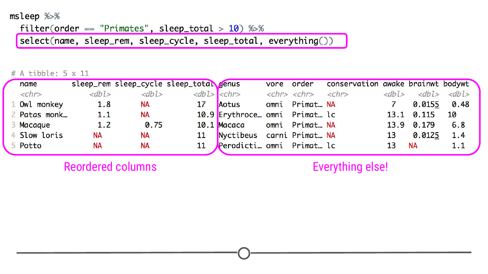
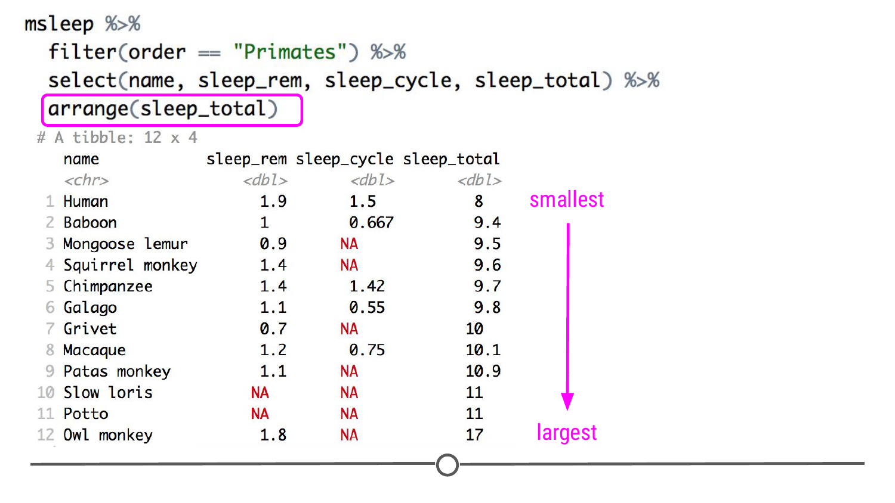
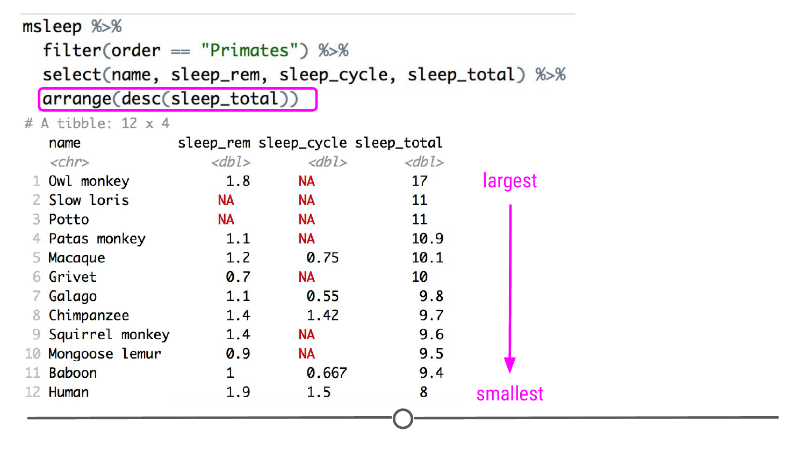

# Reordering data 

In addition to filtering rows and columns, often, you'll want the data arranged in a particular order. It may order the columns in a logical way, or it could be to sort the data so that the data are sorted by value, with those having the smallest value in the first row and the largest value in the last row. All of this can be achieved with a few simple functions. In this lesson, we will continue to use the msleep dataset from the ggplot2 package. 

### Reordering Columns

The `select()` function is powerful. Not only will it filter and rename columns, but it can also be used to reorder your columns. Using our example from the previous lesson where we are filtering the msleep dataset to include only primates that sleep more than 10 hours, if you wanted `sleep_rem` to be the second column after the species name and `sleep_total` to be the last column, all you have to do is reorder them within `select()`. The output from `select()` would then be reordered to match the order specified within `select()`.

```r
msleep %>%
  filter(order == "Primates", sleep_total > 10) %>%
  select(name, sleep_rem, sleep_cycle, sleep_total)
```


Here we see that `name` is displayed first followed by `sleep_rem`, `sleep_cycle`, and `sleep_total`, just as it was specified within `select()`. 

But let's say that we want to reorder some of the columns but also keep all the rest? As we've shown it so far, you can use `select()` to rearrange, but then you also *select* only those columns. When you have only a few columns in your dataset, you could just type them all out in the `select()` command. But what if your dataset had 20+ columns? You don't want to have to type all of them into the `select()` function! And for that, we have `everything()`! If you want to keep all of your columns, after specifying the order of the ones that you want to rearrange, you can add an `everything()` at the end and you will get to keep all of the other columns in your dataset! 

```r
msleep %>%
  filter(order == "Primates", sleep_total > 10) %>%
  select(name, sleep_rem, sleep_cycle, sleep_total, everything())
```



### Reordering Rows

Rows can also be reordered. To reorder a variable in ascending order (from smallest to largest), you'll want to use `arrange()`. Let's sort our rows by the amount of total sleep each primate gets using the following syntax:

```r
msleep %>%
  filter(order == "Primates") %>%
  select(name, sleep_rem, sleep_cycle, sleep_total) %>%
  arrange(sleep_total)
```



While `arrange` sorts variables in ascending order, it's also possible to sort in descending (largest to smallest) order. There are two ways to do this. One way is to just add a minus sign in front of the variable to be sorted. 

```r
msleep %>%
  filter(order == "Primates") %>%
  select(name, sleep_rem, sleep_cycle, sleep_total) %>%
  arrange(-sleep_total)
```

The other way is to use the function `desc()` within the arrange function:

```r
msleep %>%
  filter(order == "Primates") %>%
  select(name, sleep_rem, sleep_cycle, sleep_total) %>%
  arrange(desc(sleep_total))
```

By putting `sleep_total` within `desc()` or prefacing `sleep_total` with a minus sign, `arrange()` will now sort your data from the primates with the longest total sleep to the shortest.



`arrange()` can also be used to order non-numeric variables. For example, `arrange()` will sort character vectors alphabetically. 

```r
msleep %>%
  filter(order == "Primates") %>%
  select(name, sleep_rem, sleep_cycle, sleep_total) %>%
  arrange(name)
```


If you would like to reorder rows based on information in multiple columns, you can specify them separated by commas. This is useful if you have repeated values in one column and want to sort within these repeat rows based on information in another column. In the example here, we will first sort by the values in the column `sleep_cycle`, which contains "NA" values. For those that are "NA"s, we will then sort by the values in the column `sleep_total`. 

```r
msleep %>%
  filter(order == "Primates") %>%
  select(name, sleep_rem, sleep_cycle, sleep_total) %>%
  arrange(sleep_cycle, sleep_total)
```


### Summary 

In this lesson, we covered how you can use `select()` and `arrange()` to reorder your data. `select()` is used for reordering (and selecting) columns and can be paired with `everything()` to rearrange without removing columns. `arrange()` is used for reordering rows in ascending or alphabetical order. To rearrange your data to be in the reverse order, you can either put a minus sign in front of the variable name that you are ordering by or you can use the `desc()` command. 

### Slides

This lesson's slides can be found [here](https://docs.google.com/presentation/d/13cAGzyRyD-M9NfPVAxd_xjUbyvS11zPBPjIHJLirzvA/edit?usp=sharing)  
