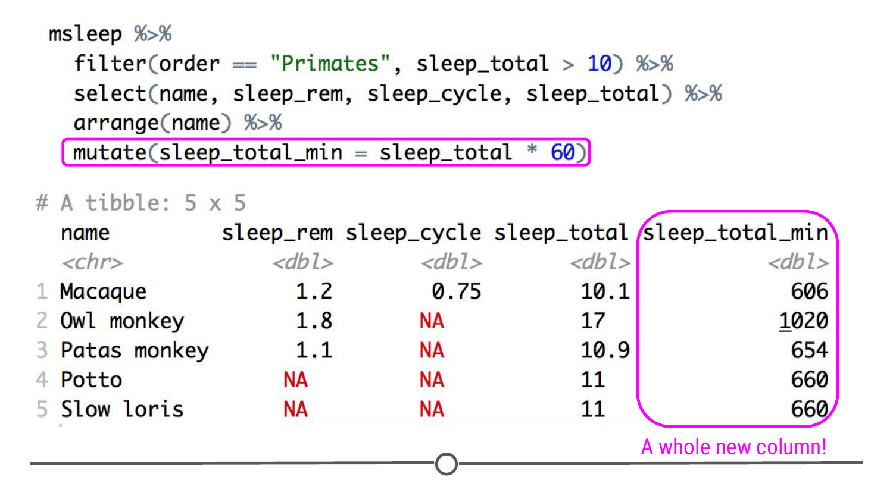
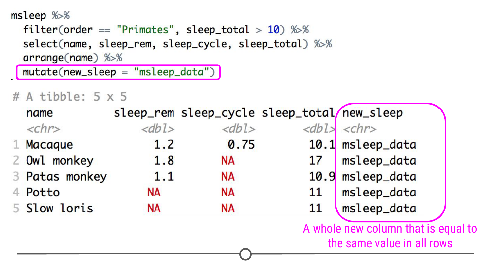
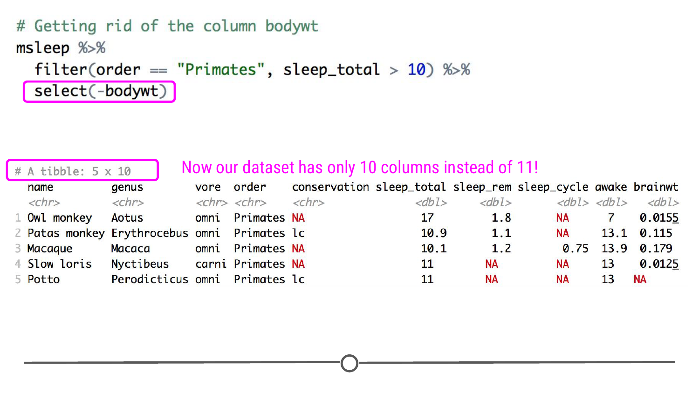
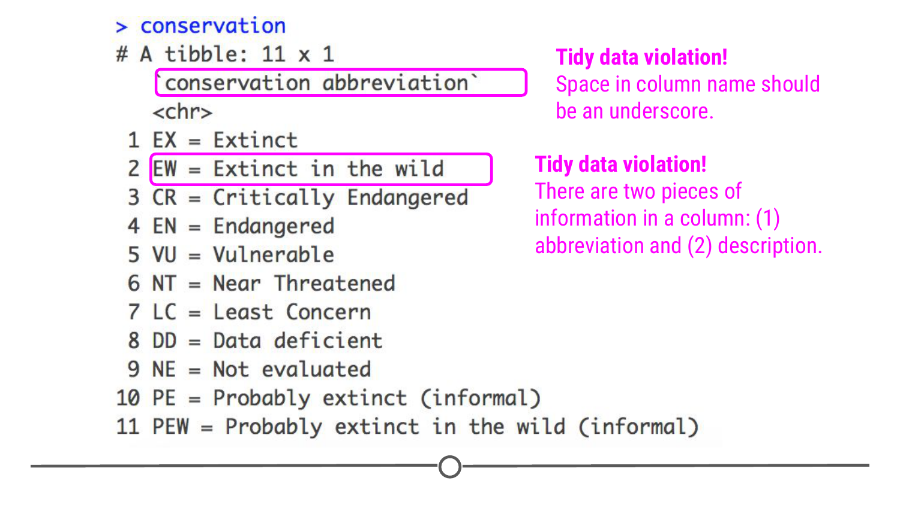

# Manipulating columns

In our mission to create tidy data, one of the things you will often be tasked with doing is manipulating the columns that are in your dataset: adding and removing them, or splitting and merging them or even just renaming them to a consistent standard. Hopefully by the end of this lesson, you will feel able to do each of these tasks for whatever data you may analyse. 

### Creating new columns

You will often find when working with data that you need an additional column. For example, if you had two datasets you wanted to combine, you may want a record of which dataset that row came from - to do this, you may want to make a new column in each dataset called `dataset`. In one dataset you may put `datasetA` in each row. In the second dataset, you could put `datasetB`. This way, once you have combined the data, you would be able to keep track of which dataset each row came from originally. More often, however, you'll likely want to create a new column that calculates a new variable based on information in a column you already have. For example, in our mammal sleep dataset, `sleep_total` is in hours. What if you wanted to have that information in minutes? You could create a new column with this very information! The function `mutate()` was *made* for **all** of these new-column-creating situations. This function has a lot of capabilities. We'll cover the basics here. 

Returning to our `msleep` dataset, after filtering and re-ordering, we can create a new column with `mutate()`. Within `mutate()`, we will calculate the number of minutes each mammal sleeps by multiplying the number of hours each animal sleeps, held in the `sleep_total` column, by 60 minutes.

```r
msleep %>%
  filter(order == "Primates", sleep_total > 10) %>%
  select(name, sleep_rem, sleep_cycle, sleep_total) %>%
  arrange(name) %>%
  mutate(sleep_total_min = sleep_total * 60)
```


We could also use `mutate()` to add a brand new column with the same value in all rows, like in our combining dataset example we discussed above. To do this, we will specify within the mutate command that our new column, called `new_sleep`, should equal `msleep_data`.

```r
msleep %>%
  filter(order == "Primates", sleep_total > 10) %>%
  select(name, sleep_rem, sleep_cycle, sleep_total) %>%
  arrange(name) %>%
  mutate(new_sleep = "msleep_data")
```



Outside of the `dplyr` package, we can create new columns by specifying `dataframe$new_column` - the difference being that there has to be a dataset in your environment to specify. So to replicate the examples above, we would perform the same filter, select, and arrange tasks, but then save that result to an object. 

```r
sleepy_primates <- msleep %>%
  filter(order == "Primates", sleep_total > 10) %>%
  select(name, sleep_rem, sleep_cycle, sleep_total) %>%
  arrange(name) 
```

Then we can use the $ operator to specify our new columns: 

```r 
# To create a new column with the sleep total converted to minutes
sleepy_primates$sleep_total_min <- sleepy_primates$sleep_total * 60

# To add a column with the same value in each row 
sleepy_primates$new_sleep <- "msleep_data"
```

While these commands perform the same function, you can see how they are more cumbersome to read and write, and rely on writing your data into an object and accessing that object rather than manipulating on the fly. 

### Removing columns

Now we can look at the opposite task: removing a column from a dataset. Again, we turn to the ever-useful `select()` function. This time we will be selecting which column to *not* include in the resulting data. To do so, we append the column name with a minus sign within the `select()` function. **Note:** This is not to be confused with using the minus sign in the `arrange()` function to signify a reverse sort order - the minus sign is used for completely different things between these two functions. 

```r
# Getting rid of the column bodywt
msleep %>%
  filter(order == "Primates", sleep_total > 10) %>%
  select(-bodywt) 
```



### Separating columns 

Sometimes multiple pieces of information are merged within a single column even though it would be more useful during analysis to have those pieces of information in separate columns. To demonstrate, we'll now move from the `msleep` dataset to talking about another dataset that includes information about conservation abbreviations in a single column.

To read this file into R, we'll use the `httr` package, which we discussed in a previous lesson ("Getting data from APIs""). We will use this to read in a file from GitHub using the code below.

```r
## load the libraries
library(httr)
library(readr)

## download file 
GET("https://raw.githubusercontent.com/suzanbaert/Dplyr_Tutorials/master/conservation_explanation.csv", write_disk(tf <- tempfile(fileext = ".csv")))
conservation <- read_csv(tf)

## take a look at this file
conservation
```



In this dataset, we see that there is a single column that includes *both* the abbreviation for the conservation term as well as what that abbreviation means. Recall that this violates one of the tidy data principles covered in the first lesson: Put just one thing in a cell. To work with these data, you could imagine that you may want these two pieces of information (the abbreviation and the description) in two different columns. To accomplish this in R, you'll want to use `separate()` from `tidyr`.

The `separate()` function requires the name of the existing column that you want to separate (`conservation abbreviation`), the desired column names of the resulting separated columns (`into = c("abbreviation", "description")`), and the characters that currently separate the pieces of information (`sep = " = "`). We have to put `conservation abbreviation` in back ticks (\`) in the code below because the column name contains a space. Without the back ticks, R would think that `conservation` and `abbreviation` were two separate things. This is another violation of tidy data! Variable names should have underscores, not spaces!

```r
conservation %>%
  separate(`conservation abbreviation`, 
           into = c("abbreviation", "description"), sep = " = ")
```

The output of this code shows that we now have two separate columns with the information in the original column separated out into `abbreviation` and `description`.


### Merging columns 

The opposite of `separate()` is `unite()`. So, if you have information in two or more different columns but wish it were in one single column, you'll want to use `unite()`. Using the code forming the two separate columns above, we can then add on an extra line of `unite()` code to re-join these separate columns, returning what we started with.

```r
conservation %>%
  separate(`conservation abbreviation`, 
           into = c("abbreviation", "description"), sep = " = ") %>%
  unite(united_col, abbreviation, description, sep = " = ")
```


### Cleaning up column names

A function that will likely prove very helpful as you start analyzing lots of different datasets is `clean_names()` from the `janitor` package. This function takes the existing column names of your dataset, converts them all to lowercase letters and numbers, and separates all words using the underscore character. For example, there is a space in the column name for conservation. `clean_names()` will convert `conservation abbreviation` to `conservation_abbreviation`. These cleaned up column names are a lot easier to work with when you have large datasets.

```r
# load the janitor package 
library(janitor)

# clean up the column names in the conservation dataset
conservation %>%
  clean_names()
```


### Summary 

In this lesson, we covered the basics on how to manipulate columns: either creating new ones (`mutate()`), removing existing ones (`select()`), separating data from one column into two (`separate()`), the reverse where we unite two columns into one (`unite()`), or fixing their column names to correspond with the principles of tidy data (`clean_names`). Everything we are learning in this week's lessons are geared towards providing you with the skills you will need to wrangle your data from messy to tidy, and the commands in this lesson are integral to that.  

### Slides

This lesson's slides can be found [here](https://docs.google.com/presentation/d/1THEjk9WHCBdHbftodDIYXuJYdBVSSL7zijCocGdjqi8/edit?usp=sharing)  
