# Joining and merging data

If you think back to the relational databases lesson from the previous week, you might remember how we joined together two datasets, `artists` and `albums`, from the `chinook` database on the basis of a common column. In this lesson, we're going to go more in depth into the various kinds of ways we can join together datasets! Joining data using `dplyr` functions is discussed in even more depth in [this tutorial](http://stat545.com/bit001_dplyr-cheatsheet.html) from [Jenny Bryan](https://www.stat.ubc.ca/~jenny/)

### Mutating Joins

Mutating joins allow you to take two different tables and combine the variables from both tables. This requires that each table have a column relating the tables to one another (i.e. a unique identifier). This unique identifier is used to match observations between the tables.

However, when combining tables, there are a number of different ways in which the tables can be joined. In this lesson, we'll cover the following types of joins:

* Inner Join - only keep observations found in *both* `x` *and* `y`
* Left Join - keep all observations in `x` regardless of overlap with `y`
* Right Join - keep all observations in `y` regardless of overlap with `x`
* Full Join - keep *any* observations in `x` *or* `y`

Here's a schematic representing each of the different kinds of joins. We will revisit this image after we've looked at each join in depth to make sure we can make sense of what the schematic is telling us. 


Let's break down exactly what we mean by this using just a small toy example from the `artists` and `albums` tables from the `chinook` database that we played with before. 

Let's get that data set up again here. 

```r 
# Load packages
library(RSQLite)
library(httr)

# Specify driver
sqlite <- dbDriver("SQLite")

# Download data
url <- "http://www.sqlitetutorial.net/wp-content/uploads/2018/03/chinook.zip"
GET(url, write_disk(tf <- tempfile(fileext = ".zip")))
unzip(tf)

# Connect to Database
db <- dbConnect(sqlite, 'chinook.db')

# Get two tables
albums <- tbl(db, "albums")
artists <- tbl(db, "artists")

# preview how these tables look 
glimpse(albums)
glimpse(artists)
```

For illustrative purposes, let's select a few rows each from the `artists` and `albums` tables. Let's look at the first 6 even rows from the albums and the first 6 odd rows from artists. 


### Inner Joins

When talking about inner joins, we are only going to keep an observation if it is found in all of the tables we're combining. Here, we're combining the tables based on the `ArtistId` column. In our dummy example, there are only two artists that are found in *both* tables. These are highlighted in green and will be the rows used to join the two tables. Then, once the inner join happens, only these artists' data will be included after the inner join.

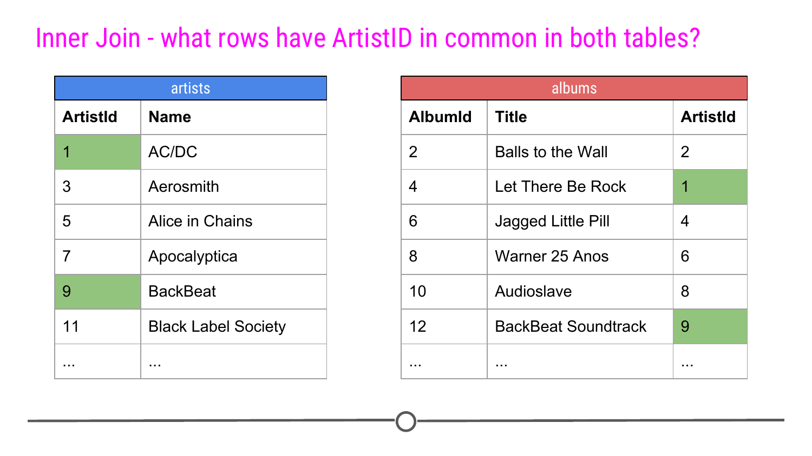

In our toy example, when doing an `inner_join()`, data from any observation found in all the tables being joined are included in the output. Here, `ArtistId`s "1" and "9" are in both the `artists` and `albums` tables. Thus, those will be the only `ArtistId`s in the output from the inner join. 

And, since it's a mutating join, our new table will have information from both tables! We now have `ArtistId`, `Name`, `AlbumId`, *and* `Title` in a single table! We've joined the two tables, based on the column `ArtistId`!

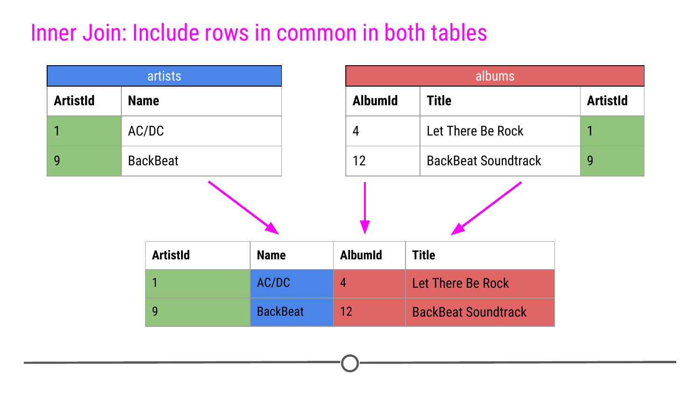

Throughout this lesson we will use the colouring you see here to explain the joins, so we want to explain it explicitly here. Green cells are cells that will be used to make the merge happen and will be included in the resulting merged table. Blue cells are information that comes from the `artists` table that will be included after the merge. Red cells are pieces of information that come from the `albums` table that will be included after the merge. Finally, cells that are left white in the `artists` or `albums` table are cells that will not be included in the merge while cells that are white *after* the merge are NAs that have been added as a result of the merge.

Now, to run this for our tables from the database, rather than just for a few rows in our toy example, you would do the following:

```r
# Perform the inner join
inner <- inner_join(artists, albums)

# Look at output as a tibble
as_tibble(inner)
```


### Left Joins

For a left join, all rows in the first table specified will be included in the output. Any row in the second table that is *not* in the first table will not be included. 

In our toy example this means that `ArtistID`s 1, 3, 5, 7, and 9 will be included in the output; however, any `ArtistID`s appearing solely in the `albums` table will not (e.g.: 2, 4, 6, and 8)

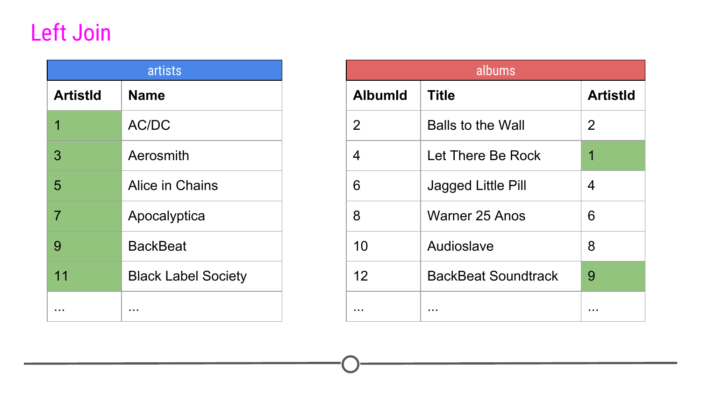

Thus, our output will again include all the columns from both tables combined into a single table; however, for example, `ArtistId` 3 will contain NAs for `AlbumId` and `Title` as there is no associated album data relating to `ArtistID` 3 in the `albums` table. NAs will be filled in for any observations in the first table specified that are missing in the second table.

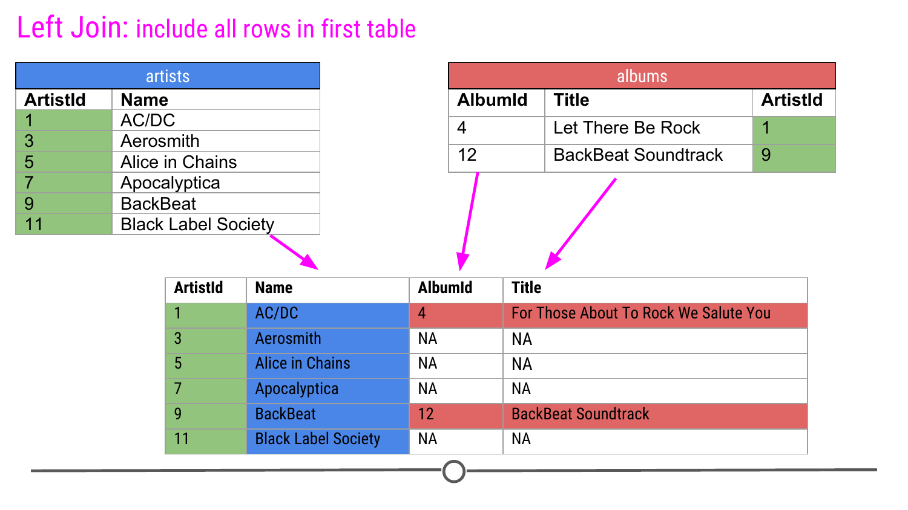

Now, to run this for our tables from the database, rather than just for a few rows in our toy example, you would do the following:

```r
# Perform a left join
left <- left_join(artists, albums)

# Look at output as a tibble
as_tibble(left)
```


### Right Joins

Right join is similar to what we just discussed; however, in the output from a right join, all rows in the last table specified are included in the output. NAs will be included for any observations found in the last specified table but not in the other tables. In the case of only joining two tables, this means that a right join will include all of the rows and data from the second table, but only those matching values from the first table. 

In our toy example, that means, album information about `ArtistID`s 2, 1, 4, 6, 8, and 9 will be included. 

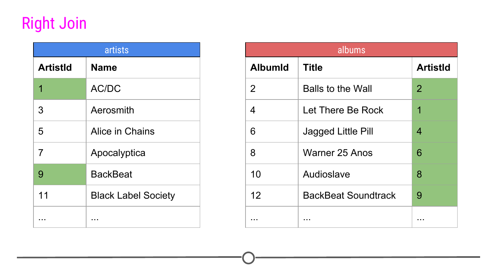

Again, in our toy example, we see that `right_join()` combines the information across tables; however, in this case, there are multiple `ArtistId`s lacking a name to go along with it, as this data is missing from the artists table. 

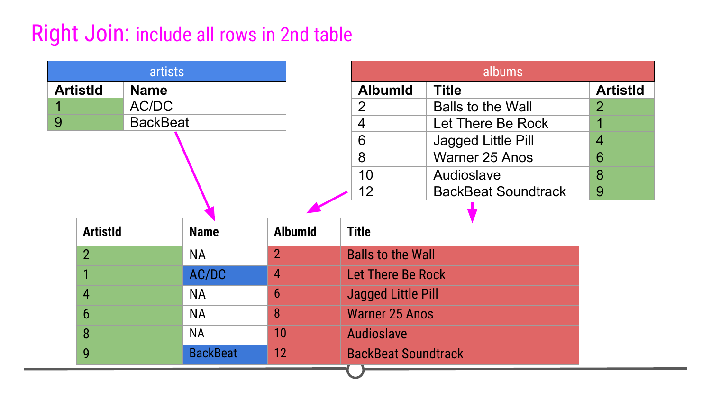

Now, to run this for our tables from the database, you would have to do something *slightly* different than what you saw above. Note in the code below that we have to change the class of the tables from the database into tibbles before doing the join. This is because SQL does not currently support right or full joins, but `dplyr` does. Thus, we first have to be sure the data are a class that `dplyr` can work with using `as_tibble()`. Other than that, the code below is similar to what you've seen already:

```r
## do right join
right <- right_join(as_tibble(artists), as_tibble(albums))

## look at output as a tibble
as_tibble(right)
```


While the output may look similar to the output from `left_join()`, you'll note that there are a different number of rows as a result of how the join was performed. The fact that 347 rows are present with the right join and 418 were present after the left join suggests that there are albums that do not have associated artists found in the `artist` table.

### Full Joins

Finally, a full join will take every observation from every table and include it in the output.

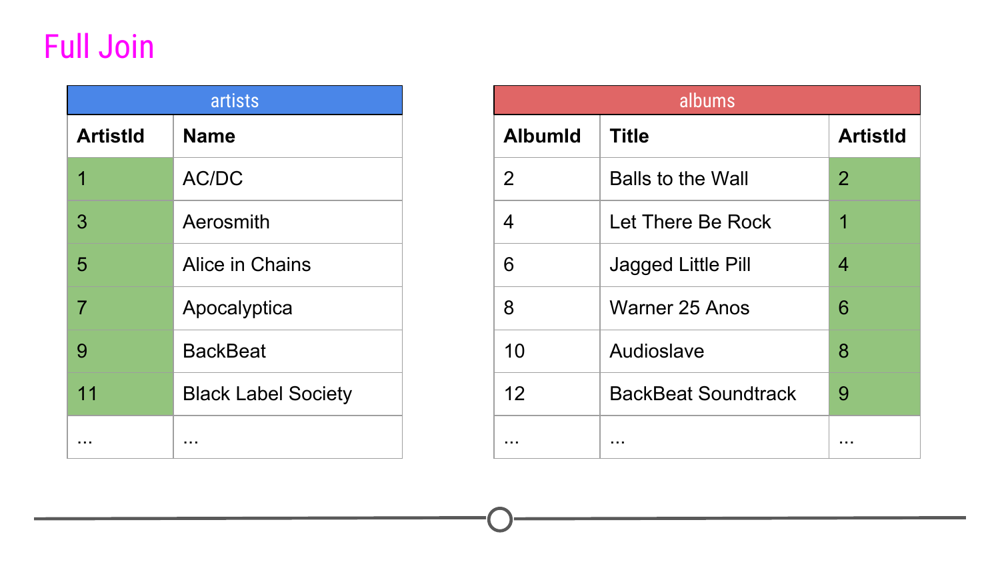

Thus, in our toy example, this join produces twelve rows, including all the observations from either table. NAs are filled in when data are missing for an observation.

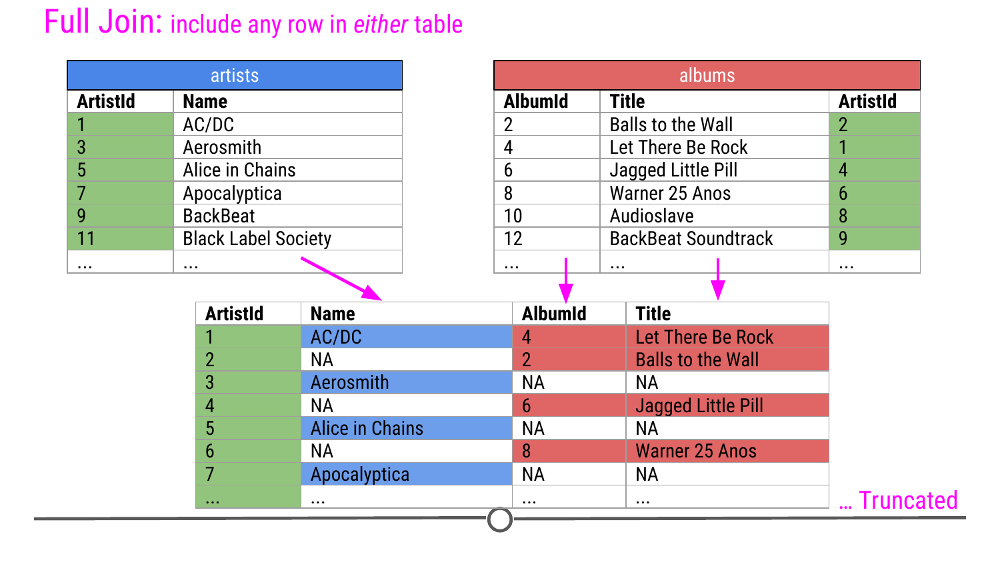

As you saw in the last example, to carry out a full join, we have to again specify that the objects are tibbles before being able to carry out the join

```r
## do right join
full <- full_join(as_tibble(artists), as_tibble(albums))

## look at output as a tibble
as_tibble(full)
```


### Mutating Joins Summary

Now that we've walked through a number of examples of mutating joins, cases where you're combining information across tables, we just want to take a second to summarize the four types of joins discussed using a visual frequently used to explain the most common mutating joins where each circle represents a different table and the grey shading on the venn diagrams indicates which observations will be included after the join.

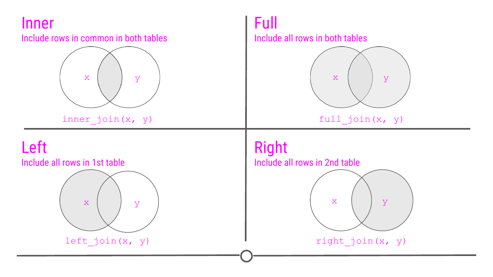

To see a different visual representation of this, there is a great resource on GitHub, where these joins are illustrated, so feel free to check out [this link](https://github.com/gadenbuie/tidyexplain#readme) from [Garrick Aden-Buie](https://www.garrickadenbuie.com/) animating joins within relational data.

### Filtering Joins

While we discussed mutating joins in detail, we're just going to mention the ability to carry out filtering joins. While mutating joins combined variables across tables, **filtering joins** affect the observations, not the variables. This *still* requires a unique identifier to match the observations between tables.

Filtering joins keep observations in one table based on the observations present in a second table. Specifically:

* `semi_join(x, y)` : keeps all observations in `x` with a match in `y`.
* `anti_join(x, y)` : keeps observations in `x` that do *NOT* have a match in `y`.

In our toy example, if the join `semi_join(artists, albums)` were run, this would keep rows of `artists` where the `ArtistID` in `artist` was also in the `albums` table. For our small example, the output would then look like this: 

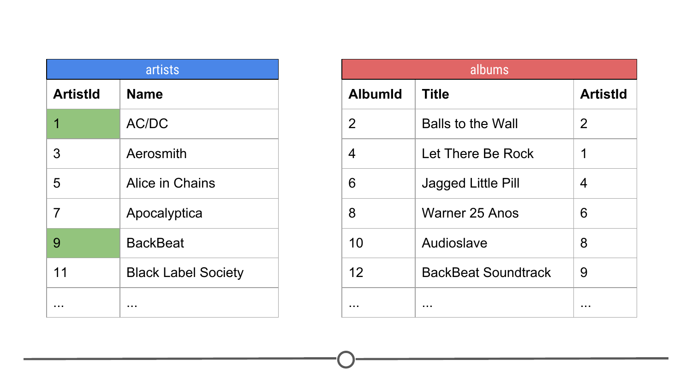

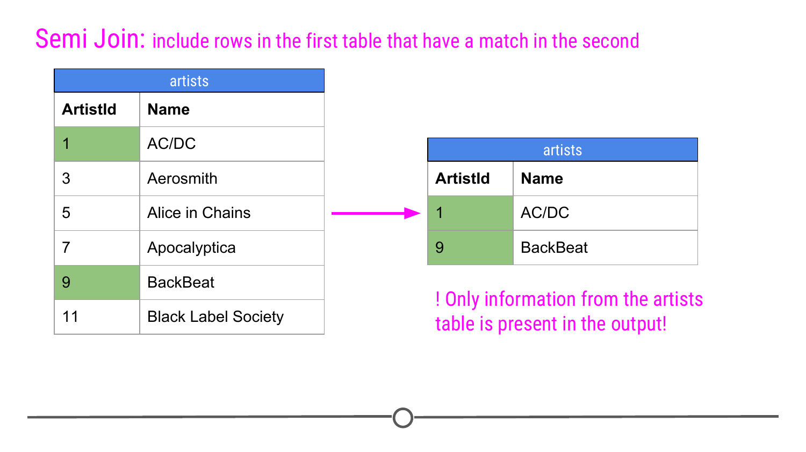

If we were to do this for our full dataset, we would use `semi_join(artists, albums)` which will output all the rows in `artists` that are also present in the `albums` table. 


Alternatively, anti joins will output all the rows of the artists table that is NOT present in the albums table. In our small example, we would output the exact opposite rows as before. 

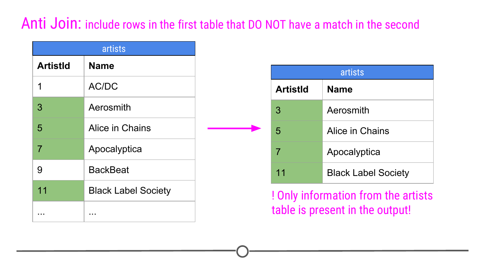

So `anti_join(artists, albums)` on the full datasets would output the rows of `artists` whose `ArtistId` was *NOT* found in the `albums` table.


Note that in the case of filtering joins, the number of columns in the table *after* the join does not change. While **mutating joins** merged the tables creating a resulting table with more columns, with **filtering joins** we're simply filtering the observations in one table based on the values in a second table.

### A working example of joining datasets

Here, we'll work through a problem to show how the `left_join()` function works, as this is used frequently. 

Let's try to combine the information from two different datasets we've used in a previous lesson. We have `msleep` and `conservation`. `msleep` contains a column called `conservation`. This column includes lowercase abbreviations that overlap with the uppercase abbreviations in the `abbreviation` column in the `conservation` dataset.

To handle the fact that in one dataset, `msleep`, the abbreviations are lowercase and in the other, `conservation`, they are uppercase, we'll use `mutate()` to take all the lowercase abbreviations to uppercase abbreviations using the function `toupper()`. 

```r
msleep %>%
  mutate(conservation = toupper(conservation))
```

Like in the last time we used the `conservation` dataset, we need to separate the abbreviation from the explanation of what it means, as this violates tidy data principles and will interfere with our join, since there would be no ID in common.  Let's save this to a table called `conserve`. 

```r
conserve <- conservation %>%
  separate(`conservation abbreviation`, 
           into = c("abbreviation", "description"), sep = " = ")
```
 
We'll then use `left_join()` which takes all of the rows in the first dataset mentioned (`msleep`) and incorporate information from the second dataset mentioned (`conserve`), when information in the second dataset is available. Since the column names of the common column are not the same in both datasets, we need to specify the column names in each table to join by. We do this with the `by = ` argument which states what columns to join by in the first (`conservation`) and second (`abbreviation`) datasets. 

The goal of this join is to add the `description` column from the `conserve` dataset onto the original dataset (`msleep`). If there is no information in the second dataset that matches with the information in the first dataset, `left_join()` will add NAs. Specifically, for rows where conservation is "DOMESTICATED" below, the `description` column will have NA because "DOMESTICATED" is not an abbreviation in the `conserve` dataset.

All together this looks like: 

```r
## Separate information into two columns and save to a new table
conserve <- conservation %>%
  separate(`conservation abbreviation`, 
           into = c("abbreviation", "description"), sep = " = ")


## Join the two datasets together!
msleep %>%
  mutate(conservation = toupper(conservation)) %>%
  left_join(conserve, by = c("conservation" = "abbreviation"))
```

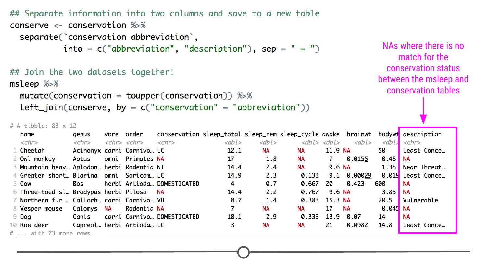

### Summary 

Here we have covered both mutating and filtering joins. Mutating joins bring together two or more datasets on the basis of a common ID column. There are four main kinds of mutating joins: inner, full, left and right. Left and right joins keep all of the lines in one of the datasets (either the first or the last specified, respectively) and will create NAs where there is no match between the sets. On the other hand, an inner join will only keep those rows that are present and common to both tables. And finally, a full join, as the name implies, keeps all of the rows from all tables and will produce NAs where no match exists.  Filtering joins, like semi- or anti-joins, are different in that it will *filter* the data in one table on the basis of data in another. In these joins, the output is solely the contents of the first table but with rows removed based on whether they match (semi-join) or don't match (anti-join) another table. 

### Slides

This lesson's slides can be found [here](https://docs.google.com/presentation/d/16bMvJkjtGYitLrlKsygwr4TfD57OF_vkmbuFc8aGCcw/edit?usp=sharing)  
