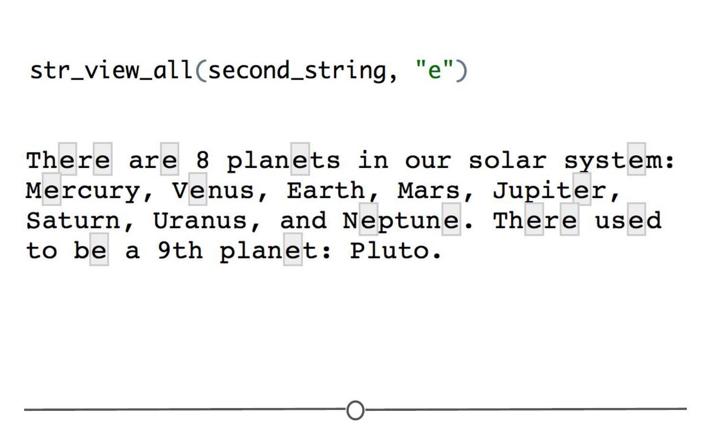
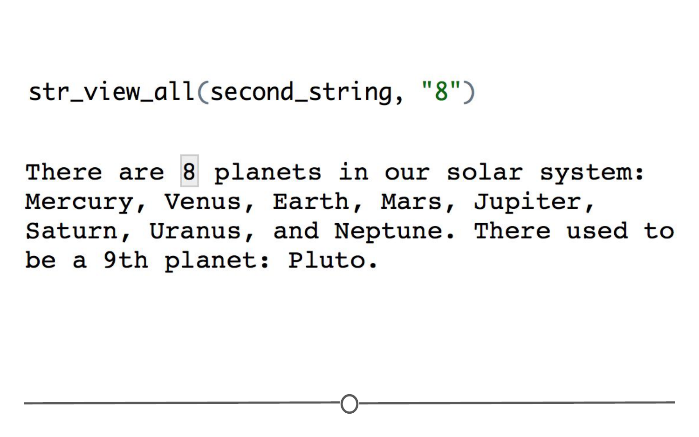
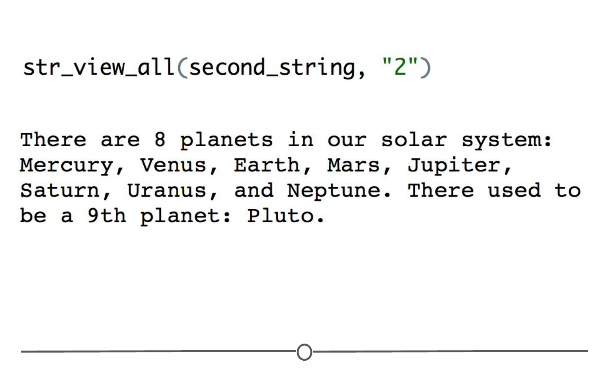
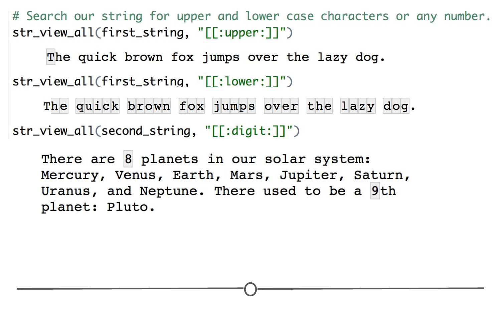
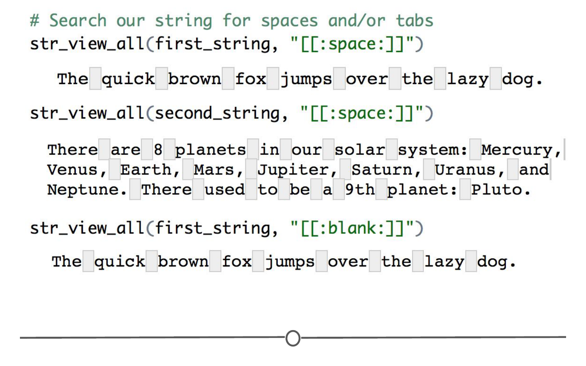
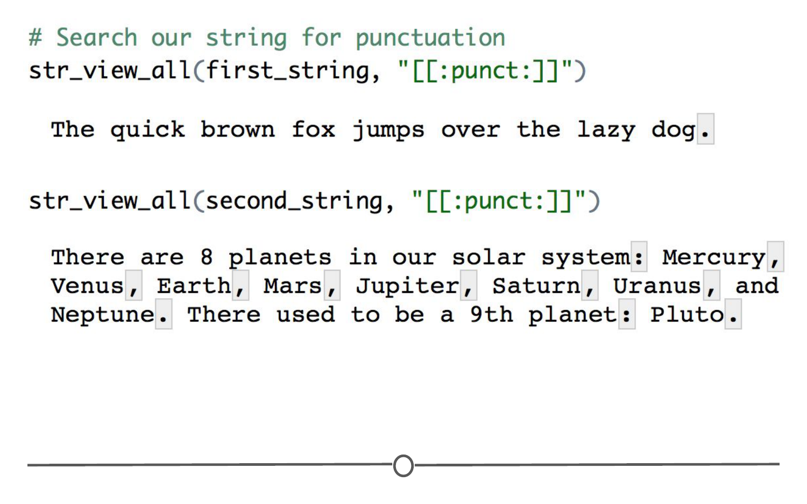
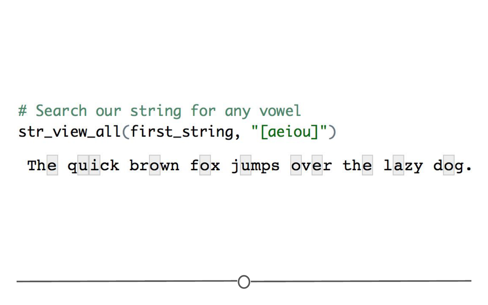
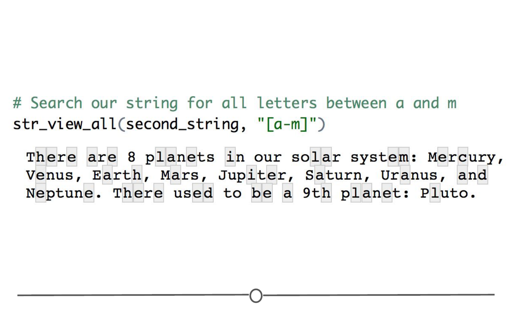
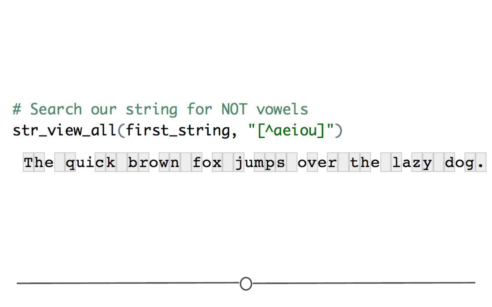

# Regular expressions

In the next lesson, we will discuss the basics of working with strings within the `stringr` package. However, before we do that, working with strings becomes infinitely easier with an understanding of regular expressions. 

### What are strings and regular expressions?  

Strings are a sequence of characters, letters, numbers or symbols.

Within R, you can create a string using the following syntax. Note that the string begins and ends with quotation marks:

```r
stringA <- "This sentence is a string."
```

Multiple strings can be stored within vectors. So, if you have multiple strings that you want to store in a single object, you could do so by using `c()` around the strings you want to store and commas to separate each individual string:

```r
objectA <- c( "This sentence is a string.", "Here's another string", "Here's a third string" )
```

Regular expressions ("regexps") are used to **describe patterns within strings**. They can take a little while to get the hang of but become very helpful once you do. 

### Performing basic matches  

Let's create some strings and perform some basic matches with regular expressions. To visualize the matches, we are going to use the `stringr` function `str_view_all`. So let's install and load the `stringr` package and then create a few strings to practice on. 

```r 
# Install and load the stringr package 
install.packages("stringr")
library(stringr)

# Create some strings
first_string <- "The quick brown fox jumps over the lazy dog."
second_string <- "There are 8 planets in our solar system: Mercury, Venus, Earth, Mars, Jupiter, Saturn, Uranus, and Neptune. There used to be a 9th planet: Pluto."
```

Before we move on, the `str_view_all()` function works by specifying the string you want to search first, and then pattern you want to look for second. Let's practice this. 

#### Searching for individual letters or numbers

At the most basic, we can search a string for a letter or number that you specify. Let's find all of the times "e" shows up in our second string. 

```r 
str_view_all(second_string, "e")
```



In the Viewer, you should see the result of our search - all of the "e"s are highlighted. But you might also have noticed, the "e" in "Earth" isn't highlighted. Searches using regular expressions are case sensitive. 

Let's repeat this, but search for a number in the second sentence. 

```r
str_view_all(second_string, "8")
```



What would happen if the number or letter you are looking for doesn't exist in the string? 

```r
str_view_all(second_string, "2")
```


#### Search for any letter or any digits

To search for any letter in a string, regardless of whether the letter is capital or lower case, you can use `[[:alpha:]]`. If you specifically want upper or lower case letters, you will use `[[:upper:]]` or `[[:lower:]]` respectively. To search for digits (i.e.: numeric variable between 0 and 9) in a string, you use `[[:digit:]]`. Let's see how these searches will match with our strings from before! 

```r 
# Search for any letter
str_view_all(first_string, "[[:alpha:]]")
str_view_all(second_string, "[[:alpha:]]")
```
Searching for all letters, we can see that numbers, punctuation, and spaces are excluded from the search. 

![**We can use `[[:alpha:]]` to search for any letter**](resources/images/19_GCD_Regex/19_GCD_Regex-08.png)

Let's test out the other search terms. 

```r 
# Search our string for upper and lower case characters or any number. 
str_view_all(first_string, "[[:upper:]]")
str_view_all(first_string, "[[:lower:]]")
str_view_all(second_string, "[[:digit:]]")
```



#### Search for spaces or punctuation

We can search for spaces, tabs, and newlines - collectively known as "whitespace" - either individually or as a group. For now, we'll look at how to find spaces or spaces and tabs - we'll look at newlines and the like later in this lesson when we cover special characters. 

If we wanted to search for spaces only, we can use `[[:space:]]`. We can search for tabs and spaces with `[[:blank:]]`.

```r 
# Search our string for spaces and/or tabs
str_view_all(first_string, "[[:space:]]")
str_view_all(second_string, "[[:space:]]")
str_view_all(first_string, "[[:blank:]]")
```
Since none of our strings have tabs in them, searching for `[[:space:]]` yields the same output as `[[:blank:]]`. 



We can also search for all punctuation, by using `[[:punct:]]`. In the strings below, we include all of the different characters that are considered punctuation. 

```r 
# Search our string for punctuation
str_view_all(first_string, "[[:punct:]]")
str_view_all(second_string, "[[:punct:]]")
```



#### Identify any character (except newline)

To identify all characters except for a newline you can use `.`. Since none of our strings we are practicing on have newline characters, this will highlight all characters in our strings. 

```r
# Search our string for any character but newline
str_view_all(first_string, ".")
str_view_all(second_string, ".")
```


### Performing more complicated matches 

One of the benefits of regular expressions is the ability to combine them to create more complicated searches. 

Above, we learned how to search for a single letter - what if we wanted to search for more than one letter? 

If we want to search for all occurrences of a series of letters, we can combine them within square brackets. So to match all vowels in our first sentence, you would specify a, e, i, o, and u within square brackets as our search term. 

```r 
# Search our string for any vowel
str_view_all(first_string, "[aeiou]")
```



Another way we can search for more than one character at a time is by specifying a range - so if we only wanted to highlight the first half of the alphabet, we can specify to search for that **range** of letters: `a-m`

```r 
# Search our string for all letters between a and m
str_view_all(second_string, "[a-m]")
```



What if we wanted to find all the consonants? We could put all of the letters of the alphabet except a, e, i, o, and u within the square brackets, *or* we could specify that we want everything **but** the vowels. We specify "anything but" with a caret (`^`). 

```r 
# Search our string for NOT vowels
str_view_all(first_string, "[^aeiou]")
```



But, we can see this has also highlighted punctuation and spaces, and we just want consonants. So we can expand on our matching by specifying we don't want vowels **OR** spaces **OR** punctuation. We specify **OR** with the `|` character (by your enter key). Let's try our search for consonants again. 

```r 
# Search the first string for NOT vowels OR spaces OR punctuation
str_view_all(first_string, "[^aeiou | [[:space:]] | [[:punct:]] ]")
```


### Anchors 

Anchors are a way to specify a position within a string to search. If you are interested in finding a pattern at the beginning (`^`) or end (`$`) of a string, you can specify that using a regular expression. Be careful! The caret here doesn't mean **NOT** like before - if the caret is outside of the brackets, it is being used as an anchor. 

Let's create some new strings to practice this with.  

```r 
names <-c("Keisha McDonald", "Mohammed Smith", "Jane Doe", "Mathieu Person")
```

So if we wanted to search for names beginning with an M, we would use `"^M"`.

```r 
# Search for strings beginning with M. 
str_view_all(names, "^M")
```


You can see that the M in Keisha's last name is not highlighted, since that is the beginning of a word and not the string as a whole. 

### Special characters and escaping 

Above, we talked about how we can search for any character but a newline with a `.` ... But what if we wanted to search for periods? The period is a **special character** because it has a meaning in regular expressions, so we can't just search for it like we would, for example, the letter "S". 

We can still search for these patterns, but we need to **escape** the regular expression so that we are searching for the literal character and not the special function. We do this by preceding the special character with black slashes, `\\`. So to search for a period, we would use `\\.`

```r 
# Search for periods 
str_view_all(second_string, "\\.")
```


Other special characters include for example: tabs (`\\t`), new lines (`\\n`) , question marks (`\\?`), exclamation marks (`\\!`), and brackets (`\\(`). 

```r 
# Create a new string with some special characters in it
crazy_string <- "This string is cRaZy!?! :)"

# Search it for !, ?, and )
str_view_all(crazy_string, "\\!")
str_view_all(crazy_string, "\\?")
str_view_all(crazy_string, "\\)")
```


### Quantifiers

There are special characters we can use to specify how many times a pattern should be found within the string. To do so, you use the following:

* ? : 0 or 1
* \+ : 1 or more
* \* : 0 or more

* {n} : exactly n times
* {n,} : n or more times
* {n,m} : between n and m times

Using the definitions above, we can use the following code to identify patterns within the names vector where m shows up one or more times in a string. 

```r
# Identify any time the letter m shows up one or more times
str_view_all(names, "m+")
```


Let's compare this to specifying we want to find the letter m one time with `{1}`.

```r
# Identify single m's
str_view_all(names, "m{1}")
```
While the difference is slight in the output here, we're identifying portions of the string where m shows up exactly once. So, instead of the 'mm' in "Mohammed" matching together, the code here splits these up, due to the fact that we're specifying the pattern match, 'm', exactly one time. 


If you only wanted to match strings where m showed up twice in a row, you could specify that with `{2}`. 

```r
# Identify where m shows up exactly two times in a row
str_view_all(names, "m{2}")
```


This could similarly be achieved by specifying to search for the pattern 'mm' one or more times (`+`):

```r
# Identify any time 'mm' shows up one or more times 
str_view_all(names, "mm+")
```


### Summary 

In this lesson we learned about regular expressions - which are patterns of characters within strings. We learned how to search for letters and numbers, either singly or as an entire class (eg: `[[:alpha:]]`). We searched for spaces (`[[:space:]]`), whitespace (`[[:blank:]]`) and punctuation (`[[:punct:]]`) as a whole. We learned how to search for multiple characters at the same time (eg: `[aeiou]`). We learned how to specify NOT (`^`) or OR (`|`) in our searches. We learned how to use anchors to specify whether to search for strings beginning (`^`) or ending (`$`) in a specific character. Additionally, we looked at how to search for special characters, by escaping (`\\`) the search. And finally, we looked at how to use quantifiers to specify the number of times a pattern needs to appear to be a match.  

There's still a lot of nuance to using regular expressions and they can get quite complicated looking! To help you on your way, there are two [R cheatsheets](https://www.rstudio.com/resources/cheatsheets/) about using regular expressions that you can download [here](https://github.com/rstudio/cheatsheets/raw/master/regex.pdf) and on the second page of [this cheatsheet](https://github.com/rstudio/cheatsheets/raw/master/strings.pdf) that will also be useful in the next lesson on `stringr`! 

### Slides

This lesson's slides can be found [here](https://docs.google.com/presentation/d/1VDJOssWXuW4DSINUrr2vVWWTPq1spTZLe33uM6bqF4U/edit?usp=sharing)  
