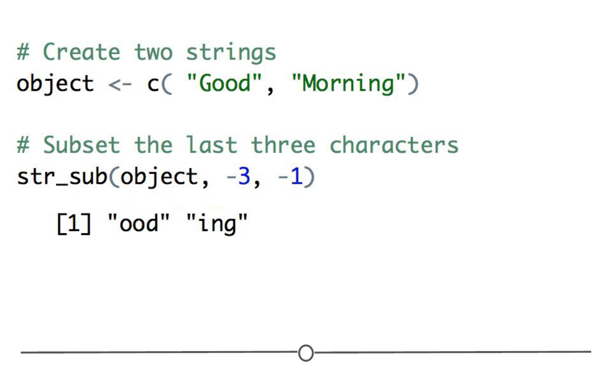

# Strings 
Let's look at how we can use the `stringr` package to look at strings in R! 

As we learned in the last lesson, a string is a sequence of characters, letters, numbers or symbols. To show the power of regular expressions, we used a single function, `str_view_all()` from the `stringr` package, but we didn't cover any other functions in this package or really how `str_view_all()` even works. So, let's fix that!

### `stringr`

[stringr](http://stringr.tidyverse.org/) is a package within the [tidyverse](https://www.tidyverse.org/) specifically designed to work well with strings. All functions within this package start with `str_`, as you'll see below. There are *many* helpful functions within the `stringr` package. We'll only review the basics here, but if you're looking to accomplish something with a string and aren't sure how to approach it, the `stringr` package is a good first place to look. There's a great cheatsheet for using the `stringr` package [here](https://github.com/rstudio/cheatsheets/raw/master/strings.pdf) that covers some of those other functions we won't cover here.

To install and load the `stringr` package, you'll use the following:

```r
# If not already installed, you'll need to install the package
install.packages("stringr")

# load package into R
library(stringr)
```

#### Available functions

As we'll only cover a few of the functions within `stringr` in this lesson, it's important to remember that if you start typing "str_" within RStudio, a list of the many options will show up.


### String basics

When working with strings, some of the most frequent tasks you'll need to complete are to:  
* Determine the length of a string  
* Combine strings together  
* Subset strings  
* Sort strings  

#### String length: `str_length()`

Returning to our object with three strings from the last lesson, we can determine the length of each string in the vector.  

```r
objectA <- c( "This sentence is a string.", "Here's another string", "Here's a third string" )

# Calculate the length of strings with str_length
str_length(objectA)
```


Here we see that the first string has a length of 26. If you were to go back and count the characters in the first string, you would see that this 26 includes each letter, space, and period in that string. The length of a string does not just count the letters in its length. The length includes *every character*. The second and third strings each have length 21. 

#### Combining strings: `str_c()`

If you were interested in **combining** strings, you'd want to use `str_c`.

```r
# Combine strings with str_c
str_c( "Good", "Morning")
```


However, the output from this doesn't look quite right. You may want a space between these two words when you combine the two strings. That can be controlled with the `sep` argument, which indicates what character should **separate** the strings.

```r
# Use the sep argument to separate the words with a space
str_c( "Good", "Morning", sep=" ")
```


#### Subsetting strings: `str_sub()`

Often, it's important to subset out one part of a string. To do this, you'll want to **subset** the string using the `str_sub()` function. For example, if you wanted only the first three characters in the strings below, you would specify that within `str_sub()`, where you specify the strings, and the start and end positions of the characters you want to subset.

```r
# Create two strings
object <- c("Good", "Morning")

# Subset the first three characters
str_sub(object, 1, 3)
```


You can also use negative numbers to count from the end of the string. For example, below we see code that returns the last three positions in the string.

```r
# Create two strings
object <- c( "Good", "Morning")

# Subset the last three characters
str_sub(object, -3, -1)
```



#### String sorting: `str_sort()`

Finally, if you wanted to sort a string alphabetically, `str_sort()` can help you accomplish that. You can also sort in reverse order, by specifying `decreasing = TRUE`.

```r
names <-c("Keisha McDonald", "Mohammed Smith", "Jane Doe", "Mathieu Person")

# Use str_sort to sort the names alphabetically
str_sort(names)

# Specify decreasing = TRUE to sort in reverse order
str_sort(names, decreasing = TRUE)
```


### `stringr` and regular expressions

Here we will put into use some of the skills we learned from the last lesson on regular expressions. To use regular expressions with the `stringr` package, the general format is `function(string , pattern = regexp)`, which you'll see used in practice below. 

We'll cover a number of helpful `stringr` functions that can use regular expressions, including:

* `str_view()` - View the first occurrence in a string that matches the regular expression
* `str_view_all()` - View all occurrences in a string that match the regular expression
* `str_count()` - Count the number of times a regular expression matches within a string
* `str_detect()` - Determine if a regular expression is found within a string
* `str_subset()` - Return subset of strings that match the regular expression
* `str_extract()` - Return portion of each string that matches the regular expression
* `str_replace()` - Replace portion of string that matches the regular expression with something else

#### Show the first match: str_view()

To get comfortable with using regular expressions with strings, `str_view()` can be very helpful. The output from `str_view()` highlights what portion of your string match the pattern specified in your regular expression with a grey box. For example, we'll use anchors and `str_view()` below:

```r
names <-c("Keisha McDonald", "Mohammed Smith", "Jane Doe", "Mathieu Person")

# Identify strings that start with "M"
str_view(names, "^M")
```


In this first example we see in the Viewer Panel that `str_view()` has identified the names that start with the letter M.

To identify names that end with the letter "e", you would use the following.

```r
# Identify strings that end with "e"
str_view(names, "e$")
```


Note, however, that regular expressions are case sensitive. To match patterns, you have to consider that "E" and "e" are different characters.  

```r
# Identify strings that end with "E"
str_view(names, "E$")
```


#### Show all matches: `str_view_all()`

One thing to pay attention to is that `str_view()` only will find the **first** instance of a pattern match, whereas the function we were using in the previous lesson, `str_view_all()` finds **ALL** matches. So if we were to search for the letter m in our `names` object, `str_view()` will only identify a single lowercase m in "Mohammed Smith" while `str_view_all()` will identify all three. 

```r
# Identify the first occurence of the letter m in each string
str_view(names, "m")

# Identify all occurrences of the letter m 
str_view_all(names, "m")
```


#### Count matches: `str_count()`

To count the number of matches within your strings, you would use `str_count()`. Below, using the `names` vector we've been using, we see that `str_count()` produces a 1 for those names that start with "M" and a 0 otherwise.

```r
# Identify strings that start with "M"
# Return count of the number of times string matches pattern
str_count(names, "^M")
```


However, if we instead wanted a count of the numbers of lowercase "m"s, we could still use `str_count()` to accomplish that. Notice below we've removed the specification to just look at the beginning of the string. Here, we're looking for lowercase m's anywhere in the string and counting them:

```r
# Identify strings that have a lowercase "m"
# Return count of the number of times string matches pattern
str_count(names, "m")
```


#### Detect matches: `str_detect()`

Instead of returning a count, at times you're just interested in knowing which strings match the pattern you're searching for. In these cases you'll want to use `str_detect()`. This function simply returns a TRUE if the string matches the pattern specified and FALSE otherwise.

```r
# Identify strings that start with "M"
# Return TRUE if they do; FALSE otherwise
str_detect(names, "^M")
```


#### Subset matches: `str_subset()`

To return the actual string that matches the specified pattern, rather than a TRUE/FALSE, you'll look to `str_subset()`. This function pulls out those strings that match the specified pattern. For example, to obtain the subset of names whose values start with the capital letter "M", you would use the following:

```r
# Identify strings that start with "M"
# Return the whole string
str_subset(names, "^M")
```


#### Extract matches: `str_extract()`

To extract only the portions of the string that match the specified pattern, you would use `str_extract()`. This function returns the pattern specified for strings where it is found and NA otherwise. For example, by searching for names that start with M, below, we see that the second and fourth strings in our vector return the pattern specified ("M") and that the first and third strings in the vector return NA, as they do not start with a capital "M".

```r
# Return "M" from strings with "M" in it, otherwise, return NA
str_extract(names, "^M")
```


#### Replace matches: `str_replace()`

The final basic function from `stringr` that we'll discuss is `str_replace()`. This function identifies a regular expression and replaces each occurrence with whatever replacement the user specifies. For example, below we search for strings that start with the capital letter "M" and replace each of them with a question mark. All strings that do *not* match the regular expression are returned unchanged.

```r
# Replace capital M with a question mark
str_replace(names, "^M", "?")
```


This can be a particularly useful function when cleaning data - for example, if you have a dataset that specifies the sex of people surveyed, but they are inconsistently written, you can use the `str_replace()` function to tidy the data and have a consistent way of denoting sex. 

```r
# Create a vector of strings with names and their sex
names_sex <-c("Keisha McDonald, Female", "Mohammed Smith, male", "Jane Doe, female", "Mathieu Person, Male")

# Note the inconsistent capitalization of the sex. Let's fix that
str_replace(names_sex, "Male", "male") %>% 
str_replace("Female", "female")
```


Here we can see that we have converted everyone's sex to lowercase. This also demonstrates how we can capitalize on the ability to use pipes with the `stringr` package. 

### Summary

This lesson set out to introduce you to how to work with strings within RStudio, using the `stringr` package. We've covered how to use `stringr` functions to calculate the length of strings, combine and subset strings, and sort them. We then looked at how we can use regular expressions with `stringr` functions to maximize `stringr`'s abilities. We looked at how to find matches for a regular expression and count those matches. We also looked at how to detect whether a string contained a match, which strings those are, and further, how to extract that match. Finally, we looked at how to find a match to your regular expression pattern and replace it with a different pattern, which also demonstrated how we can use pipes to combine `stringr` functions together. 

### Additional Resources

* [r4ds : Chapter 14 - Strings](http://r4ds.had.co.nz/strings.html) by [Hadley Wickham](http://hadley.nz/)
* [stringr documentation](http://stringr.tidyverse.org/articles/regular-expressions.html), part of the [tidyverse](https://www.tidyverse.org/)
* [stringr cheatsheet](https://github.com/rstudio/cheatsheets/raw/master/strings.pdf)

### Slides

This lesson's slides can be found [here](https://docs.google.com/presentation/d/1MkpNwB0VP1TXYRteDqPRXneDOz268HdOoSnXabRxteU/edit?usp=sharing)  
