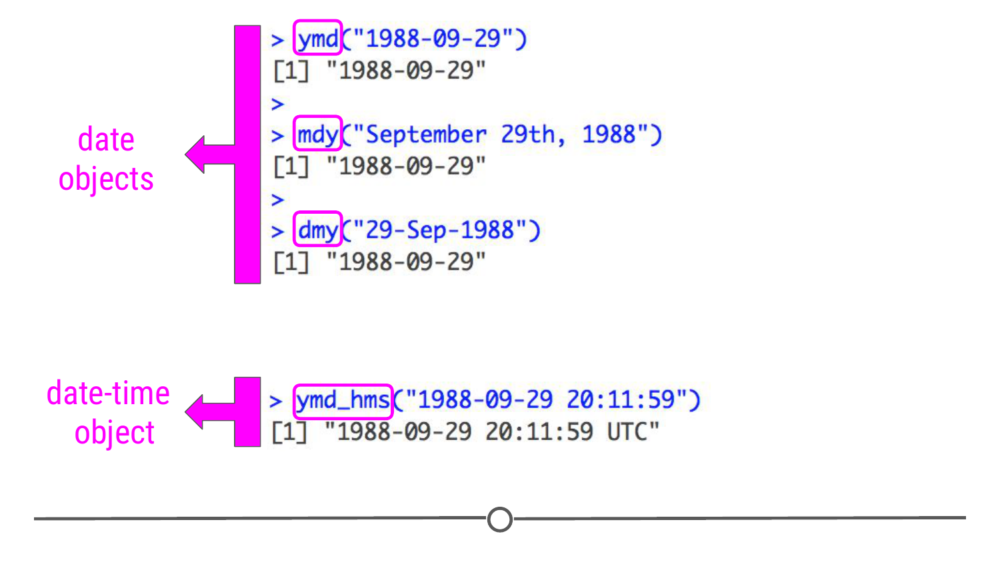

# Dates

We've covered how to work with strings in R in the previous lesson, and in the next lesson, we'll look at working with factors. Another type of data that you will commonly work with are dates and times!

As with strings, there is a tidyverse package to help you work with dates more easily. The [lubridate package](https://lubridate.tidyverse.org/) will make working with dates and times easier. Before working through this lesson, you'll want to be sure that `lubridate` has been installed and loaded in:

```r
install.packages('lubridate')
library(lubridate)
```

### Dates and time basics

When working with dates and times in R, you can consider either **dates**, **times**, or **date-times**. Date-times refer to dates plus times, specifying an exact moment in time. It's always best to work with the simplest possible object for your needs. So, if you don't need to refer to date-times specifically, it's best to work with dates. 

### Creating dates and date-time objects

To get objects into dates and date-times that can be more easily worked with in R, you'll want to get comfortable with a number of functions from the `lubridate` package. Below, we'll discuss how to create date and date-time objects from (1) strings and (2) individual parts.

#### From strings

Date information is often provided as a string. The functions within the `lubridate` package can effectively handle this information. To use them to generate date objects, you can call a function using `y`, `m`, and `d` in the order in which the year (`y`), month (`m`), and date (`d`) appear in your data. The code below produces identical output for the date September 29th, 1988, despite the three distinct input formats. This uniform output makes working with dates much easier in R.

```
ymd("1988-09-29")

mdy("September 29th, 1988")

dmy("29-Sep-1988")
```

However, this has only covered working with date objects. To work with date-time objects, you have to further include hour (`h`), minute (`m`), and second (`s`) into the function. For example, in the code below, you can see that the output contains time information in addition to the date information generated in the functions above:

```r
ymd_hms("1988-09-29 20:11:59")
```



#### From individual parts

If you have a data set where month, day, year, and/or time information are included in separate columns, the functions within `lubridate` can take this separate information and create a date or date-time object. To work through examples using the functions `make_date()` and `make_timedate()`, we'll use a dataset called `nycflights13`. As this dataset is *not* included with R by default, you'll have to install and load it in directly:

```r
install.packages('nycflights13')
library(nycflights13)
```

Loading this package makes a data frame called `flights`, which includes "On-time data for all flights that departed NYC... in 2013." We will work with this dataset to demonstrate how to create a date and date-time object from a dataset where the information is spread across multiple columns.

```r
# Preview the flights tibble
head(flights)
```

First, to create a new column, as we've done in previous lessons, we will use `mutate()`. To create a `date` object, we'll use the function `make_date()`. We just then need to supply the names of the columns containing the year, month, and day information to this function. 

```r
# make_date() creates a date object 
# from information in separate columns
flights %>% 
  select(year, month, day) %>%      # So only display the date columns during this test
  mutate(departure = make_date(year, month, day))    # Make a new column combining the date info
```


A similar procedure is used to create a date-time object; however, this requires the function `make_datetime()` and requires columns with information about time also be specified. Below, `hour` and `minute` are included in the function's input.

```r
# make_datetime() creates a date-time object 
# from information in separate columns
flights %>% 
  select(year, month, day, hour, minute) %>% 
  mutate(departure = make_datetime(year, month, day, hour, minute))
```


### Working with dates

The reason we've dedicated an entire lesson to working with dates and have shown you how to create date and date-time objects in this lesson is that you will often want to plot data over time or calculate how long something has taken. Being able to accomplish these tasks is an important job for a data scientist. So, now that you know how to create date and date-time objects, we'll work through a few examples of how to work with these objects. 

#### Getting components of dates

Often you're most interested in grouping your data by year, or just looking at monthly or weekly trends. To accomplish this, you have to be able to extract just a component of your date object. You can do this with the functions: `year()`, `month()`, `mday()`, `wday()`, `hour()`, `minute()` and `second()`. Each will extract the specified piece of information from the date or date-time object. 

```r
mydate <- ymd("1988-09-29")

# Extract year information
year(mydate)

# Extract day of the month
mday(mydate)

# Extract weekday information
wday(mydate)

# Label with actual day of the week
wday(mydate, label = TRUE)
```


Putting together a bunch of different skills we've learned over the past few lessons, let's see if planes travel longer distances on certain days of the week! Like before, we make a new column using `mutate()` with the date and time ("departure"), and now we apply the `wday()` function to these dates to create a new column, which specifies which day of the week that flight was. After this, we `select()` just this new column specifying the weekday and the distance flown column. Then we `group_by()` the day of the week and `summarize()` the distance flown per day. And finally, we plot this mean distance by the weekday using `ggplot()`! 

```r
flights %>% 
  mutate(departure = make_datetime(year, month, day, hour, minute)) %>%
  mutate(weekday = wday(departure, label = T)) %>%
  select(weekday, distance) %>%
  group_by(weekday) %>% 
  summarize(mean_dist = mean(distance)) %>% 
  ggplot(aes(x = weekday, y = mean_dist)) + 
  geom_point()
```


### Time spans

In addition to being able to look at trends by month or year, which requires being able to extract that component from a date or date-time object, it's also important to be able to operate over dates. If I give you a date of birth and ask you how old that person is today, you'll want to be able to calculate that. This is possible when working with date objects. By subtracting the birthdate from today's date, you'll learn how many days old this person is. By specifying this object using `as.duration()`, you'll be able to extract how old this person is in years.

```r
# How old is someone born on Sept 29, 1988? 

# Save their birthdate
birthdate <- ymd("1988-09-29")

# Subtract their birthday from today's date
age <- today() - birthdate
age

# A duration object can get this information in years
as.duration(age)

```


Using addition, subtraction, multiplication, and division is possible with date objects, and accurately takes into account things like leap years and different numbers of days each month. This capability and the additional functions that exist within `lubridate` can be enormously helpful when working with dates and date-time objects.

### Summary 

In this lesson we looked at dates and times and how to work with them in R, using the `lubridate` package. We first looked at how to convert either strings or existing columns into properly formatted dates, times, and date-times. Then we looked at how we can extract specific components from these dates, like which day of the week that date is, or what month. And finally, we looked at performing operations on dates, like subtracting two dates to find the length of time between them. 

This lesson has not covered how to work with times, much detail about how to operate on date or date-time objects, nor how to deal with timezones in date-time objects. To learn more about these subjects, you can explore the additional resources below!

### Additional Resources

* [r4ds : Chapter 16 - Dates and times](http://r4ds.had.co.nz/dates-and-times.html) by [Hadley Wickham](http://hadley.nz/)
* [lubridate](http://lubridate.tidyverse.org/), part of the [tidyverse](https://www.tidyverse.org/)
* [hms](https://github.com/tidyverse/hms) package, for working with time objects. This package is also part of the [tidyverse](https://www.tidyverse.org/)

### Slides

This lesson's slides can be found [here](https://docs.google.com/presentation/d/1zY6vMQ50bKFLuuTOrjYVH-soEzc2nxpdOEiEQxMYAk8/edit?usp=sharing)  
