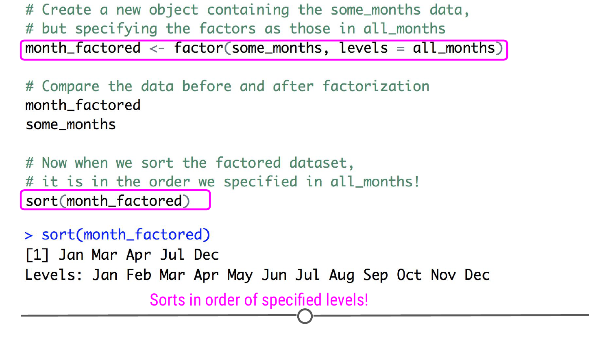
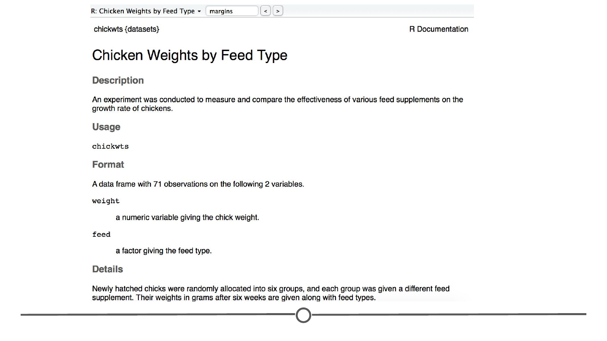

# Factors

In R, categorical data are handled as factors. By definition, categorical data are limited in that they have a set number of possible values they can take. For example, there are 12 months in a calendar year. In a month variable, each observation is limited to taking one of these twelve values. Thus, with a limited number of possible values, month is a categorical variable. Categorical data, which will be referred to as factors for the rest of this lesson, are regularly found in data. Learning how to work with this type of variable effectively will be incredibly helpful.

### Working with factors

To make working with factors simpler, we'll utilize the `forcats` package. Similar to the `stringr` package, all functions within `forcats` begin with `fct_`. As before, to see available functions you can type `?fct_` in your RStudio console. A drop-down menu will appear with all the possible forcats functions. Before working through this lesson, you'll want to be sure that `forcats` has been installed and loaded in.

```r
install.packages('forcats')
library(forcats)
```

### Factor basics

In R, factors are comprised of two components: the actual **values** of the data and the possible **levels** within the factor. Thus, to create a factor, you need to supply both these pieces of information.

For example, if we were to create a character vector of the twelve months, we could assign each of the months to a vector called `all_months" - this will eventually become our factor **levels**. Then we can supply some month names to a new vector, which will be our **values**, which will become factorized later. 

```r
# All 12 months
all_months <- c("Jan", "Feb", "Mar", "Apr", "May", "Jun", "Jul", "Aug", "Sep", "Oct", "Nov", "Dec")

# Our data
some_months <- c("Mar", "Dec", "Jan",  "Apr", "Jul")
```

However, if we were to sort this vector, R would sort this vector alphabetically. 

```r
sort(some_months)
```


While you and I know that this is not how months should be ordered, we haven't yet told R that. To do so, we need to let R know that it's a factor variable and what the levels of that factor variable should be.

```r
# Create a new object containing the some_months data, but specifying the factors as those in all_months
month_factored <- factor(some_months, levels = all_months)

# Compare the data before and after factorization
month_factored
some_months

# Now when we sort the factored dataset, it is in the order we specified in all_months!
sort(month_factored)
```



Here, we specify all the possible values that the factor could take in the `levels = all_months` argument. So, even though not all twelve months are included in the `some_months` object, we've stated that all of the months are possible values. Further, when you sort this variable, it now sorts in the sensical way!

If you ever need to check what levels are assigned to a factor, you can use the `levels()` function. 

```r
levels(month_factored)
```

### Manually change the labels of factor levels : `fct_relevel()`

What if you wanted your months to start with July first? That can be accomplished using `fct_relevel()`. To use this function, you simply need to state what you'd like to relevel (`month_factored`) followed by the levels you want to relevel. If you want these to be placed in the beginning, the after argument should be `after = 0`. You can play around with this setting to see how changing `after` affects the levels in your output.

```r
months_relevel <- fct_relevel(month_factored, "Jul", "Aug", "Sep", "Oct", "Nov", "Dec", after = 0)

months_relevel

sort(months_relevel)
```


After re-leveling, when we sort this factor, we see that July is placed first, as specified by the level re-ordering.

### Keep the order of the factor levels : `fct_inorder()`

Another way of ordering your data is to keep it in the order you originally specified. In our case, "Mar", "Dec", "Jan",  "Apr", then "Jul". To do this, you simply use `fct_inorder`.   

```r
months_inorder <- fct_inorder(some_months)

months_inorder

sort(months_inorder)
```


We see now with `fct_inorder` that even when we sort the output, it does not sort the factor alphabetically, nor does it put it in calendar order. In fact, it stays in the same order as the input, just as we specified.

### Advanced Factoring 

For the remainder of this lesson, we're going to return to using a dataset that's in R by default. We'll use the `chickwts` dataset for exploring the remaining advanced functions. This dataset includes data from an experiment that was looking to compare the "effectiveness of various feed supplements on the growth rate of chickens."



### Re-ordering factor levels by frequency : `fct_infreq()`

To re-order factor levels by frequency of the value in the dataset, you'll want to use `fct_infreq()`. Below, we see from the output from `tabyl()` that 'soybean' is the most frequent feed in the dataset while 'horsebean' is the least frequent. Thus, when we order by frequency, we can expect these two feeds to be at opposite ends for our levels.

```r
# Take a look at frequency of each level 
# using tabyl() from janitor package
library(janitor)
tabyl(chickwts$feed)

# Order levels by frequency 
fct_infreq(chickwts$feed) %>% levels()
```


As expected, soybean, the most frequent level, appears as the first level and horsebean, the least frequent level, appears last with the rest of the levels in between, sorted by their frequency. 

### Reversing order levels : `fct_rev()`

If we wanted to sort the levels from least frequent to most frequent, we could just add `fct_rev()` to the code using a pipe to reverse the factor level order.

```r
# Reverse factor level order
fct_infreq(chickwts$feed) %>% 
  fct_rev() %>% 
  levels()
```


### Re-ordering factor levels by another variable : `fct_reorder()`

At times you may want to reorder levels of a factor by another variable in your dataset. This is often helpful when generating plots. To do this you specify the variable you want to reorder, followed by the numeric variable by which you'd like the factor to be re-leveled. Here, we see that we're re-leveling `feed` by the `weight` of the chickens. The best way to demonstrate how this works is by plotting the `feed` against the `weight`. We can see that the order of the feed is such that those chickens with the lowest median weight (horsebean) are to the left, while those with the highest median weight (casein) are to the right.

```
# Order levels by a second numeric variable 
chickwts %>%
  mutate(newfeed = fct_reorder(feed, weight)) %>% # Reorder feed types by chicken weight 
  ggplot(aes(x = newfeed, y = weight)) + # Plot the feed type on the X and chicken weights on the Y axes
  geom_point() # Plot this data as points
```


### Combining several levels into one: `fct_recode()`

To demonstrate how to combine several factor levels into a single level, we'll continue to use our `chickwts` dataset. Let's *assume* (even if it doesn't make good sense with regards to chicken feed) you wanted to combine all the feeds with the name "bean" in it to a single category and you wanted to combine "linseed" and "sunflower" into the category "seed". This can be simply accomplished with `fct_recode()`. In fact, below, you see we can rename all the levels to a simpler term (the values on the left side of the equals sign) by re-naming the original level names (the right side of the equals sign). This code will create a new column, called `feed_recode` (accomplished with `mutate()`). This new column will combine "horsebean" and "soybean" feeds, grouping them both into the larger level "bean". It will similarly group "sunflower" and "linseed" into the larger level "seed." All other feed types will also be renamed. When we look at the summary of this new column by using `tabyl()`, we see that all of the feeds have been recoded, just as we specified! We now have four different feed types, rather than the original six.

```r
# We can use mutate to create a new column
# and fct_recode() to:
# 1. group horsebean and soybean, and sunflower and linseed into single levels
# 2. rename all the other levels
chickwts %>%
  mutate(feed_recode = fct_recode(feed,
    "seed"    =   "linseed",
    "bean"    =   "horsebean",
    "bean"    =   "soybean",
    "meal"    =   "meatmeal",
    "seed"    =   "sunflower",
    "casein"  =   "casein"
  )) %>%
  tabyl(feed_recode)
```


### Converting numeric levels to factors: `ifelse()` + `factor()`

Finally, when working with factors, there are times when you want to convert a numeric variable into a factor. For example, if you were talking about a dataset with BMI for a number of individuals, you may want to categorize people based on whether or not they are underweight (BMI < 18.5), of a healthy weight (BMI between 18.5 and 29.9), or obese (BMI >= 30). When you want to take a numeric variable and turn it into a categorical factor variable, you can accomplish this easily by using `ifelse()` statements. Here we combine those two ideas. Within a single statement we provide R with a condition: `weight <=200`. With this, we are stating that the condition is if a chicken's weight is less than or equal to 200 grams. Then, if that condition is true, meaning if a chicken's weight is less than or equal to 200 grams, let's assign that chicken to the category `low`. Otherwise, and this is the `else{}` part of the `ifelse()` function, assign that chicken to the category `high`. Finally, we have to let R know that `weight_recode` is a factor variable, so we call `factor()` on this new column. This way we take a numeric variable (`weight`), and turn it into a factor variable (`weight_recode`). 

```r
# Convert numeric variable to factor
chickwts %>%
    mutate(weight_recode = ifelse(weight <= 200, "low", "high"), 
           weight_recode = factor(weight_recode)) %>%
    tabyl(weight_recode)
```


### Summary

This lesson has covered how to work with factors (categorical) variables in R using the `forcats` package in R. In line with the previous few lessons, the best way to learn how to work with factors, is to actually work with them. Play around with the examples here and continue to practice using this type of variable! You'll come across factors regularly as you analyze data!

### Additional Resources
* [r4ds : Chapter 15 - Factors](http://r4ds.had.co.nz/factors.html) by [Hadley Wickham](http://hadley.nz/)
* [forcats](https://forcats.tidyverse.org/), part of the [tidyverse](https://www.tidyverse.org/)
* [forcats blog post](https://blog.rstudio.com/2016/08/31/forcats-0-1-0/)  by [Hadley Wickham](http://hadley.nz/)
* [Wrangling Categorical Data in R](https://peerj.com/preprints/3163/) by [Amelia McNamara](http://www.science.smith.edu/~amcnamara/) & [Nicholas J Horton](https://www.smith.edu/academics/faculty/nicholas-horton)

Note: [Wrangling Categorical Data in R](https://peerj.com/preprints/3163/) is **full** of really great examples and goes into further depth than what is covered here. This is a *great* resource to get more practice working with categorical data (factors) in R.

### Slides

This lesson's slides can be found [here](https://docs.google.com/presentation/d/1pyE6tFzl-YYriPrVAW_0tZMsHP6RXvQZNP0ALFhLCW8/edit?usp=sharing)  
