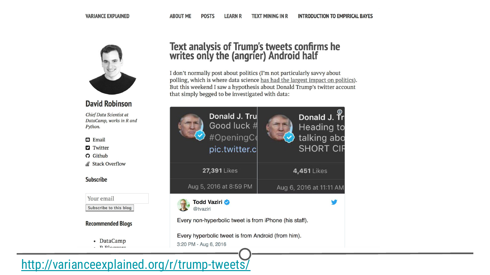
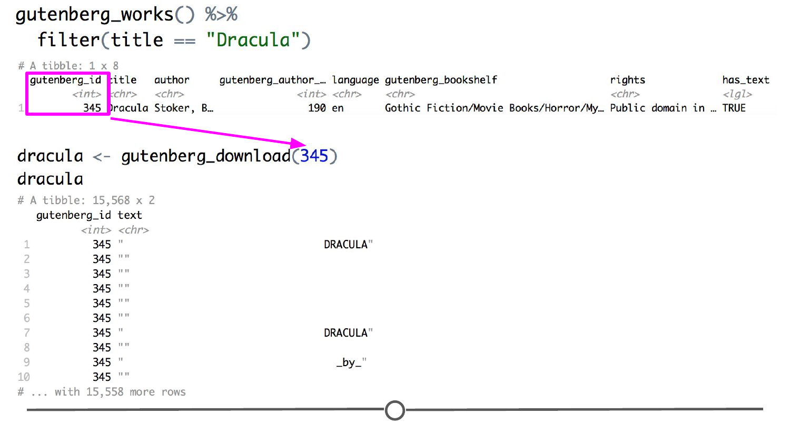
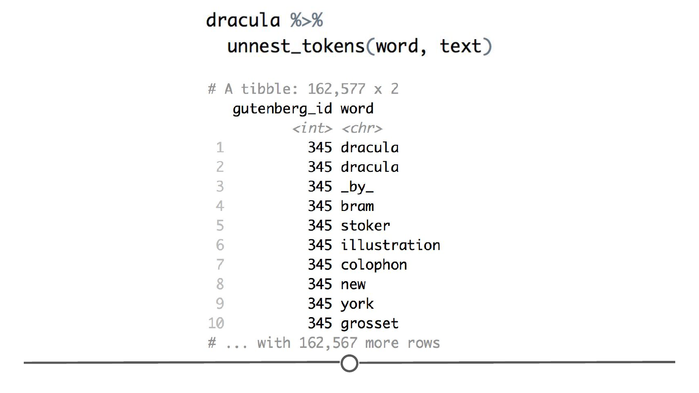
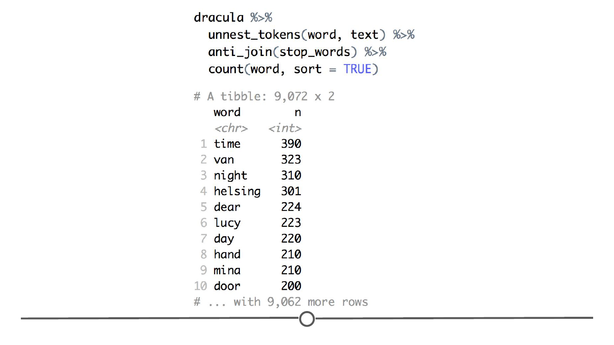
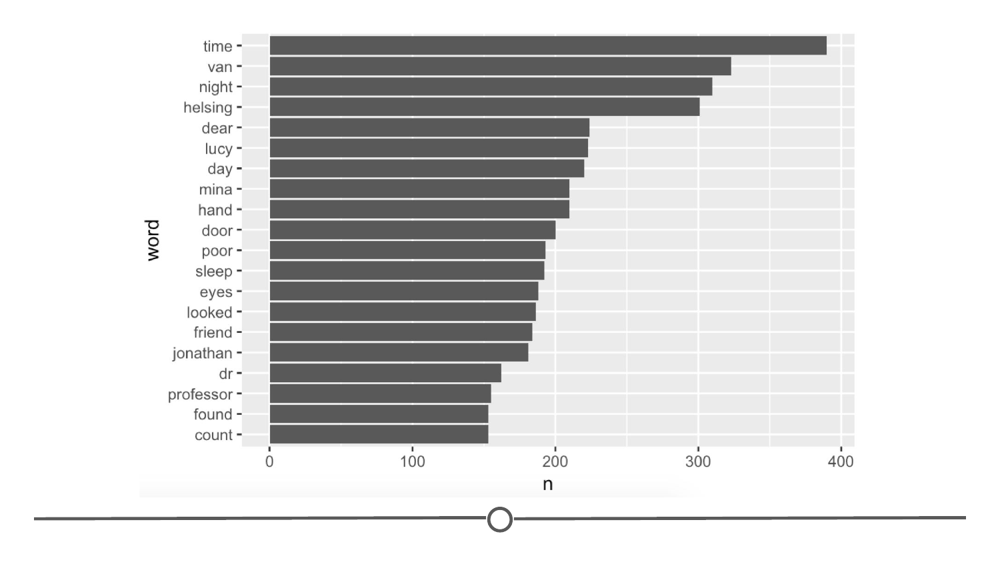
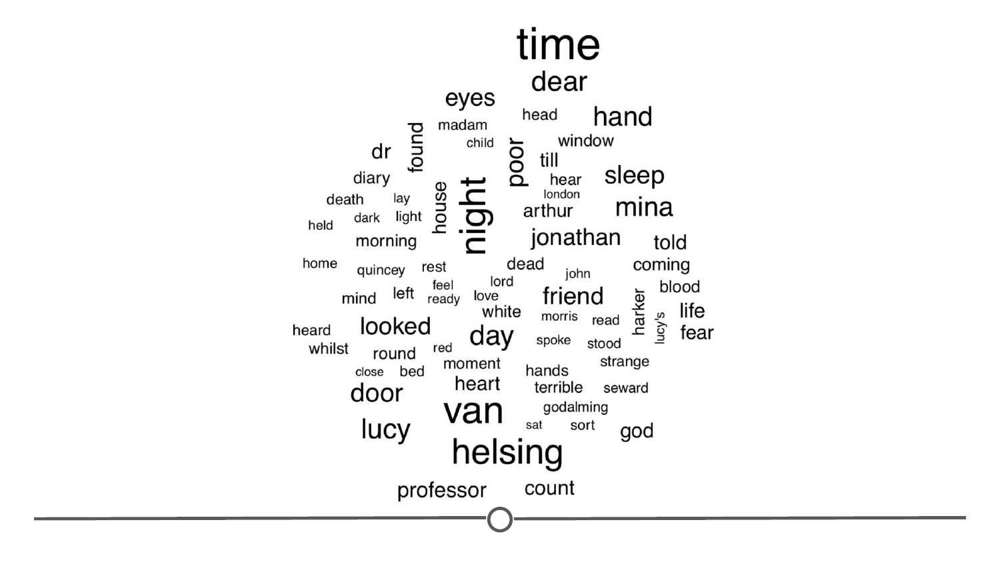
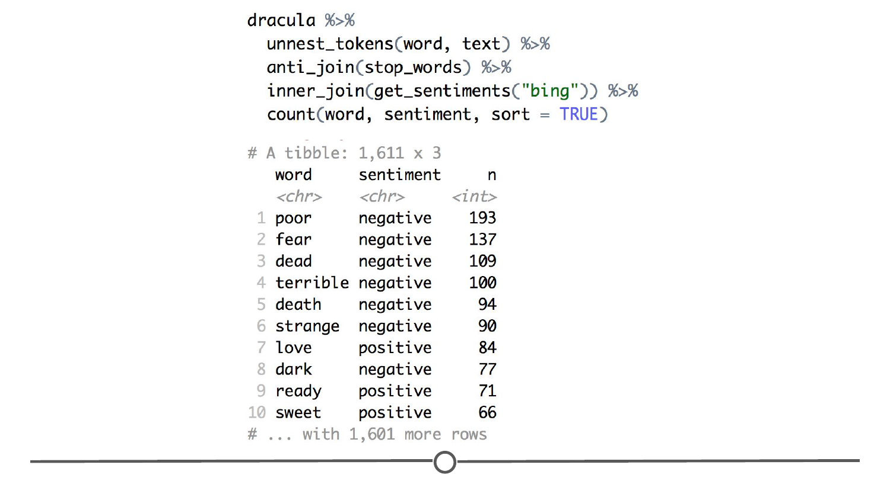
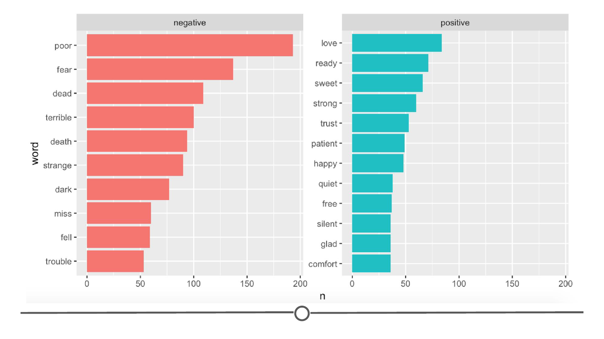

# Text

Unstructured data may contain text, images, audio files, and even video files. Given the differences in these types of data, traditional methods for cleaning and analysing these kind of data are not as helpful. Nevertheless, there are ways to work with these data in R. In these upcoming lessons, we'll introduce a number of different types of unstructured data and then give you a brief example of where you would start if you wanted to work with each unconventional data type in R. 

While most of the data we've seen so far has been text stored in rows and columns within a spreadsheet, text documents or words of any kind can also be data! **Text analytics** or **text mining** is the process of taking large collections of text, generating a dataset from the that can be analysed, and analysing the words in that dataset. In other words, text mining is the process of converting textual data from unstructured form to a structured form for analysis or visualization.

### Analysing Text in R

While not the most typical type of data analysed in R, R can be used to analyse text. There are three packages that are particularly helpful for analysing textual data using text mining:

* `tm` : a text mining package
* `languageR` : statistical analysis of linguistic data
* `tidytext` : a tidy analysis package; works with tidy data tools (e.g.: `dplyr`)

To see an example of text analysis in R, check out David Robinson's post [Text analysis of Trump's tweets confirms he writes only the (angrier) Android half](http://varianceexplained.org/r/trump-tweets/), where he uses the `tidytext` package, `twitteR` package, and Twitter API to analyse the tweets from Donald Trump during his presidential campaign.



### Using `tidytext`

There are plenty of different ways to get (mine) and analyse text data, but here, we will go over a few of the ways we can analyse text using the `tidytext` package. This lesson will closely follow the first two chapters of the [`tidytext` book](https://www.tidytextmining.com/tidytext.html). Before we get into it, first, let's install and load it. 

```r 
install.packages("tidytext") 
library(tidytext)
```

The `tidytext` package is used to convert text into a tidy format that is compatible with all the other tidyverse packages that we have looked at (e.g.: `dplyr`), which makes it a great place to start learning how to analyse text within R. Let's get some text and convert it to a tidy format! We'll go back to using some of the free text available on [Project Gutenberg](https://www.gutenberg.org/). Thankfully, there's an [R package](https://github.com/ropensci/gutenbergr), `gutenbergr`, that allows you to access all of their texts! Install and load it now:

```r 
install.packages("gutenbergr")
library(gutenbergr)

```

Let's find the text for *"Dracula"*. To do so, we use the `gutenberg_works()` function to find information about how it is stored in the Gutenberg database. 

```r 
# Find out how Dracula is stored in the Project Gutenberg database
gutenberg_works() %>%
  filter(title == "Dracula")
```

We can see from this output, that *Dracula* has an ID of 345, which we will use in the next function, `gutenberg_download()` to get the text. 

```r 
# Download the full text of Dracula, using ID 345
dracula <- gutenberg_download(345)
```



So now we have a dataframe, called `dracula`, that contains the entire text of the novel! The first step of analysing this text with the `tidytext` package is to convert sentences and paragraphs to a format where each word is on its own line. This process is called **tokenization**. 

#### Tokenization 

A token is a "meaningful unit of text", which in our case means words, but in other scenarios could be sentences or even paragraphs. We are going to use the `tidytext` function, `unnest_tokens()` to separate the full text of *Dracula*, currently stored in the `text` column of the dataframe `dracula` into one line per word. This step also converts all words to lowercase text and removes punctuation, which we don't necessarily want in our analyses.

```r 
dracula %>%
  unnest_tokens(word, text)
```



After doing this, you can see that there is one word per line. From here, we could jump right into analysis, but another common step of text analysis is to remove common words, like "the", "of", or "at". 

#### Stop words

Stop words are common words that you would like removed from your analysis due to how common they are. The `tidytext` package conveniently has a list of these words, kept in the dataset `stop_words`. We can use an `anti_join()` to remove these stop words from our *Dracula* text.

```r
# Take a peek at the stop_words dataset 
stop_words

# Remove these words from the text of Dracula using an anti-join 
dracula %>%
  unnest_tokens(word, text) %>%
  anti_join(stop_words)
```

From here, we have a tidied dataset containing the filtered text of *Dracula*, which we can now choose to analyse in multiple ways! One common thing we can do is to count the frequency of words used in the text and plot them. To do so, we will use `dplyr`s `count()` function to find the most common words used in *Dracula*. 

```r
dracula %>%
  unnest_tokens(word, text) %>% 
  anti_join(stop_words) %>%
  count(word, sort = TRUE)

```



Just looking at the first few lines, we can see that "time", "van", "night", and "helsing" are the top four words most commonly used in *Dracula*. To plot our results, we can either use our old friend ggplot, to create a bar plot of these common words and their frequencies, or we could make a word cloud. Let's start with the bar chart, where we will see which words are used greater than 150 times. 

```r 
dracula %>%
  unnest_tokens(word, text) %>%              # Put each word on its own line
  anti_join(stop_words) %>%                     # Remove common "stop" words
  count(word, sort = TRUE) %>%              # Count the number of times each word appears
  filter(n > 150) %>%                                  # Keep only those that appear more than 150 times 
  mutate(word = reorder(word, n)) %>%    # Put them in the order they appear
  ggplot(aes(word, n)) +                             # Plot the number of times each word appears
  geom_bar(stat = "identity") +                   # Using a bar plot 
  coord_flip()                                               # Flip the axes so that the words are on the Y
```



A similar procedure is used to create a word cloud, but requires the installation of another package, aptly named `wordcloud`. Install and load this now. 

```r 
install.packages("wordcloud")
library(wordcloud)
```

A word cloud is a representation of the most common words in a text sample, with each word's size determined by its frequency - the more frequent a word, the larger it appears. Let's use this package to create a word cloud of the 75 most common words in *Dracula*. 

```r
dracula %>%
  unnest_tokens(word, text) %>%
  anti_join(stop_words) %>%
  count(word) %>%
  with(wordcloud(word, n, max.words = 75))
```



And there we have a slightly less scientific looking plot, with a bit more style, showing the most common words appearing in *Dracula*. From this cloud, we can get a sense of the tone of *Dracula*, with some of the common words being "dead", "blood", "fear", "poor" and, "terrible". But we can get a bit more rigorous in this and perform **sentiment analysis**.

#### Sentiment analysis

In sentiment analysis, the goal is to categorize the text and quantify opinions and emotions expressed within the text. For instance, in a lot of satisfaction surveys, as you may have taken, the company asks you to express your opinion about your experience or a specific product in a few sentences. Historically, due to the fact that survey respondents could have typed anything they wanted in these boxes, these kind of data were often ignored when analysing the survey data due to their *unstructured* nature. In other words, free text responses on a survey can be hard to analyse. 

In cases where these data *were* analysed, the text from each survey respondent would have been read by a human. That human would assess what the response and assign a score as to how positive or negative the text was. However, using sentiment analysis we are now able to read a vast amount of textual data and use an algorithm to assign a value to a respondent's attitude toward the service or the product. 

There are different approaches to sentiment analysis. Sometimes, a paragraph of text will be evaluated to assess how sad or happy the words in the text are. Other times, you'll use sentiment analysis to gauge how positive or negative the words in the text are. Other times still, words will be analysed using sentiment analysis to determine how scientific or unscientific text is. For more on sentiment analysis read this [this article](https://www.crimsonhexagon.com/blog/what-is-sentiment-analysis/).

Here, we will use sentiment analysis to look at whether *Dracula* is as dark as our word cloud would suggest. Within the `tidytext` package, they provide a list of words and their connotations within the `sentiment` dataset. They score words on the basis of three different sources and here, we are going to use the "bing" database, which scores words purely on "positive" or "negative", which we can view using the `get_sentiments()` function. 

```r
sentiments

get_sentiments("bing")
```


You can see that there is a long list of words that are scored for being positive or negative. Now we will see if these positive or negative words are more common in *Dracula*. We will tokenize the text and remove stop words like before, but this time we will follow it with an `inner_join()` to find only those words in *Dracula* that match with either positive or negative words in the "bing" dataset and then we will count the number of times each appears, and sort by their popularity. 

```r
dracula %>%
  unnest_tokens(word, text) %>%
  anti_join(stop_words) %>%
  inner_join(get_sentiments("bing")) %>%
  count(word, sentiment, sort = TRUE)
```



Doing so, we see that seven of the top ten most common sentiments are negative words! It definitely seems like *Dracula* is a gloomy book! Let's plot this to see just how much more common the top ten negative words are than the top ten positive. 

```r 
dracula %>%
  unnest_tokens(word, text) %>%
  anti_join(stop_words) %>%
  inner_join(get_sentiments("bing")) %>%
  count(word, sentiment) %>%
  group_by(sentiment) %>%                               # Group the words into positive and negative groups
  top_n(10) %>%                                                 # Find the top ten most common words in both the positive and negative groups
  ungroup() %>%                                                 # Ungroup the data so that mutate() works in the next step 
  mutate(word = reorder(word, n)) %>%             # Reorder the words so that when you plot them it will be in order of most common to least
  ggplot(aes(word, n, fill = sentiment)) +             # Plot the words and their frequencies
  geom_bar(stat = "identity") +                            # In a bar plot
  facet_wrap(~sentiment, scales = "free_y") +    # In two separate plots, one for each sentiment
  coord_flip()                                                       # With the X and Y axes flipped for readability
```



From this, we can see that the top negative words are used far more frequently than even the most frequently used positive words! 

### Summary

In this lesson, we looked at how to manipulate and analyse text data in R, introducing the packages `tm`, `languageR`, and in particular `tidytext`. We looked more into the `tidytext` package, were we learned what tokens are and what stop words are and how to get rid of them. We then analysed our text data by counting and plotting common words (either in a bar plot or a word cloud). From there, we looked at sentiment analysis and examined the distribution of positive and negative words in *Dracula* and saw that negative words are more common than positive ones. 

### Additional Resources

* [`tm` vignette](http://varianceexplained.org/r/trump-tweets/)
* ["Text Mining with R"](https://www.tidytextmining.com/), by [Julia Silge](https://juliasilge.com/) and [David Robinson](http://varianceexplained.org/about/)
* [Analysis of Trump's tweets](http://varianceexplained.org/r/trump-tweets/), by [David Robinson](http://varianceexplained.org/about/)
* [tutorial: "Text Mining in R""](https://www.springboard.com/blog/text-mining-in-r/), by Shubham Simar Tomar

### Slides and Video

This lesson's slides can be found [here](https://docs.google.com/presentation/d/1NBj_D531B7ILHCNtSe-9aALAeFYNH_sGHIDxIM_eH1s/edit?usp=sharing)  
