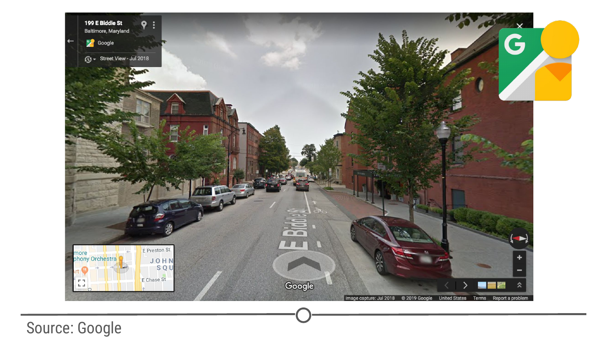
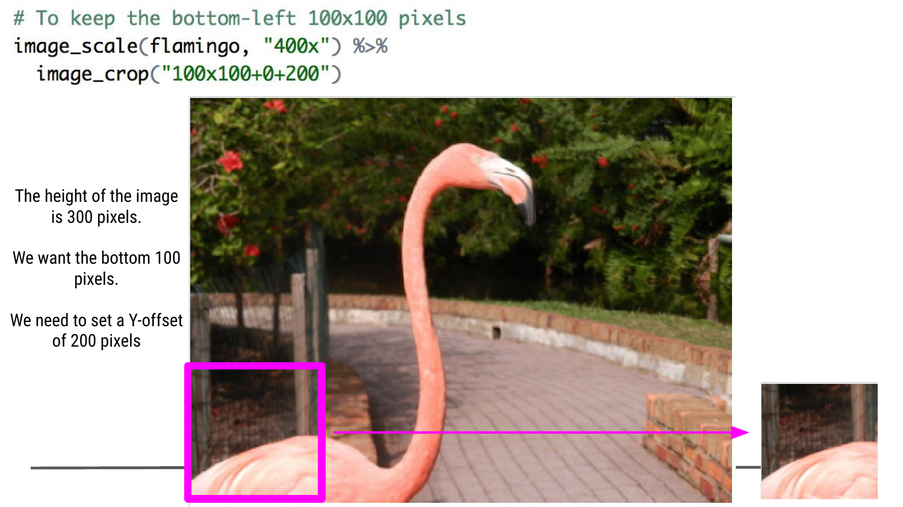
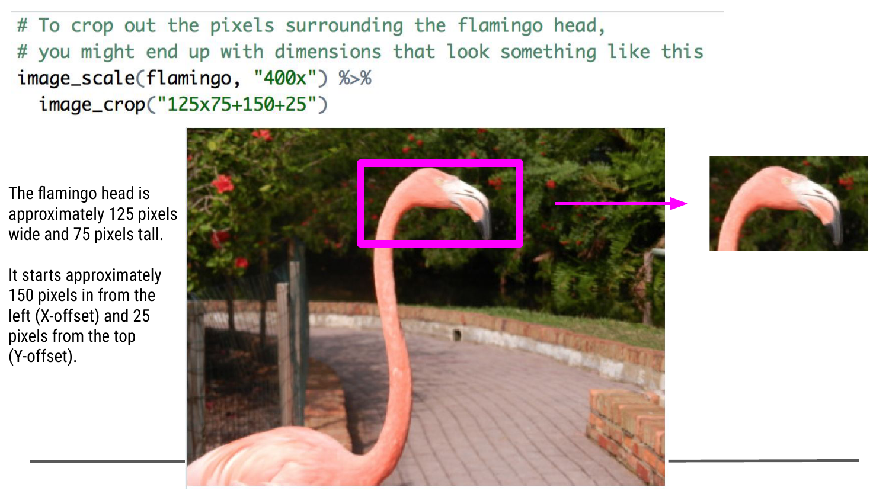
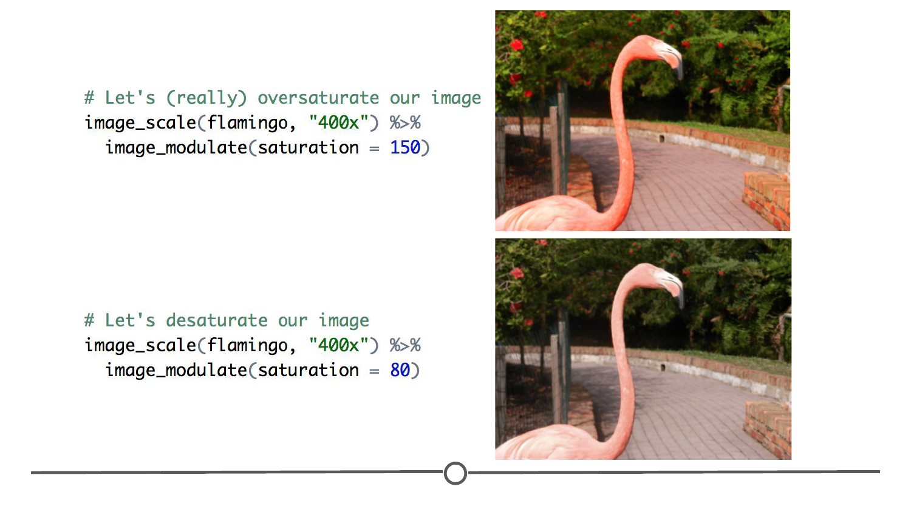
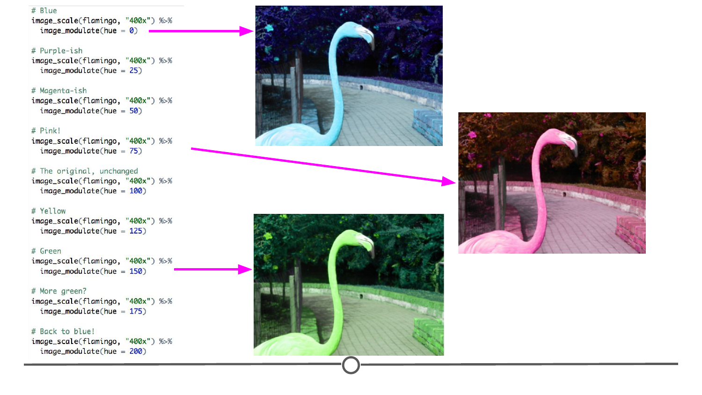
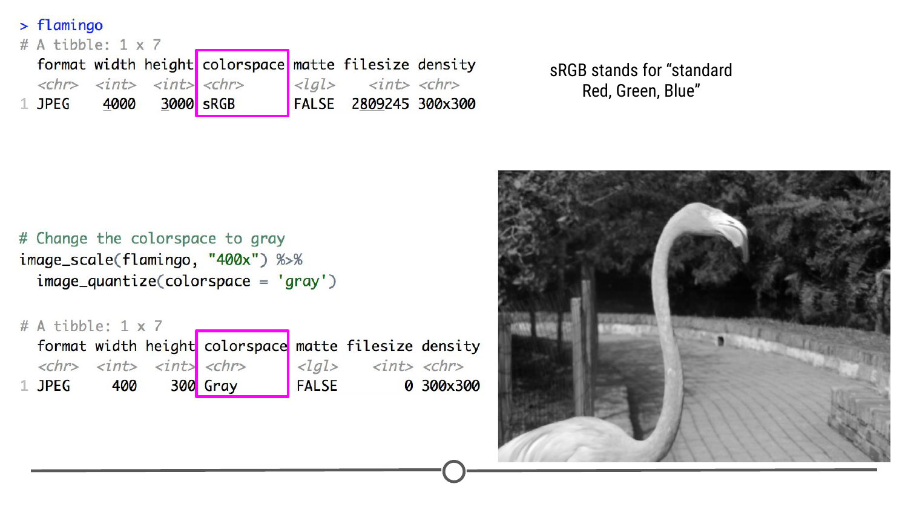
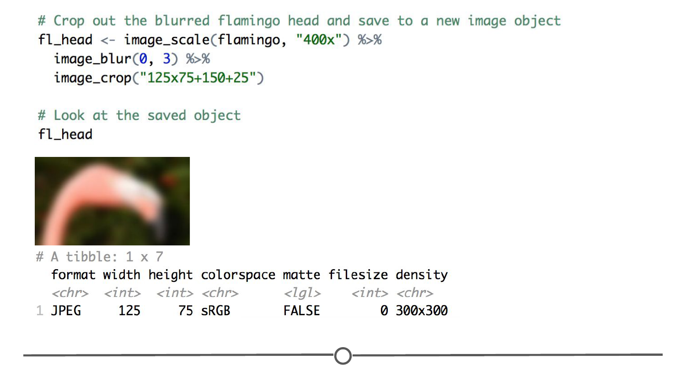
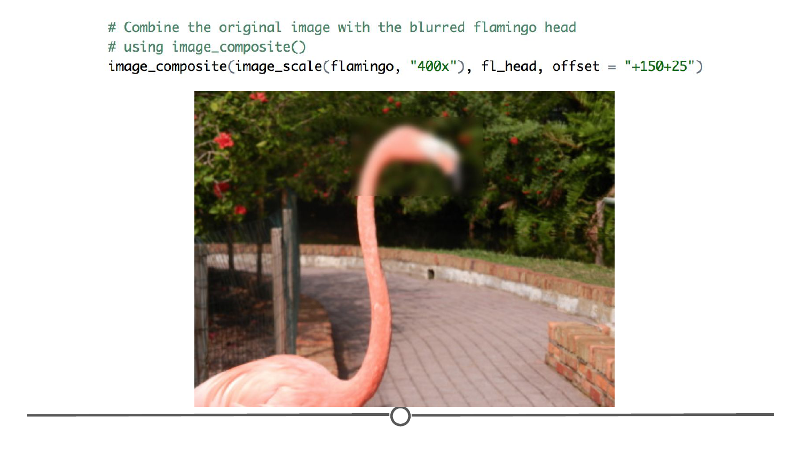
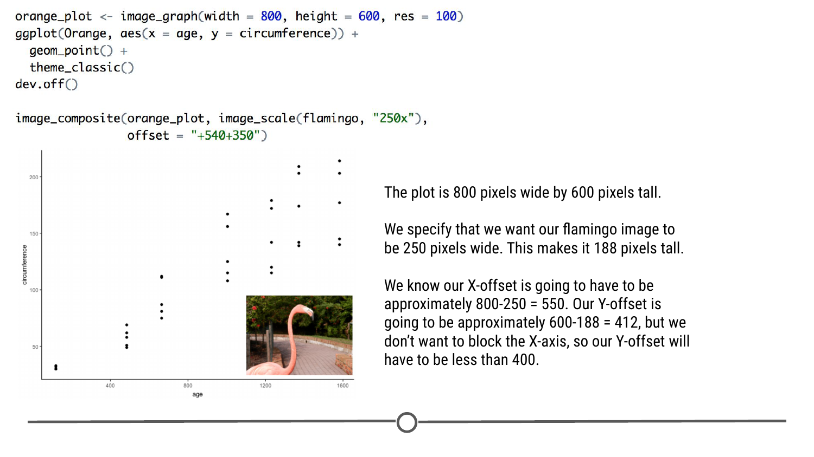

# Images

Only a few decades ago, analyzing a large dataset of images was not feasible for most researchers. Many didn't even think of images as data. But, there is so much we can get from analyzing image data. We're going to do some basic image processing in R in this lesson, but for more advanced image analysis, like in the example below, you will use specialized packages and functions that are out of the scope of this introductory course. Nevertheless, these preprocessing steps are often integral to getting a "tidy" image dataset for these more specialized analyses. 

### An example of image analysis at work

An example of a more complex image analysis involves [researchers extracting car makes and models and census data to predict a neighbourhood's voting habits](https://www.pnas.org/content/114/50/13108). To do this, within Google Maps there is a Street View feature that allows panoramic views from positions along many streets in the world. One of the things you may notice if you're looking around on Google Maps' street view is that for many streets in the world you do not only see houses; you are also able to see cars. 



Some 50 million images of cars from over 200 cities were used by researchers to detect the make, model, body type, and age of the cars in each neighbourhood. They were able to take unstructured image data and compile a structured data set! These same researchers then pulled together a structured dataset from the Census and the 2008 elections of demographic information (such as race and income), and voting history in these same neighbourhoods. 

Using these two datasets (the Google Street view car image data and the demographic data), researchers used a technique known as **machine learning** to build an algorithm that could, from the images of cars in a neighbourhood, predict the demographics (race, income, etc.) and how that area is likely to vote. Comparing these two sets of data, they were able to accurately estimate income, race, education, and voting patterns at the zip code level from the Google Street view images.

### Analyzing Images in R

Like with text, there are packages in R that will help you carry out analysis of images. In particular, `magick` is especially helpful for advanced image processing within R, allowing you to process, edit, and manipulate images within R. There are a number of different image file formats and the `magick` package is capable of working with many of these different types of images, including PNG, JPEG, and TIFF. The `magick` package has a particularly helpful [vignette](https://cran.r-project.org/web/packages/magick/vignettes/intro.html) where you can learn the ins and outs of working with images using `magick`'s functionality. 

We'll follow some of their documentation to learn how to read image data into R, how to edit images, and how to add images to your R plots.

### Using `magick`

Before we get into exploring some of the capabilities of the `magick` package, we need to install and load it. Do so now! 

```r 
install.packages("magick")
library(magick)
```

#### Reading and writing images 

The first thing you will want to be able to do with this package is read in images into R, using the `image_read()` function. We've uploaded a picture of a flamingo here(https://drive.google.com/file/d/1Y8z2ukKaa63S_XpbDHFw7YcmUFDhkk9Q/view?usp=sharing) which you can download to follow along with this lesson. If you have your own image file on your computer that you want to practice on, that's great - you will just have to specify the specific filename of your picture in the following commands.

```r 
# Download the flamingo image from https://drive.google.com/file/d/1Y8z2ukKaa63S_XpbDHFw7YcmUFDhkk9Q/view?usp=sharing
# We will have to specify the path to the image file
# In this example, our image file is stored in a directory called "GCD" on the Desktop

flamingo <- image_read('~/Desktop/GCD/Flamingo.jpeg')

# Call the flamingo object 
flamingo
```

Now if you call the flamingo object in RStudio, not only does a tibble providing some details about the image appear in the Console, the flamingo image should also open up in the "Viewer" tab in the bottom right quadrant! 


While we're covering how to read in images, let's look at how to write out images too! This way once you've modified the images, which we'll learn in the following step, you can save your changes! Also, one of the benefits of working with the `magick` package is that you can change the file format of your images simply by specifying so in the write out command. So while the original flamingo image is a JPEG, you can save it, for example, as a PDF. Here, we are going to write out the flamingo image as a PDF to a folder on the Desktop called "GCD" using the `image_write()` function. 

```r
# Write out the image of the flamingo as a PDF to a folder on your desktop called GCD
image_write(flamingo, path = "~/Desktop/GCD/Flamingo.pdf", format = "pdf")
```

If you open up the directory where you saved your image, you should now see a PDF file containing the flamingo image. 


#### Modifying images 

Here we are going to look at the various ways we can use `magick` to change how the image looks, either through resizing, cropping, or playing with the colours in the image. While we don't go into it all here, if you can think of some basic image processing step, `magick` probably has some way to do it - you just have to explore the full breadth of the package either on your own or by following the [great vignette](https://cran.r-project.org/web/packages/magick/vignettes/intro.html) included with the package. 

**Pipes**

One of the major benefits of using the `magick` package is the integration with pipes, like those from the `dplyr` package. Using `%>%`, you can add multiple modifications to an image in one command. We'll use the pipe in the following examples, to show you how you can begin to multiplex different image manipulations together. 

**Scale** 

`image_scale()` is how we are going to resize or **scale** our images. Using this function, you can either specify the desired width or height in pixels. To specify the width, you will type the number of pixels you want, followed by an "x". For height, you do the same, only the "x" goes *before* the number of pixels. When you scale your images, the resized image will appear in the Viewer and a tibble with the new dimensions of your picture will be output to the Console. 

```r 
# Specify you want to change the width to 400 pixels 
image_scale(flamingo, "400x")

# Specify you want to change the height to 400 pixels 
image_scale(flamingo, "x400")
```


For each of the following functions, we will first resize our images so that they comfortably fit in the Viewer pane and then pipe into the new command. If a width of 400 pixels does not quite fit in your Viewer, change the dimensions to better fit your monitor. 

**Rotate** 

To rotate our images, we will use `image_rotate()`. To use this function, you will specify the number of degrees between 0 and 360 that you would like to rotate the image. You can also specify whether you want to rotate the image clockwise or anti-clockwise by using either a positive or negative number of degrees. 

```r 
# Use image_rotate() with a positive integer to rotate clockwise
image_scale(flamingo, "400x") %>% 
image_rotate(10)

# Use image_rotate() with a negative integer to rotate anti-clockwise
image_scale(flamingo, "400x") %>% 
image_rotate(-10)

# Rotating your image 350 degrees is the same as anti-clockwise rotating 10 degrees
image_scale(flamingo, "400x") %>% 
image_rotate(350)
```

Note how by using the `image_scale()` first, we have resized our image and this scaled image is what is being modified by the `image_rotate()` function. 


**Crop** 

To crop an image, or select only a small portion of the image, we will use the `image_crop()` function. Here we will specify the X and Y co-ordinates that we want to keep. 

If we just specify we want a block of 100 x 100 pixels, we will see that it starts counting from the upper-left corner.

```r 
# To keep the upper-left 100x100 pixels
image_scale(flamingo, "400x") %>% 
image_crop("100x100")

```


But, what if we wanted the bottom-left 100x100 pixel square? We can change where it takes the block of 100x100 pixels from by using the `xoffset` and `yoffset` options in the command. These are the number of pixels away from the upper (`yoffset`) or left (`xoffset`) edges that you are asking for. So for `image_crop()`, we can specify `width x height + xoffset + yoffset`.

In our example, we have resized the flamingo image to a width of 400 and a height of 300 pixels. If we want the bottom 100 pixels, we need to specify a Y-offset of 200 (and an X-offset of zero, since we still want the left edge).

```r 
# To keep the bottom-left 100x100 pixels
image_scale(flamingo, "400x") %>% 
image_crop("100x100+0+200")
```



What if we want just the flamingo head? This may take a few iterations to get the offset perfect, but give it a few goes to see if you can get a rectangular cutout of just the flamingo head? Estimating, it looks to be about midway through the picture, so try starting with an X-offset of around 200 and adjust from there. 

```r 
# To crop out the pixels surrounding the flamingo head, you might end up with dimensions that look something like this
image_scale(flamingo, "400x") %>% 
image_crop("125x75+150+25")
```



**Brightness, saturation, hue, greyscale, contrast**

We can change the brightness, saturation and hue of an image using the `image_modulate()` function. By default, each of these are at 100. So to increase the **brightness**, we would increase the number above 100, and to decrease, we would lower the number. 

```r 
# Let's increase the brightness 
image_scale(flamingo, "400x") %>% 
image_modulate(brightness = 120)

# Let's decrease the brightness 
image_scale(flamingo, "400x") %>% 
image_modulate(brightness = 80)
```


Let's experiment with saturation now; **saturation** is a measure of how intense a colour is. If you over-saturate an image, all of the colours become *more* - so in our image, we'd expect the flamingo to become *more* pink, and the background to become *more* green. If we *desaturate*, we'd expect each colour to be a little less vibrant, so a *duller* pink and *duller* green. The original flamingo picture is a little oversaturated to start with, given how bright the pinks and how vibrant the greens are, so to really see the effect of over-saturating our image, we're going to have to really turn the saturation up to see an extreme effect. 

```r
# Let's (really) oversaturate our image
image_scale(flamingo, "400x") %>% 
image_modulate(saturation = 150)

# Let's desaturate our image
image_scale(flamingo, "400x") %>% 
image_modulate(saturation = 80)

```



Alright, last option to play around with is the hue option. **Hue** is a bit hard to explain - it's essentially how red, green, or blue an image is. It's easier to show you by playing around with this parameter and seeing the effect! Hue is measured on a scale of 0-200 in this command, so try a bunch of different options!

```r
# Blue
image_scale(flamingo, "400x") %>% 
image_modulate(hue = 0)

# Purple-ish
image_scale(flamingo, "400x") %>% 
image_modulate(hue = 25)

# Magenta-ish
image_scale(flamingo, "400x") %>% 
image_modulate(hue = 50)

# Pink!
image_scale(flamingo, "400x") %>% 
image_modulate(hue = 75)

# The original, unchanged
image_scale(flamingo, "400x") %>% 
image_modulate(hue = 100)

# Yellow
image_scale(flamingo, "400x") %>% 
image_modulate(hue = 125)

# Green
image_scale(flamingo, "400x") %>% 
image_modulate(hue = 150)

# More green?
image_scale(flamingo, "400x") %>% 
image_modulate(hue = 175)

# Back to blue!
image_scale(flamingo, "400x") %>% 
image_modulate(hue = 200)

```



That's it for the `image_modulate()` function, but there are stil a couple of colour-related manipulations we can apply using the `magick` package. First, we can remove all of the colour entirely and turn our image **greyscale**. First, let's call `flamingo` and look at the tibble. 

```r
flamingo
```

We can see that there is a column called `colorspace` that is said to be `sRGB` for our image. This stands for "standard Red, Green, Blue" - meaning our image is made up of all of those colours. If we wanted to make our image greyscale, we can specify that we want that colorspace to instead be gray using the `image_quantize()` function. 

```r
# Change the colorspace to gray
image_scale(flamingo, "400x") %>% 
image_quantize(colorspace = 'gray')
```



And finally, we will look at **contrast** - which is a measure of how different colours which are next to each other appear. If we increase contrast, we'd expect the colours to diverge more from each other - we'll play with this parameter using the `image_contrast()` function, where the contrast is by default equal to 1.  

```r
# Original 
image_scale(flamingo, "400x")

# Increase the contrast
image_scale(flamingo, "400x") %>% 
image_contrast(2)
```


#### Combining images or plots

There are many ways outlined in the vignette about how to combine images. We're going to look at one case here that brings together a few different functions available in `magick`. 

First thing we need to look at is blurring. You may find yourself wanting to blur part of an image if it contains some identifying information; think to Google Maps where car license plates and faces are blurred out. 

So let's say we are particularly concerned for our flamingo friend's identity. We can blur the entire image using the `image_blur()` function, where you can specify two options: the radius and the sigma, which control how much blurring occurs. We aren't going to go too in depth exploring these options, but you can read more about them [here](http://www.imagemagick.org/Usage/blur/#blur). For now, just know that the higher the sigma, the more blurry your image will be.

```r
# Let's blur our flamingo!
image_scale(flamingo, "400x") %>% 
image_blur(0, 3)
```


But this blurs everything, and we only want to blur out the flamingo's head. Thankfully, in an earlier example, we learned the co-ordinates of the flamingo head when we were learning how to crop. Let's combine the blurring with the crop to get just the blurred flamingo head and save it to a new image object, `fl_head`. 

```r 
# Crop out the blurred flamingo head and save to a new image object 
fl_head <- image_scale(flamingo, "400x") %>% 
image_blur(0, 3) %>% 
image_crop("125x75+150+25")

# Look at the saved object
fl_head
```



Okay, so now we have two images: the flamingo image in full, unblurred; and the flamingo head, blurred. Our goal is to combine the two into one image, overlaying the blurred head over the original! We are going to use the `image_composite()` function to do this; where you specify the two images you want to combine, and the offset that you want to move the second image compared to the first. 

For our example, we need to specify that the first image is the full, scaled flamingo image. Then we need to call the second image, `fl_head`. And finally, we need to specify that the flamingo head needs to be offset - using the same co-ordinates from the crop! 

```r 
# Combine the original image with the blurred flamingo head using image_composite()
image_composite(image_scale(flamingo, "400x"), fl_head, offset = "+150+25")
```



Great! The flamingo's identity is safe now!  

A more common reason you might want to combine two images is in adding images to plots. Let's add our flamingo picture to a graph about orange tree growth. We'll use the inbuilt dataset, `Orange`, for this and we will plot the age of the tree by the trunk circumference. 

```r 
ggplot(Orange, aes(x = age, y = circumference)) + geom_point() + theme_classic()
```

Let's add our flamingo on top of this! First, we need to make the ggplot2 object into an image that `magick` can read. We will create an image object from a graph using the function `image_graph()`, where we will specify the width, height, and resolution (`res`) of our desired image. We'll then call the same ggplot command as before. And we will end this with specifying `dev.off()` which tells `magick` that you are done adding to the image and it will therefore save it, here in an image named `orange_plot`. 

```r 
orange_plot <- image_graph(width = 800, height = 600, res = 100)
ggplot(Orange, aes(x = age, y = circumference)) + geom_point() + theme_classic()
dev.off()
```

And now we're ready to make a composite image! As before, we specify both of the images we want to combine, `flamingo` and `orange_plot`, and we include any offset we want. Let's see if we can get the flamingo to fit in the white space on the bottom right side of the plot. 

```r 
image_composite(orange_plot, image_scale(flamingo, "250x"), offset = "+540+350")
```



This might not look like much, but now you are able to add any image you want to any plot you want and specify exactly where it should be, what size it is, and you can add any of the other image manipulations we discussed in the rest of this lesson. The possibilities are endless! 

### Additional Resources

* [`magick` package](https://cran.r-project.org/web/packages/magick/vignettes/intro.html)
* Some guides on using `magick` like this [one covering basic functions using a picture of a kitten](https://heartbeat.fritz.ai/image-manipulation-for-machine-learning-in-r-ff2b92069fef) and [this Towards Data Science article that shows how useful pipes are](https://towardsdatascience.com/advanced-image-processing-in-r-210618ab128a)
* ["Google Street View Can Reveal How Your Neighborhood Votes"](https://www.citylab.com/transportation/2017/12/google-street-view-data-demographics-cars-research/547436/); [Original Publicaton](https://www.pnas.org/content/114/50/13108)

### Summary 

In this lesson, we dove into the various functionalities of the `magick ` package. We started with looking at how to read and write images using the `magick` package. Then we explored how to resize, rotate or crop an image. We then looked at how we can manipulate the colours in an image - playing with brightness, saturation, hue, greyscale and contrast. We ended with looking at how to combine images with other images or with plots. All throughout, we saw how useful the pipe operator is in chaining together various modifications. This may be an unusual data format to work in, but if you keep exploring this package, you'll be an ace at it! 

### Slides 

This lesson's slides can be found [here](https://docs.google.com/presentation/d/1HdKgIiAm1FG9fLzBW6b3cqV5mitvh7D9hHxNvWQp4NE/edit?usp=sharing)  
