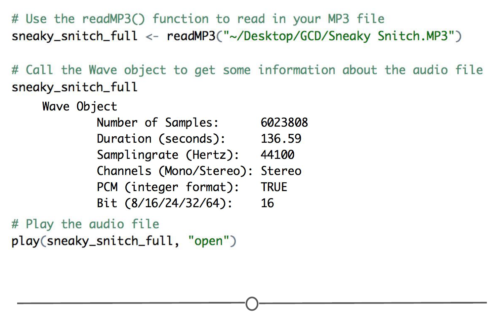
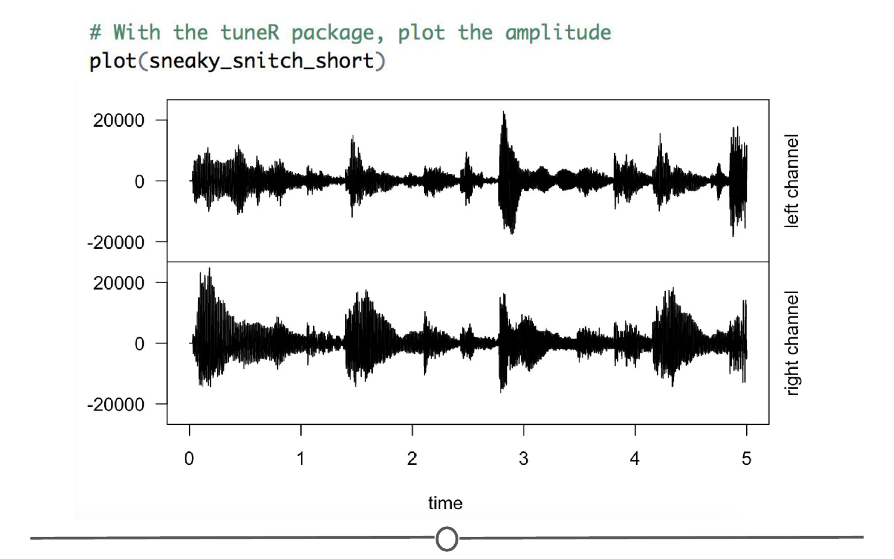
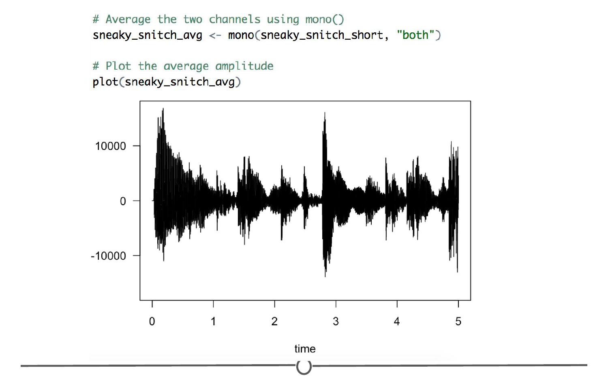
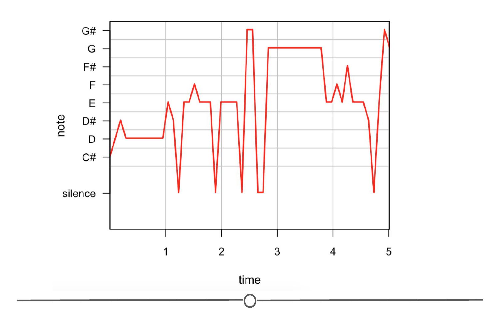
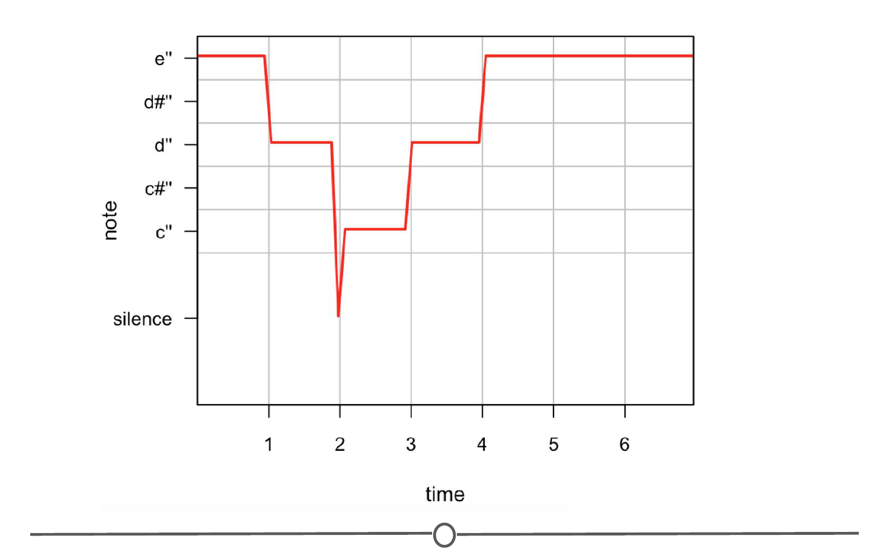

# Audio

So much of the data generated today comes in the form of audio files. This could be all the data contained within the MP3 files of your favorite songs or the audio files saved in the archives from the speeches of politicians. While certainly not tabular data, there is a lot of information stored within all the audio files we've generated!

It likely isn't surprising that there are [many different file types](https://en.wikipedia.org/wiki/Audio_file_format) to store audio data. MP3s are currently the most common file format, becoming popular as CDs became less popular due to the fact that the same audio file saved as an [MP3](https://en.wikipedia.org/wiki/MP3) would take up *much* less space than the same file stored on a CD. 

### Analyzing Audio Files in R

There are two packages that will likely be helpful for analyzing audio files in R:

* `tuneR` - package to analyze music and speech
* `seewave` - package to analyze, manipulate, display, edit and synthesize sound waves

Admittedly, working with audio files in R is not as common as working with tabular data; however, that just means there's room for development and exploration of how to approach audio files in R. To see how others have worked with audio files in R, take a look through the following examples:

* [transcribing music in R using `tuneR`](http://www.vesnam.com/Rblog/transcribing-music-from-audio-files-2/), by [Vesna Memisevic](http://www.vesnam.com/aboutme.html)
* [clustering music in R using `tuneR` and `seewave`](http://www.vesnam.com/Rblog/sortmymusic/), by [Vesna Memisevic](http://www.vesnam.com/aboutme.html)

A lot of the functions in these packages are for highly specific use-cases that are out of the scope of this general introduction - particularly the analysis functions of `seewave`; check out some of the ways to use it [here](http://rug.mnhn.fr/seewave/exam.html). For more in depth examples of how these tools can be used, check out the Additional Resources section at the end of this lesson. For now, we are going to do some of the most basic functions - read and write audio files, plot music amplitude and frequency and create audio from within R. 

#### Install `tuneR` and `seewave`

Before we get into it, first, let's install and load the two main audio analysis packages for R. 

```r 
install.packages(c("tuneR", "seewave"))
library(tuneR)
library(seewave)
```

#### Download music file 

We will be playing with the song "Sneaky Snitch" by [Kevin MacLeod](incompetech.com), who releases his music as royalty free music under a [Creative Commons: By Attribution 3.0 License](http://creativecommons.org/licenses/by/3.0/), meaning it is available to be used in this course! 

Go to [this link](https://www.incompetech.com/music/royalty-free/index.html?isrc=USUAN1100772) to download the "Sneaky Snitch" MP3 file. Move the downloaded MP3 file to a directory of your choice, that you can find from within R. We have chosen to save it in a folder on the Desktop called GCD. 

#### Load the MP3 into R 

First thing we need to do is read the MP3 file into R. We will use the `readMP3()` function to do so. Once we've loaded the file, we can play it, using the `play()` function. Doing so should open either Windows Media Player (if you are on a Windows computer) or iTunes (if you are on a Mac). If you have a problem with tuneR not finding the correct media player for your computer when you call the `play()` function, you can tell it what program to use using the `setWavPlayer()` function. 

```r
# Use the readMP3() function to read in your MP3 file
sneaky_snitch_full <- readMP3("~/Desktop/GCD/Sneaky Snitch.MP3")

# Call the Wave object to get some information about the audio file 
sneaky_snitch_full

# Play the audio file 
play(sneaky_snitch_full, "open")
```

 

From this, we can see, for example, that our audio file is 136 seconds long, has a sampling rate of 44100, and is stereo (i.e.: has two channel audio). One thing to note, the file which started as an MP3 is now in Wave (WAV) format. [WAV files](https://en.wikipedia.org/wiki/WAV) are an uncompressed audio file so there is maximum audio quality possible in this form. Helpfully, WAV files are the file type that is required by `seewave` - so this is a first step to working with both the `tuneR` and `seewave` packages. 

#### "Crop" the audio file down to a few seconds 

For some of the plotting that we are going to do, we don't necessarily want to see the entire song - so let's shorten down the audio file so that we only look at the first 5 seconds. We will use the `extractWave()` function to extract the audio from 0 to 5 seconds. 

```r
# Use extractWave() to extract the first five seconds of audio
sneaky_snitch_short <- extractWave(sneaky_snitch_full, from = 0, to = 5, xunit = "time")

# Preview the file to confirm the length is 5 seconds
sneaky_snitch_short

# Play the resulting audio clip
play(sneaky_snitch_short, "open")
```

Doing so, we have now created a Wave object that is the first five seconds of our song! 

#### Write out cropped file 

One of the other base functionalities of `tuneR` that we need to cover now is how to write an audio file from within R. We will use the `writeWave()` function, specifying that we want to save the file to our GCD directory on the Desktop. 

```r
# Use the writeWave() function to write out a WAV file of our shortened audio clip
writeWave(sneaky_snitch_short, "~/Desktop/GCD/Sneaky_snitch_shortened.wav")
```

`tuneR` is only able to write out WAV files, which since they are uncompressed are much larger files than MP3s. This is also a great function for converting MP3s to WAV files. 

#### Plot the soundwave

Audio analysis at first glance, doesn't seem like a particularly visual medium, but there are plenty of different ways we can plot sound! One way we can plot our data is to look at the amplitude (i.e.: the loudness) of the music across time. We can use the generic `plot()` function to do so. 

```r
# With the tuneR package, plot the amplitude 
plot(sneaky_snitch_short)
```



Where there are peaks, the sound is louder; where the amplitude is closer to zero, the sound is quieter.  

One thing you might notice is that that `plot()` command produces two plots. Each plot represents one of the channels in stereo audio: the left and the right. You can see that there are subtle differences between the left and right channel -- this is why songs sometimes can sound funny if you are only listening with one earphone. 

We can average the left and right channels to make the audio into "mono". This means that if you play the song across many speakers, all of them would play the exact same sound. Whereas in stereo, the speakers on the left are playing different sounds from the right. We will use the `mono()` function to convert `both` channels into one. When you plot the amplitude, you can see that only one plot is produced.

```r
# Average the two channels using mono()
sneaky_snitch_avg <- mono(sneaky_snitch_short, "both")

# Plot the average amplitude 
plot(sneaky_snitch_avg)
```



#### Calculate the frequency

The other main property of sound is [frequency](https://en.wikipedia.org/wiki/Audio_frequency). While amplitude directs how loud something is, the frequency determines what note is heard. 

To plot this, we have to estimate the frequencies, using the `periodogram()` and `FF()` functions. We will then derive the notes from these frequencies using `noteFromFF()`. And finally, we will plot these notes using the `melodyplot()` function. 

```r
# Calculate the frequency
Wspec_sneaky_snitch <- periodogram(sneaky_snitch_avg, width = 4096)
sneaky_snitch_frequency <- FF(Wspec_sneaky_snitch)

# Derive the notes from the frequencies
sneaky_snitch_notes <- noteFromFF(sneaky_snitch_frequency)

# Plot the notes
melodyplot(Wspec_sneaky_snitch, sneaky_snitch_notes, plotenergy = F)
```



This is going to be imperfect given how complex our input music is, but you can see how this could be used to go from a music file to suggested notes, which can be further processed/analysed. 

#### Create audio from within R 

To fully capitalize on the functions above, we are going to simplify the analysis by creating our own very simple audio file from within R. 

Sound is essentially just made up of waves, so we can use the `sine()` function from the `tuneR` package to create waves of different frequencies, which in turn will be derived into notes, which we can then plot. 

```r
# Create a single tone lasting 1 second
R_sound <- sine(880, duration = 1, xunit = "time")
play(R_sound, "open")

# Create a series of 7 sounds, each lasting 1 second
mary <- bind(sine(659, duration = 1, xunit = "time"),
                sine(587, duration = 1, xunit = "time"),
                sine(523, duration = 1, xunit = "time"),
                sine(587, duration = 1, xunit = "time"),
                sine(659, duration = 1, xunit = "time"),
                sine(659, duration = 1, xunit = "time"),
                sine(659, duration = 1, xunit = "time"))
                
# Can you tell what song this is?               
play(mary, "open")

```

Now let's do the same plotting exercise as before, where we estimate the frequencies, derive notes and plot them.

```r
# Calculate the frequency
Wspec_mary <- periodogram(mary, width = 4096)
mary_frequency <- FF(Wspec_mary)

# Derive the notes from the frequencies
mary_notes <- noteFromFF(mary_frequency)

# Plot the notes
melodyplot(Wspec_mary, mary_notes, plotenergy = F)
```



You can see from this analysis just how much more clean the frequency and note estimations are when the input is so simple. 

There are many different directions to take any of these analysis components - from here, you will need to explore the help files, vignettes, online tutorials, and other people's analyses to experience the full range of possibilities that these packages provide. 

### Additional Resources

* [`tuneR` and `seewave` tutorial](http://samcarcagno.altervista.org/blog/basic-sound-processing-r/?doing_wp_cron=1527700628.0053870677947998046875), by [Sam Carcagno](http://samcarcagno.altervista.org/index.html)
* [`tuneR` tutorial: transcribing music](http://www.vesnam.com/Rblog/transcribing-music-from-audio-files-2/), by [Vesna Memisevic](http://www.vesnam.com/aboutme.html)
* [`tuneR` and `seewave` tutorial: clustering music](http://www.vesnam.com/Rblog/sortmymusic/), by [Vesna Memisevic](http://www.vesnam.com/aboutme.html)
* [`seewave` documentation](http://rug.mnhn.fr/seewave/docu.html)
* [Examples of `seewave` in use for advanced audio analysis](http://rug.mnhn.fr/seewave/exam.html)

### Summary 

In this lesson, we introduced some of the basic functions in the `tuneR` package for audio analysis. We learned how to read and write audio files, listen to them from within R, and sample audio files to pull out audio clips. We then looked at some basic visualization of audio files - plotting either the amplitude or calculating the frequencies and notes and plotting those. Finally, we looked at how to create sound from within R using sine waves. Audio analysis is not the most common file type to analyse in R; but hopefully you feel equipped to at least approach audio analysis in R with this introduction.  

### Slides

This lesson's slides can be found [here](https://docs.google.com/presentation/d/1QrhHX5N1GqxsklcinxBpwX47yn0Hb6YNc2Ir9wX2-Mo/edit?usp=sharing)  
